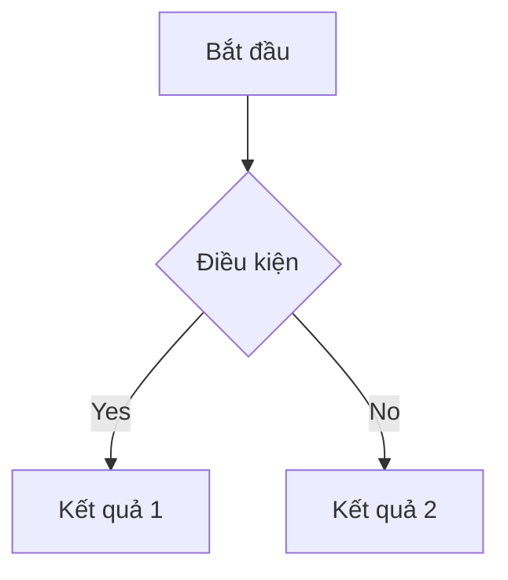

# BPRD: [Tên Dự Án/Tính Năng]
> Business and Product Requirements Document

## 1. Thông Tin Chung (Document Information)
- **Dự án/Tính năng:** [Tên]
- **Mục tiêu (Epic):** [[Link đến Epic nếu có]]
- **Người chịu trách nhiệm (Owner):** [Tên PO/PM]
- **Nhóm tham gia (Stakeholders):** [Design, Dev, QA, Marketing, v.v.]
- **Mức độ ưu tiên (Priority):** [High/Medium/Low]

---

## 2. Tổng Quan Kinh Doanh (Business Context)
### 2.1. Vấn Đề/Cơ Hội (Problem & Opportunity)
*Trả lời câu hỏi: Tại sao chúng ta cần làm tính năng/dự án này? Vấn đề của người dùng/doanh nghiệp đang gặp phải là gì?*
- [Mô tả vấn đề 1]
- [Mô tả vấn đề 2]

### 2.2. Mục Tiêu (Business Goals & OKRs)
*Tính năng này giúp cải thiện chỉ số gì?*
- Khía cạnh Sản phẩm: [Ví dụ: Tăng retention rate lên x%, giảm time-to-task]
- Khía cạnh Kinh doanh: [Ví dụ: Tăng Revenue, giảm vận hành]

### 2.3. Phạm Vi (Scope)
- **Nằm trong phạm vi (In-Scope):** [Những gì sẽ được làm]
- **Nằm ngoài phạm vi (Out-of-Scope):** [Những gì sẽ KHÔNG làm trong phase này]

---

## 3. Người Dùng Mục Tiêu (User Personas & JTBD)
### 3.1. Chân dung người dùng (Personas)
- **Persona 1:** [Mô tả ngắn gọn đặc điểm]
- **Persona 2:** [Mô tả ngắn gọn đặc điểm]

### 3.2. Jobs-to-be-Done
*Khi [hoàn cảnh], người dùng muốn [làm gì đó] để [nhận được lợi ích gì].*

---

## 4. Yêu Cầu Nghiệp Vụ (Business Requirements)
### 4.1. Quy Trình / Luồng Nghiệp Vụ (Process Flows)

### 4.2. Quy Tắc Kinh Doanh (Business Rules)
- Rule 1: [Ví dụ: User phải đăng nhập tài khoản hạng Gold mới được sử dụng]
- Rule 2: [Ví dụ: Số tiền tối thiểu cho 1 giao dịch là 10,000đ]

---

## 5. Yêu Cầu Sản Phẩm/Tính Năng (Functional Requirements)
*Bóc tách chi tiết tính năng thành các User Stories. 
**PROMPT CHO AI:** Khi viết Mục này (đặc biệt là cột Acceptance Criteria), BẮT BUỘC tuân thủ chặt chẽ theo format và ngôn ngữ hành vi Gherkin được định nghĩa trong file `.agents/skills/business-analysis/templates/user-story-detailed.md`. Mọi tiêu chí nghiệm thu phải rõ ràng hành vi (Trạng thái trước -> Thao tác -> Kết quả/Hiển thị lỗi).*

| ID | User Story | Acceptance Criteria (Tiêu chí nghiệm thu) | Priority |
| :--- | :--- | :--- | :--- |
| US-01 | Là [user], tôi muốn [hành động] để [kết quả]. | **[Behavior 1]** Khi [điều kiện], thì [kết quả rành mạch]   **[Behavior 2]** Khi [Lỗi X], thì [User thấy thông báo Y] | High |
| US-02 | ... | ... | Medium |

### 5.1. UX/UI & Trải nghiệm (Mockups/Wireframes)
- Link thiết kế: [Figma/Sketch/etc.]
- Ghi chú UX: [Animation, Transition, Loading/Empty/Error States]

---

## 6. Yêu Cầu Phi Chức Năng (Non-Functional Requirements)
- **Bảo Mật (Security):** [Mã hóa, chuẩn bảo mật]
- **Hiệu Năng (Performance):** [Ví dụ: Load < 2s, 10,000 CCU]
- **Log & Tracking:** [Event tracking, theo dõi lỗi]
- **Tính Tương Thích:** [iOS 15+, Android 8+, v.v.]

---

## 7. Edge Cases (Trường Hợp Ngoại Lệ)
- **Mất kết nối Internet:** [Ứng xử của app?]
- **Lỗi hệ thống/API:** [Màn hình/thông báo lỗi hiển thị gì?]
- **Hành vi bất thường:** [User spam click, thao tác nhanh...]

---

## 8. Kế Hoạch Ra Mắt & Go-to-Market
- **Giai đoạn (Phases):** [Alpha → Beta → Rollout 20% → 100%]
- **Đào tạo & Phổ biến:** [Thông báo người dùng, hướng dẫn CSKH]

---

## 9. Definition of Done
- [ ] Thiết kế đã được duyệt (Design Approved)
- [ ] Code pass tất cả Acceptance Criteria
- [ ] Đã viết Unit Test và E2E Test
- [ ] Đã có tài liệu hướng dẫn người dùng
- [ ] Đã gắn tracking sự kiện analytics
