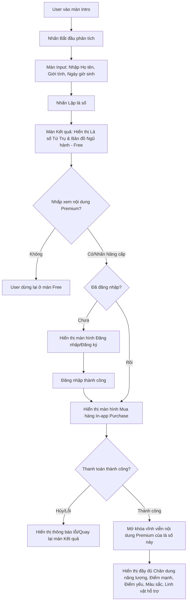

# BPRD: Kích Hoạt Năng Lượng Cá Nhân

> Business and Product Requirements Document

## 1. Thông tin tài liệu

| **Trường**  | **Nội dung**                                        |
| ------------------- | ---------------------------------------------------------- |
| Tên dự án        | Kích Hoạt Năng Lượng Cá Nhân (Bát tự phong thủy) |
| Người phụ trách | Đỗ Thị Hường                                          |
| Phiên bản         | v1.0                                                       |
| Trạng thái        | Đang cập nhật                                           |

## Nhật ký thay đổi

| Ngày cập nhật | Phiên bản | Người thực hiện | Nội dung thay đổi                                                                       |
| ---------------- | ----------- | ------------------- | ------------------------------------------------------------------------------------------ |
| 2026-07-16       | v1.0        | Đỗ Thị Hường   | Khởi tạo tài liệu yêu cầu nghiệp vụ và sản phẩm (BPRD)                          |
| 2026-07-29       | v1.1        | Đỗ Thị Hường   | Bổ sung hệ thống KPI phân tầng (Business, Phễu chuyển đổi, Gắn kết, Kỹ thuật) |

---

## 2. Tổng Quan Kinh Doanh (Business Context)

### 2.1. Vấn Đề/Cơ Hội (Problem & Opportunity)

- **Vấn đề**: Người dùng xem Lịch Việt thường có xu hướng quan tâm sâu sắc tới phong thủy, tử vi và bản mệnh cá nhân. Tuy nhiên, các công cụ hiện tại chỉ cung cấp thông tin chung chung theo ngày/tháng, chưa cá nhân hóa sâu sắc theo giờ sinh cụ thể (Bát tự). Đồng thời, người dùng có nhu cầu tìm hiểu cách cải thiện vận mệnh, kích hoạt năng lượng tích cực (màu sắc, linh vật, phương hướng) nhưng thiếu một công cụ hướng dẫn khoa học, trực quan.
- **Cơ hội**: Tận dụng tệp người dùng lớn của Lịch Việt để giới thiệu tính năng lập lá số Tứ trụ (Bát tự) miễn phí, từ đó tạo phễu chuyển đổi sang gói luận giải chuyên sâu trả phí (Premium) và liên kết bán các sản phẩm phong thủy (linh vật hỗ trợ, đá hộ mệnh...) tương ứng với hành khuyết thiếu của bản mệnh.

### 2.2. Mục tiêu và KPIs

**Mục tiêu kinh doanh:**

* Tăng trưởng doanh thu từ dịch vụ in-app purchase (mở khóa luận giải nâng cao).
* Thúc đẩy doanh thu bán các sản phẩm vật phẩm phong thủy và linh vật hỗ trợ thông qua liên kết cá nhân hóa.

**Mục tiêu sản phẩm:**

* Cung cấp giao diện lập lá số Tứ Trụ và biểu đồ Ngũ hành trực quan, dễ hiểu.
* Xây dựng trải nghiệm mua hàng và nâng cấp gói dịch vụ mượt mà, minh bạch.

**KPIs cốt lõi (North Star & Business):**

| **Mã** | **Chỉ số (KPI)**                                         | **Định nghĩa / Cách tính**                                                                                                                                     | **Mục tiêu (Target)**                          | **Tần suất đo**   |
| :------------ | :--------------------------------------------------------------- | :------------------------------------------------------------------------------------------------------------------------------------------------------------------------ | :----------------------------------------------------- | :------------------------- |
| **K01** | Tỷ lệ nhấp CTA nâng cấp (CTA Click Rate)                    | (Số lượt nhấp "Mở khóa luận giải chuyên sâu" / Tổng số lượt xem màn Kết quả Free) × 100%                                                                | ≥ 15%                                                 | Hàng ngày                |
| **K02** | Tỷ lệ chuyển đổi trả phí (Free → Paid Conversion)        | (Số giao dịch IAP thành công / Tổng số lượt xem màn Kết quả Free) × 100%                                                                                      | ≥ 3%                                                  | Hàng ngày                |
| **K03** | Số lá số Bát tự hoàn thành/ngày (Daily Charts Completed) | Đếm số sự kiện`chart_completed` trong ngày                                                                                                                        | ≥ 5,000 lượt/ngày                                  | Hàng ngày                |
| **K04** | Số đơn hàng khởi tạo (Orders Initiated)                    | Tổng số order                                                                                                                                                           | Đặt baseline & theo dõi xu hướng                  | Hàng ngày / Hàng tháng |
| **K05** | Số giao dịch thành công (Successful Transactions)            | Tổng số đơn hàng thanh toán thành công                                                                                                                            | Đặt baseline; tăng trưởng ≥ 10% MoM              | Hàng ngày / Hàng tháng |
| **K06** | Tỷ lệ hoàn tất đơn hàng (Order Completion Rate)           | (Số giao dịch thành công / Số đơn hàng khởi tạo) × 100%                                                                                                        | ≥ 60%                                                 | Hàng ngày                |
| **K07** | Doanh thu mua gói lẻ Kích Hoạt Năng Lượng Cá Nhân       | Tổng doanh thu từ các đơn mua gói lẻ mở khóa luận giải Kích Hoạt Năng Lượng Cá Nhân (sau khi trừ phí nền tảng Apple/Google 15–30% và hoàn tiền) | Đặt baseline tháng đầu; tăng trưởng ≥ 10% MoM | Hàng ngày / Hàng tháng |

### 2.2.1. Chỉ số phễu chuyển đổi (Conversion Funnel)

Đo lường tỷ lệ rơi rớt (drop-off) qua từng bước để tối ưu điểm nghẽn:

| **Bước phễu**       | **Sự kiện đo**  | **Chỉ số theo dõi** | **Ngưỡng cảnh báo (Alert)** |
| :--------------------------- | :----------------------- | :--------------------------- | :------------------------------------ |
| 1. Xem Intro                 | `intro_viewed`         | — (đầu phễu)             | —                                    |
| 2. Bắt đầu nhập liệu    | `input_started`        | Intro → Input CVR           | < 40%                                 |
| 3. Hoàn thành lập lá số | `chart_completed`      | Input → Result CVR          | < 60%                                 |
| 4. Nhấp CTA nâng cấp      | `upgrade_cta_clicked`  | Result → CTA CVR (= K01)    | < 15%                                 |
| 5. Bắt đầu thanh toán    | `iap_purchase_started` | CTA → Checkout CVR          | < 50%                                 |
| 6. Thanh toán thành công  | `iap_purchase_success` | Checkout → Paid CVR         | < 60%                                 |

### 2.2.2. Chỉ số gắn kết & sản phẩm (Engagement & Product)

| **Mã** | **Chỉ số**                                          | **Định nghĩa**                                                                       | **Mục tiêu** |
| :------------ | :---------------------------------------------------------- | :-------------------------------------------------------------------------------------------- | :------------------- |
| **E01** | Tỷ lệ hoàn tất nhập liệu (Input Completion Rate)      | Số lá số hoàn thành / Số lượt bắt đầu nhập liệu                                  | ≥ 60%               |
| **E02** | Tỷ lệ quay lại xem lại lá số (Return Rate)            | % người dùng mở lại lá số đã lập trong 7 ngày                                      | ≥ 20%               |
| **E03** | Lá số bình quân/người dùng                           | Tổng lá số lập / người dùng hoạt động                                               | ≥ 1.5               |
| **E04** | Số lượt click chọn thành viên gia đình              | Đếm số lượt người dùng nhấp vào nút/mục "Chọn thành viên gia đình"           | Đặt baseline       |
| **E05** | Tỷ lệ dùng "Chọn nhanh thành viên gia đình" (US-04) | % lượt lập lá số dùng tính năng điền nhanh                                          | Đặt baseline       |
| **E06** | Số lượt click vào từng sản phẩm phong thủy          | Đếm số lượt nhấp vào mỗi sản phẩm/linh vật gợi ý (bóc tách theo`product_id`) | Đặt baseline       |
| **E07** | Số người click vào từng sản phẩm phong thủy         | Đếm số người dùng duy nhất (unique users) nhấp vào mỗi sản phẩm/linh vật gợi ý | Đặt baseline       |

### 2.2.3. Chỉ số kỹ thuật & vận hành (Technical & Reliability)

| **Mã** | **Chỉ số**                                              | **Định nghĩa**                                       | **Mục tiêu** |
| :------------ | :-------------------------------------------------------------- | :------------------------------------------------------------ | :------------------- |
| **T01** | Tỷ lệ giao dịch IAP thất bại                               | Số giao dịch lỗi / Tổng số giao dịch khởi tạo         | ≤ 5%                |
| **T02** | Tỷ lệ xác thực biên lai (receipt) thành công server-side | Số receipt verify thành công / Tổng số receipt gửi lên | ≥ 99%               |
| **T03** | Tỷ lệ khôi phục mua hàng thành công (Restore Purchase)   | Số lượt restore thành công / Tổng lượt restore        | ≥ 98%               |
| **T04** | Thời gian tải luận giải sau thanh toán (P95)               | Percentile 95 độ trễ hiển thị nội dung Premium          | < 1.5 giây          |
| **T05** | Tỷ lệ crash màn Kết quả (Crash-free rate)                  | % phiên không crash tại luồng lập lá số & thanh toán  | ≥ 99.5%             |
| **T06** | Tỷ lệ hoàn tiền/tranh chấp (Refund/Chargeback Rate)        | Số giao dịch hoàn tiền / Tổng giao dịch thành công    | ≤ 2%                |

> **Ghi chú phân tích**: Toàn bộ chỉ số cần được bóc tách (segment) theo: nền tảng (iOS/Android), trạng thái đăng nhập (Guest/Logged-in), phiên bản app, và kênh nguồn (nếu có) để phục vụ A/B testing và tối ưu phễu. Nên xây dựng dashboard theo dõi realtime trên Firebase Analytics/Amplitude và đối soát doanh thu định kỳ với báo cáo App Store Connect / Google Play Console.

### 2.3. Phạm Vi (Scope)

- **Nằm trong phạm vi (In-Scope)**:
  - Màn hình Giới thiệu (Intro Screen): Giới thiệu về tính năng kích hoạt năng lượng, tạo phễu tò mò.
  - Màn hình Nhập liệu (Input Screen): Nhập Họ tên, Giới tính, Ngày sinh Dương lịch, Giờ sinh cụ thể (bản đồ giờ chi tương ứng).
  - Màn hình Kết quả (Result Screen) phân cấp 2 luồng:
    - **Luồng miễn phí (Free)**: Xem tiêu đề, thông tin cá nhân (Dương lịch/Âm lịch), bảng Tứ Trụ (Thiên can, Địa chi, Tàng can, Thập thần) và sơ đồ Ngũ hành.
    - **Luồng trả phí (Premium)**: Xem Chân dung năng lượng, Điểm mạnh nổi bật, Điểm cần cân bằng, Hướng phát triển phù hợp, Màu sắc phù hợp, Linh vật hỗ trợ.
  - Nút CTA mua hàng "Mở khóa luận giải chuyên sâu" (Nâng cấp) hiển thị trực tiếp popup/màn hình in-app purchase (IAP) tích hợp bắt buộc đăng nhập trước khi thanh toán.
- **Nằm ngoài phạm vi (Out-of-Scope)**:
  - Tính năng tư vấn phong thủy trực tiếp 1-1 với chuyên gia.
  - Chức năng tự thanh toán/giao hàng thương mại điện tử đầy đủ trong app (giai đoạn này chỉ liên kết giới thiệu sản phẩm in-app, hoặc chuyển hướng link mua hàng sang sàn TMĐT/đối tác).

---

## 3. Người Dùng Mục Tiêu (User Personas & JTBD)

### 3.1. Chân dung người dùng (Personas)

- **Persona 1: Chị Minh (30 tuổi, Nhân viên văn phòng)**:
  - *Đặc điểm*: Quan tâm đến phong thủy cải mệnh, thường gặp áp lực công việc và muốn biết màu sắc/vật phẩm nào phù hợp để tăng may mắn, tài lộc tại nơi làm việc.
  - *Hành vi*: Sẵn sàng chi tiền mua các sản phẩm nhỏ (vòng tay, linh vật để bàn) và trả phí mở khóa luận giải cá nhân nếu thấy thông tin có độ tin cậy cao.
- **Persona 2: Anh Đức (26 tuổi, Khởi nghiệp)**:
  - *Đặc điểm*: Quan tâm tới điểm mạnh, điểm yếu bản thân và hướng phát triển phù hợp để đưa ra các quyết định quan trọng trong sự nghiệp.
  - *Hành vi*: Muốn lập lá số nhanh chóng, đọc thông tin luận giải súc tích, khoa học.

### 3.2. Jobs-to-be-Done

- **JTBD 1**: Khi tôi đang gặp khó khăn hoặc muốn tối ưu hóa năng lượng làm việc, tôi muốn biết bản mệnh Bát tự của mình khuyết thiếu hành gì để chọn đúng màu sắc trang phục và hướng làm việc nhằm tăng may mắn, hiệu quả.
- **JTBD 2**: Khi xem lá số Bát tự miễn phí, tôi muốn mở khóa phần luận giải chuyên sâu một cách nhanh chóng ngay trong app bằng thanh toán in-app để tôi có thể hiểu rõ chân dung năng lượng và cách cải thiện cuộc sống của mình.

---

## 4. Yêu Cầu Nghiệp Vụ (Business Requirements)

### 4.1. Quy Trình / Luồng Nghiệp Vụ (Process Flows)

### 4.2. Quy Tắc Kinh Doanh (Business Rules)

- **BR-1 (Không giới hạn)**: Người dùng có thể lập và xem lá số Tứ Trụ miễn phí không giới hạn số lượng và số lần xem.
- **BR-2 (Không bắt buộc đăng nhập xem miễn phí)**: Người dùng vãng lai (Guest) chưa đăng nhập vẫn có thể nhập thông tin và xem phần lá số miễn phí.
- **BR-3 (Bắt buộc đăng nhập khi mua hàng)**: Người dùng bắt buộc phải đăng nhập tài khoản Lịch Việt trước khi tiến hành thanh toán gói Premium để đảm bảo quyền lợi sở hữu lá số được đồng bộ trên đám mây và lịch sử mua hàng.
- **BR-4 (Đồng bộ mua hàng)**: Quyền sở hữu gói Premium luận giải chuyên sâu được liên kết trực tiếp với ID lá số hoặc tài khoản người dùng. Nếu người dùng đã mua, khi mở lại lá số của cùng một thông tin (tên, ngày giờ sinh) trên thiết bị/tài khoản đó, hệ thống sẽ tự động hiển thị đầy đủ thông tin Premium mà không bắt mua lại.

---

## 5. Đặc tả tính năng cốt lõi

| **Mã** | **Tính năng**                                                                              | **Mô tả chi tiết**                                                                                                                                                      | **User Story**                                                                                                                                                    | **Giai đoạn** | **Phiên bản** | **Trạng thái** |
| :------------ | :------------------------------------------------------------------------------------------------- | :------------------------------------------------------------------------------------------------------------------------------------------------------------------------------- | :---------------------------------------------------------------------------------------------------------------------------------------------------------------------- | :-------------------- | :-------------------- | :--------------------- |
| **F01** | **Nhập liệu thông tin lập lá số Bát tự**                                             | Màn hình cho phép người dùng nhập họ tên, giới tính, ngày sinh dương lịch và giờ sinh chi tiết để chuẩn bị lập lá số.                                   | Là người dùng, tôi muốn nhập đầy đủ họ tên, giới tính và ngày giờ sinh để hệ thống lập lá số Bát tự chính xác của tôi.                   | GD1                   | v1.0                  | Đang làm             |
| **F02** | **Hiển thị lá số Tứ Trụ và Bản đồ Ngũ hành (Miễn phí)**                        | Hiển thị bảng Tứ Trụ cơ bản (can, chi, tàng can, thập thần) và bản đồ ngũ hành. Các khối luận giải chuyên sâu nâng cao sẽ bị khóa.                     | Là người dùng, tôi muốn xem bảng Tứ Trụ và biểu đồ phân bổ ngũ hành của mình miễn phí để hiểu cấu trúc can chi bản mệnh cơ bản.           | GD1                   | v1.0                  | Đang làm             |
| **F03** | **Mua gói Premium nâng cấp luận giải**                                                  | Tích hợp thanh toán in-app purchase (IAP) của HĐH Apple/Google để mở khóa vĩnh viễn nội dung luận giải nâng cao. Bắt buộc đăng nhập trước khi thanh toán. | Là người dùng chưa nâng cấp, tôi muốn thực hiện mua hàng in-app nhanh chóng để sở hữu trọn vẹn luận giải Bát tự chuyên sâu.                    | GD1                   | v1.0                  | Đang làm             |
| **F04** | **Xem luận giải chuyên sâu và gợi ý phong thủy kích hoạt năng lượng (Premium)** | Hiển thị chi tiết Chân dung năng lượng, điểm mạnh/yếu, hướng phát triển và gợi ý màu sắc, linh vật phong thủy cá nhân hóa phù hợp bản mệnh.         | Là người dùng Premium, tôi muốn đọc chi tiết phân tích tính cách và các gợi ý ứng dụng phong thủy (màu sắc, linh vật) phù hợp với bản mệnh. | GD1                   | v1.0                  | Đang làm             |

## 6. Thiết kế

### 6.1. Màn hình Giới thiệu (Intro Screen)

- **Link thiết kế**: [Figma - Màn hình Giới thiệu](https://figma.com/...)
- **Hình ảnh giao diện**:
  - File prototype: [[KichHoatNangLuong_Intro.html]]
  - Ảnh minh họa: `docs/040-Design/Assets/Intro_Mockup.png` (sẽ cập nhật sau khi có thiết kế UI chính thức)
- **User Story**: Chi tiết nghiệp vụ tại [[Story-KichHoatNangLuong#US-01: Xem giới thiệu và lợi ích của tính năng kích hoạt năng lượng]]

### 6.2. Màn hình Nhập liệu (Input Screen)

- **Link thiết kế**: [Figma - Màn hình Nhập liệu](https://figma.com/...)
- **Hình ảnh giao diện**:
  - File prototype: [[KichHoatNangLuong_Input.html]]
  - Ảnh minh họa: `docs/040-Design/Assets/Input_Mockup.png` (sẽ cập nhật sau khi có thiết kế UI chính thức)
- **User Story**: Chi tiết nghiệp vụ tại:
  - [[Story-KichHoatNangLuong#US-02: Nhập thông tin để tạo bản đồ ngũ hành cá nhân]]
  - [[Story-KichHoatNangLuong#US-03: Hiển thị Can Chi và Mệnh ngũ hành động theo ngày sinh]]
  - [[Story-KichHoatNangLuong#US-04: Chọn nhanh thành viên gia đình để tự động điền thông tin]]

### 6.3. Màn hình Kết quả (Result Screen - Free & Premium)

- **Link thiết kế**: [Figma - Màn hình Kết quả](https://figma.com/...)
- **Hình ảnh giao diện**:
  - File prototype: [[KichHoatNangLuong_Result.html]] và [[KichHoatNangLuong_Result_DEMO_card.html]]
  - Ảnh minh họa: `docs/040-Design/Assets/Result_Mockup.png` (sẽ cập nhật sau khi có thiết kế UI chính thức)
- **User Story**: Sẽ được bổ sung tại `docs/022-User-Stories/Backlog/Story-KichHoatNangLuongResult.md`. Tham chiếu đặc tả thiết kế hiện tại tại [[Spec-KichHoatNangLuong]].

---

## 7. Yêu cầu phi chức năng (Kỹ thuật)

- **Bảo Mật (Security)**:
  - Giao dịch in-app purchase phải được xác thực (verify receipt) an toàn qua máy chủ (server-side validation) để tránh tình trạng giả lập giao dịch trên các máy đã root/jailbreak.
- **Hiệu Năng (Performance)**:
  - Tốc độ tải dữ liệu luận giải sau khi thanh toán thành công phải nhanh chóng (< 1.5 giây).
- **Log & Tracking**:
  - Gắn sự kiện (event tracking) tại các điểm: Nhấp nút Lập lá số, Nhấp nút Nâng cấp ngay, Bắt đầu thanh toán IAP, Giao dịch thành công, Giao dịch thất bại.

---

## 8. Trường hợp ngoại lệ (Edge Cases)

- **Mất kết nối mạng khi đang thanh toán**: Nếu giao dịch IAP của Apple/Google báo thành công nhưng kết nối mạng bị mất khiến app không thể verify receipt với máy chủ → App sẽ lưu receipt cục bộ vào Keychain/Secure Storage. Khi có mạng trở lại, app tự động gửi lại receipt để mở khóa lá số (luồng restore purchase).
- **Mua hàng thành công nhưng không mở khóa**: Cung cấp nút "Khôi phục mua hàng" (Restore Purchase) ở màn hình Kết quả để người dùng có thể tải lại quyền sở hữu nếu đổi thiết bị hoặc cài lại app.

---

## 9. Kế hoạch ra mắt & Go-to-Market

- **Giai đoạn 1 (Alpha - 2 tuần)**: Test nội bộ giữa Dev và QA về luồng tính toán Bát tự và thanh toán IAP sandbox.
- **Giai đoạn 2 (Beta - 1 tuần)**: Rollout thử nghiệm cho 10% người dùng ngẫu nhiên để đánh giá conversion rate và lỗi crash.
- **Giai đoạn 3 (Official Rollout)**: Phát hành chính thức 100% trên App Store và Google Play.

---

## 10. Definition of Done

- [ ] Thiết kế UI/UX đã được duyệt hoàn toàn bởi Product Team và Business Owner.
- [ ] Code pass tất cả 4 User Stories cùng đầy đủ Acceptance Criteria.
- [ ] Xác thực biên lai IAP (Server-side receipt validation) hoạt động ổn định và bảo mật.
- [ ] Đã viết Unit Test cho thuật toán lập lá số Tứ Trụ từ ngày giờ sinh Dương lịch.
- [ ] Đã kiểm thử luồng phục hồi mua hàng (Restore Purchase) thành công trong môi trường sandbox.
- [ ] Đã cấu hình đầy đủ các sự kiện tracking phân tích kinh doanh (Firebase Analytics / Amplitude).
