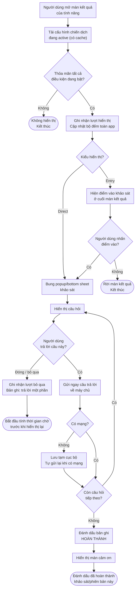
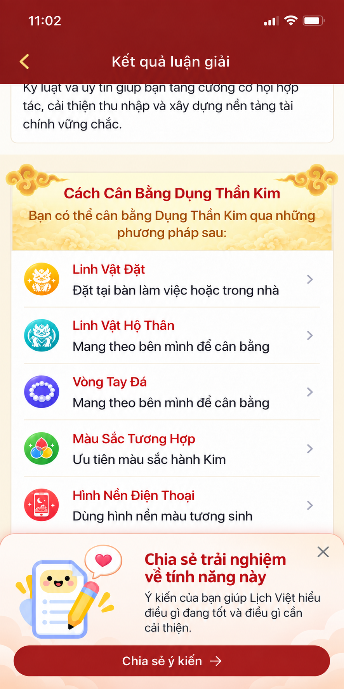

# BPRD: Khảo Sát Người Dùng Trong App (In-app Survey)

## 1. Thông tin tài liệu

| **Trường**  | **Nội dung**                                |
| ------------------- | -------------------------------------------------- |
| Tên dự án        | Khảo sát người dùng trong app (In-app Survey) |
| Người phụ trách | Đỗ Thị Hường                                  |
| Phiên bản         | v1.0                                               |
| Trạng thái        | Đang cập nhật                                   |

## Nhật ký thay đổi

| Ngày cập nhật | Phiên bản | Người thực hiện | Nội dung thay đổi                                              |
| ---------------- | ----------- | ------------------- | ----------------------------------------------------------------- |
| 2026-09-16       | v1.0        | Đỗ Thị Hường   | Khởi tạo tài liệu yêu cầu nghiệp vụ và sản phẩm (BPRD) |

---

## 2. Tổng Quan Kinh Doanh (Business Context)

### 2.1. Vấn Đề/Cơ Hội (Problem & Opportunity)

- **Vấn đề**: Hiện tại việc đánh giá một tính năng chủ yếu dựa trên số liệu hành vi (lượt xem, lượt nhấp, tỷ lệ chuyển đổi). Các chỉ số này cho biết người dùng **làm gì** nhưng không cho biết **vì sao**: nội dung luận giải có đúng với họ không, phần nào khó hiểu, vì sao dừng ở màn kết quả mà không nâng cấp. Khi cần quyết định nâng cấp tính năng, đội sản phẩm thiếu dữ liệu định tính từ chính người đã dùng thật.
- **Cơ hội**: Xây dựng một cơ chế khảo sát dùng chung, hỏi **đúng người – đúng lúc**: chỉ hỏi người dùng đã có đủ trải nghiệm thực tế với tính năng, ngay tại màn kết quả khi trải nghiệm còn nguyên vẹn trong đầu. Cơ chế này dùng lại được cho mọi tính năng, mỗi tính năng chỉ cần cấu hình mà không phát sinh phát triển mới.

### 2.2. Mục tiêu và KPIs

**Mục tiêu kinh doanh:**

* Rút ngắn thời gian phát hiện vấn đề của tính năng, giảm rủi ro đầu tư vào hướng nâng cấp sai.
* Tạo nguồn dữ liệu định tính thường xuyên phục vụ ưu tiên roadmap.

**Mục tiêu sản phẩm:**

* Thu thập ý kiến từ người dùng đã có đủ trải nghiệm thực tế với từng tính năng, làm cơ sở đánh giá mức độ sử dụng, phát hiện vấn đề và cải thiện/nâng cấp tính năng.
* Đảm bảo khảo sát **không gây phiền**: không làm gián đoạn việc đọc nội dung và không lặp lại quá mức trên toàn app.

**KPIs cốt lõi:**

| **Mã** | **Chỉ số (KPI)**              | **Định nghĩa / Cách tính**                                                                          | **Mục tiêu (Target)**               | **Tần suất đo** |
| :------------ | :------------------------------------ | :------------------------------------------------------------------------------------------------------------- | :------------------------------------------ | :----------------------- |
| **S01** | Tỷ lệ phản hồi (Response Rate)    | (Số khảo sát được trả lời ≥ 1 câu / Số lượt khảo sát được hiển thị) × 100%                | ≥ 20% (Direct), ≥ 8% (Entry)              | Theo chiến dịch        |
| **S02** | Tỷ lệ hoàn thành (Completion)     | (Số khảo sát hoàn thành toàn bộ câu hỏi / Số khảo sát bắt đầu trả lời) × 100%                | ≥ 70%                                      | Theo chiến dịch        |
| **S03** | Tỷ lệ nhấp điểm vào (Entry CTR) | (Số lượt nhấp điểm vào khảo sát / Số lượt hiển thị điểm vào) × 100%                          | ≥ 10%                                      | Theo chiến dịch        |
| **S04** | Tỷ lệ đóng ngay (Dismiss Rate)    | (Số lượt đóng khảo sát trong < 3 giây / Số lượt hiển thị) × 100%                                 | ≤ 30% (vượt ngưỡng ⇒ xem lại timing) | Theo chiến dịch        |
| **S05** | Ảnh hưởng tới tính năng gốc    | Chênh lệch tỷ lệ chuyển đổi/thời gian xem màn kết quả giữa nhóm thấy và không thấy khảo sát | Không suy giảm quá 2% tương đối      | Theo chiến dịch        |

### 2.3. Phạm Vi (Scope)

**Trong phạm vi (In-scope):**

* Cơ chế hiển thị, luật điều kiện, luật chống làm phiền dùng chung cho toàn app.
* Hai kiểu hiển thị: **Direct** (bung trực tiếp) và **Entry** (điểm vào khảo sát).
* Bộ dạng câu hỏi chuẩn: chọn 1, chọn nhiều, thang điểm (sao/1–5/1–10), câu hỏi mở.
* Cấu hình chiến dịch qua remote config: bật/tắt, đối tượng, thời gian chạy, cỡ mẫu.
* Lưu trữ phản hồi và tracking sự kiện phục vụ báo cáo.

**Ngoài phạm vi (Out-of-scope):**

* Khảo sát ngoài app (email, SMS, mạng xã hội).
* Khảo sát đặt ở màn hình không phải màn kết quả (màn chủ, màn nhập liệu) — sẽ cân nhắc ở phiên bản sau.
* Trả thưởng/quà tặng cho người tham gia khảo sát -> để sau, ai hoàn thành khảo sát mà quan tâm tới tính năng đó mà chưa được trải nghiệm thì có thể tặng xem miễn phí 1 lá số

---

## 3. Người Dùng Mục Tiêu (User Personas & JTBD)

### 3.1. Chân dung người dùng

* **Người dùng thân thiết của một tính năng**: đã mở tính năng nhiều lần, đọc kỹ kết quả. Đây là nhóm được hỏi — họ có đủ trải nghiệm để đánh giá chính xác.
* **Đội sản phẩm / BA**: người tạo và cấu hình chiến dịch khảo sát, đọc kết quả để ra quyết định nâng cấp.

### 3.2. Jobs-to-be-Done

* *Khi tôi vừa đọc xong kết quả và thấy có điểm chưa đúng với mình, tôi muốn nói ra ngay tại chỗ, để sản phẩm sửa cho lần sau.*
* *Khi tôi (BA) chuẩn bị nâng cấp một tính năng, tôi muốn biết người dùng thật đang vướng ở đâu, để không đầu tư vào thứ họ không cần.*

---

## 4. Yêu Cầu Nghiệp Vụ (Business Requirements)

### 4.1. Mô tả tổng quát

Mỗi tính năng có một cấu hình khảo sát riêng, gồm bộ điều kiện hiển thị và kiểu hiển thị.

**Từng điều kiện được bật/tắt độc lập theo từng tính năng.** Hệ thống chỉ kiểm tra những điều kiện đang bật; người dùng phải thỏa mãn **toàn bộ** các điều kiện đó mới đủ điều kiện nhận khảo sát.

Khi người dùng đang ở **màn kết quả** của tính năng và thỏa mãn đầy đủ các điều kiện đó, hệ thống hiển thị khảo sát hoặc điểm vào khảo sát theo kiểu đã cấu hình.

### 4.2. Luồng nghiệp vụ (Process Flow)

**Sơ đồ luồng (User Flow):**

**Diễn giải chi tiết:**

1. Người dùng mở màn kết quả của tính năng có gắn khảo sát.
2. App tải cấu hình chiến dịch đang active của tính năng đó (từ remote config, có cache), bao gồm **danh sách điều kiện đang bật** và tham số đi kèm.
3. App kiểm tra lần lượt **các điều kiện đang bật** tại mục 4.3; điều kiện đang tắt được bỏ qua hoàn toàn, không kiểm tra. Chỉ cần trượt 1 điều kiện đang bật ⇒ không hiển thị, kết thúc.
4. Đủ điều kiện ⇒ hiển thị theo `display_type`:
   - **Direct**: bung popup/bottom sheet khảo sát.
   - **Entry**: hiển thị điểm vào khảo sát; chỉ mở khảo sát đầy đủ khi người dùng chủ động nhấn.
5. Ghi nhận sự kiện hiển thị và cập nhật bộ đếm chống làm phiền toàn app **ngay tại thời điểm hiển thị** (kể cả khi người dùng không trả lời, và kể cả khi điều kiện 6/7 đang tắt — bộ đếm vẫn luôn được cập nhật để các chiến dịch khác dùng).
6. **Người dùng trả lời xong câu nào thì gửi ngay câu đó về máy chủ**, không chờ hoàn thành toàn bộ khảo sát. Mỗi lần gửi kèm `survey_id`, `version` và số thứ tự câu hỏi để máy chủ ghép vào cùng một bản ghi phản hồi.
7. Trả lời hết câu cuối → đánh dấu bản ghi là **hoàn thành** → hiển thị màn cảm ơn → đánh dấu đã hoàn thành khảo sát/phiên bản này.
8. Người dùng đóng/bỏ qua → ghi nhận lượt bỏ qua, bắt đầu tính thời gian chờ trước khi được hiển thị lại. Các câu đã trả lời trước đó **vẫn được giữ**, bản ghi ở trạng thái **trả lời một phần**.

### 4.3. Điều kiện hiển thị (Business Rules)

Mỗi điều kiện có một cờ bật/tắt riêng, cấu hình độc lập cho từng tính năng. **Chỉ kiểm tra các điều kiện đang bật; phải thỏa mãn đồng thời tất cả điều kiện đang bật thì mới hiển thị khảo sát.**

Cột **Mặc định** là trạng thái của điều kiện khi tạo một chiến dịch mới. Nguyên tắc: các điều kiện có tham số dùng chung được cho mọi tính năng thì **mặc định bật** (trạng thái an toàn, tránh làm phiền người dùng vì BA quên bật); các điều kiện có tham số phụ thuộc đặc thù từng tính năng thì **mặc định tắt**, buộc BA phải chủ động cân nhắc con số. Điều kiện không bật sẽ không được kiểm tra.

| **STT** | **Điều kiện**                                                                                                             | **Mã cấu hình** | **Nhóm**              | **Bật/tắt**               | **Mặc định** | **Lý do dùng điều kiện này**                                                                             |
| :------------ | :--------------------------------------------------------------------------------------------------------------------------------- | :----------------------- | :--------------------------- | :-------------------------------- | :-------------------- | :------------------------------------------------------------------------------------------------------------------- |
| 1             | Đã sử dụng tính năng ≥**X lần hợp lệ** trong **N ngày** gần nhất                                          | `cond_usage_count`     | Đủ trải nghiệm           | Bật/tắt được                 | **Tắt**        | Đảm bảo chỉ hỏi người đã dùng thật, đủ số lần để có ý kiến đáng tin.                           |
| 2             | Tổng thời gian xem màn kết quả trong**N ngày** gần nhất ≥ **Y phút**                                         | `cond_total_view_time` | Đủ trải nghiệm           | Bật/tắt được                 | **Tắt**        | Lọc tiếp nhóm chỉ mở lướt qua: dùng nhiều lần nhưng không thực sự đọc nội dung.                     |
| 3             | Phiên hiện tại đã ở màn kết quả ≥**Z giây**                                                                       | `cond_session_dwell`   | Đúng thời điểm          | Bật/tắt được                 | Bật                  | Tránh bung khảo sát ngay khi màn vừa hiển thị, lúc người dùng chưa đọc được gì để đánh giá.   |
| 4             | Chưa hoàn thành khảo sát/phiên bản khảo sát hiện tại                                                                    | `cond_not_completed`   | Không hỏi lại             | **Luôn bật (bắt buộc)** | Bật                  | Tránh hỏi lại người đã trả lời: một người trả lời nhiều lần làm cỡ mẫu ảo và gây phiền nặng. |
| 5             | Nếu từng đóng/bỏ qua khảo sát thì đã đủ thời gian cho phép hiển thị lại                                           | `cond_skip_wait`       | Không hỏi lại             | Bật/tắt được                 | Bật                  | Tôn trọng ý muốn từ chối: không hỏi lại ngay ở lần vào màn kết quả kế tiếp.                         |
| 6             | Trong ngày chưa hiển thị khảo sát nào khác                                                                                 | `cond_daily_cap`       | Chống làm phiền toàn app | Bật/tắt được*(xem lưu ý)*  | Bật                  | Giới hạn số khảo sát người dùng gặp trong một ngày, tính trên toàn app chứ không riêng tính năng. |
| 7             | Đã đủ khoảng cách tối thiểu**M ngày** kể từ lần gần nhất được hiển thị **bất kỳ** khảo sát nào | `cond_global_gap`      | Chống làm phiền toàn app | Bật/tắt được*(xem lưu ý)*  | Bật                  | Giãn tần suất giữa các đợt khảo sát của mọi tính năng, tránh dồn dập nhiều ngày liên tiếp.       |
| 8             | Khảo sát đang**active** và user thuộc đúng nhóm đối tượng cấu hình                                             | `cond_audience`        | Vòng đời chiến dịch     | **Luôn bật**              | Bật                  | Cho phép dừng chiến dịch từ xa và khoanh vùng đúng nhóm người dùng cần khảo sát.                     |

**Lưu ý nghiệp vụ quan trọng:**

* **Điều kiện 4 không được phép tắt.** Tắt điều kiện này đồng nghĩa hỏi lại người đã trả lời một cách vô hạn, làm hỏng dữ liệu (một người trả lời nhiều lần) và gây phiền nghiêm trọng. Muốn hỏi lại nhóm đã trả lời thì tăng `version` của khảo sát, không tắt điều kiện 4.
* **Điều kiện 6 và 7 là luật toàn app**, bộ đếm dùng chung cho tất cả chiến dịch. Về kỹ thuật vẫn tắt được theo từng tính năng, nhưng chỉ nên tắt trong trường hợp đặc biệt (ví dụ khảo sát nội bộ, chiến dịch chạy cho nhóm nhỏ có kiểm soát) và **phải được Product Owner duyệt**, vì tắt ở một tính năng sẽ khiến người dùng có thể nhận nhiều khảo sát trong cùng một ngày.
* **Bộ đếm hiển thị toàn app luôn được cập nhật** kể cả khi điều kiện 6/7 của chiến dịch đó đang tắt — để các chiến dịch khác vẫn tính đúng khoảng cách.
* **Bộ điều kiện tối thiểu**: điều kiện 1 và 2 mặc định tắt, nếu BA không bật cái nào thì khảo sát sẽ chạm cả người vừa dùng tính năng lần đầu, trái với mục tiêu "chỉ hỏi người đã có đủ trải nghiệm". Một chiến dịch hợp lệ phải bật tối thiểu: **điều kiện 3, 5, 6, 7 và ít nhất một trong hai điều kiện 1, 2**. Hệ thống cấu hình chặn lưu chiến dịch không đạt mức này, trừ khi có đánh dấu ngoại lệ đã được Product Owner duyệt.
* "Lần sử dụng hợp lệ" (điều kiện 1) do từng tính năng định nghĩa trong BRD của mình, nhưng tối thiểu phải là lượt **xem được màn kết quả thành công** — không tính lượt mở rồi thoát ngay.
* Khi hiển thị dạng **Entry**, lượt hiển thị điểm vào **vẫn tính** là một lượt hiển thị khảo sát cho điều kiện 6 và 7.

### 4.4. Bộ tham số mặc định

Mỗi điều kiện gồm một cờ bật/tắt (trạng thái mặc định xem bảng 4.3) và tham số đi kèm. Các giá trị dưới đây là giá trị dùng cho tham số khi điều kiện được bật mà không khai báo cụ thể:

| **Điều kiện** | **Cờ bật/tắt**  | **Tham số** | **Ý nghĩa**                                                                       | **Mặc định**  |
| :--------------------- | :----------------------- | :----------------- | :---------------------------------------------------------------------------------------- | :--------------------- |
| 1                      | `cond_usage_count`     | `X`              | Số lần sử dụng hợp lệ tối thiểu                                                   | 3 lần                 |
| 1, 2                   | —                       | `N`              | Cửa sổ thời gian xét trải nghiệm                                                    | 30 ngày               |
| 2                      | `cond_total_view_time` | `Y`              | Tổng thời gian xem màn kết quả tối thiểu trong N ngày                             | 3 phút                |
| 3                      | `cond_session_dwell`   | `Z`              | Thời gian ở màn kết quả trong phiên hiện tại                                      | 20 giây               |
| 5                      | `cond_skip_wait`       | `skip_wait_days` | Thời gian chờ trước khi được hiển thị lại, tính từ lần người dùng bỏ qua | 14 ngày               |
| 5                      | —                       | `max_skip`       | Số lần bỏ qua tối đa trước khi ngừng hỏi vĩnh viễn                             | 2 lần                 |
| 6                      | `cond_daily_cap`       | `daily_cap`      | Số khảo sát tối đa hiển thị trong 1 ngày (toàn app)                              | 1                      |
| 7                      | `cond_global_gap`      | `M`              | Khoảng cách tối thiểu giữa 2 lần hiển thị bất kỳ khảo sát                     | 30 ngày               |
| 8                      | `cond_audience`        | `audience`       | Nhóm đối tượng: free/premium, nền tảng, phiên bản app, vùng                     | Tất cả người dùng |

---

## 5. Đặc tả tính năng cốt lõi

### 5.1. Kiểu hiển thị (Display Type)

| **Kiểu**  | **Hành vi**                                                                                               |
| :--------------- | :--------------------------------------------------------------------------------------------------------------- |
| **Direct** | Đủ điều kiện thì bung trực tiếp popup/bottom sheet khảo sát.                                           |
| **Entry**  | Đủ điều kiện thì chỉ hiện điểm vào khảo sát; user chủ động nhấn mới mở khảo sát đầy đủ. |

**Khuyến nghị mặc định:**

* Dùng **Entry** cho các màn kết quả dài để tránh gián đoạn việc đọc.
* **Direct** chỉ dùng với survey ngắn hoặc trường hợp cần ưu tiên tỷ lệ phản hồi.

### 5.2. Dạng câu hỏi hỗ trợ

| **Dạng** | **Mô tả**                           | **Ghi chú**                                        |
| :-------------- | :------------------------------------------ | :-------------------------------------------------------- |
| Chọn 1         | Danh sách đáp án, chọn duy nhất       | Có thể cấu hình đáp án "Khác" kèm ô nhập       |
| Chọn nhiều    | Cho phép chọn nhiều đáp án            | Cấu hình được số lựa chọn tối đa                |
| Thang điểm    | Sao 1–5, thang 1–5 hoặc 1–10 (CSAT/NPS) | Kèm nhãn 2 đầu thang                                  |
| Câu hỏi mở   | Ô nhập văn bản tự do                   | Giới hạn ký tự; luôn để**không bắt buộc** |
| Nhị phân      | Hữu ích / Không hữu ích (👍 👎)        | Dùng cho micro-survey 1 câu                             |

**Quy tắc chung:** tối đa **5 câu** cho một khảo sát; câu hỏi mở luôn đặt cuối và không bắt buộc; người dùng phải đóng được khảo sát ở mọi bước. **Mỗi câu trả lời được gửi lên máy chủ ngay sau khi người dùng chọn/nhập xong**, nên dữ liệu vẫn thu được kể cả khi người dùng bỏ dở giữa chừng.

### 5.3. Cấu hình chiến dịch

Mỗi chiến dịch khảo sát gồm các trường:

| **Trường**        | **Mô tả**                                                                                                         |
| :------------------------ | :------------------------------------------------------------------------------------------------------------------------ |
| `survey_id`             | Mã định danh duy nhất, ví dụ`SV-KHNL-01`                                                                          |
| `feature_key`           | Tính năng gắn khảo sát                                                                                               |
| `version`               | Phiên bản khảo sát — đổi version ⇒ được phép hỏi lại người đã trả lời bản cũ                        |
| `display_type`          | `direct` hoặc `entry`                                                                                                |
| `placement`             | Vị trí đặt trên màn kết quả (với kiểu`entry`)                                                                 |
| `conditions`            | Danh sách điều kiện: mỗi điều kiện gồm cờ bật/tắt (`enabled`) và tham số đi kèm — xem mục 4.3 và 4.4 |
| `audience`              | Nhóm đối tượng: free/premium, nền tảng, phiên bản app, vùng                                                     |
| `questions`             | Danh sách câu hỏi theo các dạng tại 5.2                                                                             |
| `start_at` / `end_at` | Thời gian chạy chiến dịch                                                                                             |
| `sample_target`         | Cỡ mẫu mục tiêu — đạt đủ thì tự động dừng hiển thị                                                        |
| `status`                | `draft` / `active` / `paused` / `ended`                                                                           |

**Quy tắc vòng đời:** chiến dịch bật/tắt được từ xa mà không cần cập nhật app; khi đạt `sample_target` hoặc quá `end_at` thì tự chuyển `ended` và ngừng hiển thị; tại một thời điểm, **một tính năng chỉ có tối đa 1 chiến dịch active**.

---

## 6. Thiết kế

### 6.1. Khảo sát dạng Direct (Popup / Bottom Sheet)

- **Link thiết kế**: (sẽ cập nhật)
- **Yêu cầu**: 

### 6.2. Điểm vào khảo sát dạng Entry

- **Link thiết kế**: (sẽ cập nhật)
- **Yêu cầu**: dạng thẻ/dải đặt cuối nội dung màn kết quả, không che hết nội dung, không nổi đè (floating); có thể ẩn đi khi người dùng đóng.

**Ví dụ minh họa:**

### 6.3. Màn cảm ơn (Thank-you State)

- **Yêu cầu**: xác nhận đã ghi nhận phản hồi, tự đóng sau vài giây hoặc có nút đóng; không dẫn sang bán hàng/nâng cấp trong màn này.

---

## 7. Yêu cầu phi chức năng (Kỹ thuật)

- **Hiệu năng**: việc kiểm tra điều kiện hiển thị chạy bất đồng bộ, không được làm chậm quá trình dựng màn kết quả; cấu hình chiến dịch phải có cache cục bộ để màn kết quả không phải chờ mạng.
- **Quyền riêng tư**: không thu thập thông tin định danh cá nhân trong câu trả lời mở; có thông báo ngắn về mục đích thu thập; phản hồi gắn với ID người dùng ẩn danh phục vụ phân tích.
- **Độ tin cậy**: mỗi câu trả lời được gửi ngay khi người dùng hoàn tất câu đó; khi mất mạng thì lưu tạm cục bộ và gửi lại khi có mạng. Máy chủ ghép các câu vào cùng một bản ghi theo `survey_id` + `version` + ID người dùng, và phải chịu được gửi lại cùng một câu nhiều lần (idempotent) — câu gửi sau ghi đè câu gửi trước, không tạo bản ghi mới.
- **Log & Tracking**: gắn sự kiện tại các điểm `survey_eligible`, `survey_impression`, `survey_entry_clicked`, `survey_started`, `survey_question_answered` (bắn mỗi lần gửi một câu trả lời), `survey_completed`, `survey_dismissed`. Mỗi sự kiện kèm `survey_id`, `feature_key`, `version`, `display_type`; riêng `survey_question_answered` kèm thêm số thứ tự câu hỏi.

---

## 8. Trường hợp ngoại lệ (Edge Cases)

- **Mất mạng khi đang trả lời**: cho phép trả lời tiếp bình thường, các câu chưa gửi được xếp hàng chờ và tự gửi lại khi có mạng; không hiển thị lỗi làm người dùng bỏ dở.
- **Thoát giữa chừng**: các câu đã trả lời đều đã được gửi lên nên **không mất dữ liệu**; bản ghi ở trạng thái **trả lời một phần** và vẫn được tính vào kết quả phân tích. Lần sau không hỏi lại từ đầu cho tới khi hết thời gian chờ `skip_wait_days`.
- **Trả lời lại một câu đã gửi**: nếu người dùng quay lại sửa đáp án của câu trước, gửi lại câu đó và máy chủ ghi đè giá trị cũ, không tạo thêm bản ghi.
- **Trùng nhiều khảo sát trong một phiên**: khi 2 tính năng cùng đủ điều kiện, ưu tiên khảo sát có `start_at` sớm hơn; khảo sát còn lại lùi theo `daily_cap`.
- **Xung đột với popup khác**: khảo sát **không được** hiển thị chồng lên paywall, popup nâng cấp, popup đánh giá app (rate app) hoặc thông báo hệ thống; khi có xung đột, khảo sát nhường và không tính là một lượt hiển thị.
- **Người dùng đã bỏ qua `max_skip` lần**: ngừng hỏi vĩnh viễn với `survey_id` đó, kể cả khi các điều kiện khác đều thỏa mãn.
- **Đổi thiết bị / cài lại app**: bộ đếm trải nghiệm và lịch sử hiển thị đồng bộ theo tài khoản; với người dùng chưa đăng nhập, chấp nhận tính lại từ đầu trên thiết bị mới.
- **Chiến dịch bị tắt khi người dùng đang trả lời**: cho phép hoàn thành và vẫn ghi nhận phản hồi.

---

## 9. Kế hoạch ra mắt & Go-to-Market

- **Giai đoạn 1 (Alpha)**: hoàn thiện cơ chế nền tảng, test nội bộ toàn bộ 8 điều kiện hiển thị và luật chống làm phiền bằng cấu hình rút gọn.
- **Giai đoạn 2 (Pilot)**: chạy chiến dịch đầu tiên trên **1 tính năng duy nhất** với kiểu **Entry**, rollout 10–20% người dùng, theo dõi S01–S06 (đặc biệt S06 — ảnh hưởng tới tính năng gốc).
- **Giai đoạn 3 (Mở rộng)**: mở cho các tính năng còn lại; mỗi tính năng khai báo cấu hình trong BRD/BPRD của mình theo mẫu tại mục 10.

---

## 10. Cấu hình khảo sát theo từng tính năng

Toàn bộ cấu hình khảo sát của mọi tính năng được khai báo tập trung tại mục này. Tài liệu BRD/BPRD của từng tính năng **không chứa cấu hình**, chỉ cần một dòng ánh xạ:

> **Khảo sát trong tính năng**: tính năng này có khảo sát in-app. Cấu hình chi tiết xem [[BPRD-002-KhaoSatInApp#10. Cấu hình khảo sát theo từng tính năng]].

Cách làm này giúp xếp lịch các chiến dịch cạnh nhau để kiểm tra xung đột — điều kiện 6 và 7 là luật toàn app, không thể kiểm tra được nếu cấu hình nằm rải rác ở nhiều tài liệu.

### 10.1. Bảng tổng quan các chiến dịch

| Mã khảo sát | Tính năng               | Kiểu hiển thị | Thời gian chạy | Cỡ mẫu | Trạng thái |
| :------------- | :------------------------ | :--------------- | :--------------- | :------- | :----------- |
| `SV-KHNL-01` | Kích Hoạt Năng Lượng | Entry            | 01/10 – 31/10   | 500      | draft        |

> Trước khi bật một chiến dịch mới, đối chiếu bảng này để đảm bảo không trùng thời gian chạy với chiến dịch khác của cùng nhóm người dùng.

### 10.2. Mẫu khai báo cho một tính năng

Mỗi tính năng có khảo sát được khai báo thành một tiểu mục `10.x` theo mẫu dưới đây.

**a. Thông tin chiến dịch**

| Trường            | Giá trị                       |
| :------------------ | :------------------------------ |
| Mã khảo sát      | `SV-XXX-01`                   |
| Tính năng         | (tên tính năng)              |
| Màn áp dụng      | Màn kết quả của tính năng |
| Kiểu hiển thị    | Entry                           |
| Vị trí đặt      | Cuối màn kết quả            |
| Đối tượng       | Free + Premium                  |
| Thời gian chạy    | 01/10 – 31/10                  |
| Cỡ mẫu mục tiêu | 500                             |
| Trạng thái        | draft                           |

**b. Cấu hình điều kiện hiển thị** (điền theo trạng thái mặc định ở bảng 4.3, đánh dấu ✅ vào điều kiện áp dụng và ghi tham số tương ứng)

| STT | Điều kiện                                            | Bật?              | Tham số                               |
| :-- | :------------------------------------------------------ | :----------------- | :------------------------------------- |
| 1   | Số lần sử dụng hợp lệ trong N ngày               | ✅                 | X = 3, N = 30 ngày                    |
| 2   | Tổng thời gian xem màn kết quả trong N ngày       | ✅                 | Y = 3 phút                            |
| 3   | Thời gian ở màn kết quả trong phiên hiện tại    | ✅                 | Z = 20 giây                           |
| 4   | Chưa hoàn thành khảo sát/phiên bản hiện tại    | ✅*(bắt buộc)* | —                                     |
| 5   | Thời gian chờ sau khi người dùng bỏ qua           | ✅                 | Chờ 14 ngày, tối đa 2 lần bỏ qua |
| 6   | Trong ngày chưa hiển thị khảo sát nào khác      | ✅                 | 1 khảo sát/ngày                     |
| 7   | Khoảng cách tối thiểu kể từ khảo sát gần nhất | ✅                 | M = 30 ngày                           |
| 8   | Đúng nhóm đối tượng cấu hình                   | ✅                 | Free + Premium                         |

**c. Bộ câu hỏi**

| STT | Câu hỏi                 | Dạng đáp án | Đáp án             | Bắt buộc |
| :-- | :------------------------ | :-------------- | :-------------------- | :--------- |
| 1   | (nội dung câu hỏi)     | Chọn 1         | (liệt kê đáp án) | Có        |
| 2   | (câu hỏi mở, nếu có) | Câu hỏi mở   | —                    | Không     |
