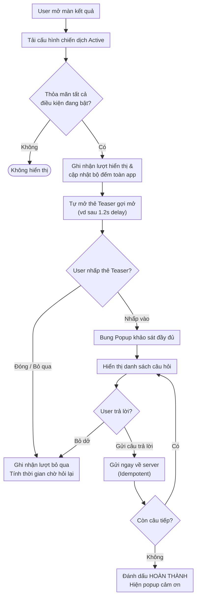
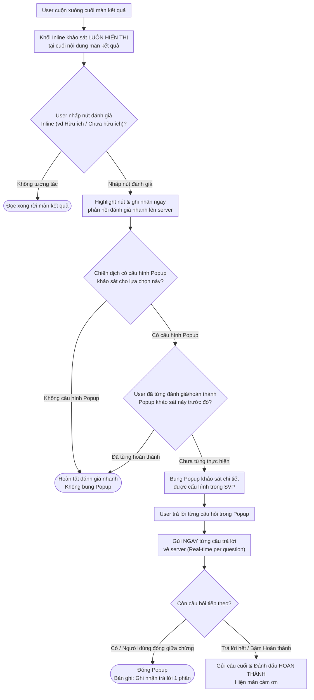
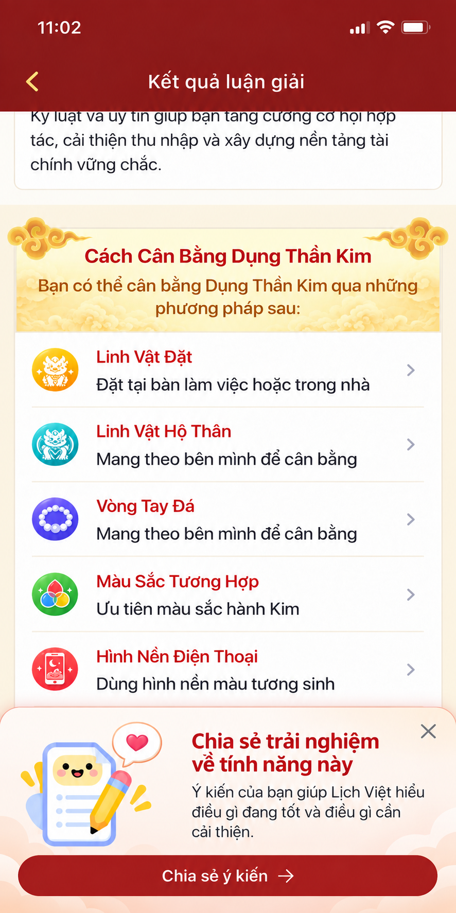
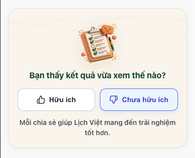

# BPRD: Khảo Sát Người Dùng Trong App (In-app Survey)

## 1. Thông tin tài liệu

| **Trường**  | **Nội dung**                                |
| ------------------- | -------------------------------------------------- |
| Tên dự án        | Khảo sát người dùng trong app (In-app Survey) |
| Người phụ trách | Đỗ Thị Hường                                  |
| Phiên bản         | v1.4                                               |
| Trạng thái        | Đang cập nhật                                   |

## Nhật ký thay đổi

| Ngày cập nhật | Phiên bản | Người thực hiện | Nội dung thay đổi                                                                                                                                                                               |
| ---------------- | ----------- | ------------------- | -------------------------------------------------------------------------------------------------------------------------------------------------------------------------------------------------- |
| 2026-09-16       | v1.0        | Đỗ Thị Hường   | Khởi tạo tài liệu yêu cầu nghiệp vụ và sản phẩm (BPRD)                                                                                                                                  |
| 2026-09-17       | v1.1        | Đỗ Thị Hường   | Bổ sung khảo sát theo tập người dùng (segment) và thứ tự ưu tiên; tách cấu hình từng tính năng ra Kế hoạch khảo sát (SVP) riêng, mục 10 chuyển thành danh mục toàn app |
| 2026-09-18       | v1.2        | Đỗ Thị Hường   | Bổ sung điều kiện 9: khoảng cách tối thiểu giữa 2 khảo sát của cùng một tính năng                                                                                                  |
| 2026-10-01       | v1.3        | Đỗ Thị Hường   | Bổ sung hình thức khảo sát Inline ở cuối màn kết quả thuộc dạng Entry (cố định/cuộn cuối màn kết quả kèm nút đánh giá nhanh)                                              |
| 2026-10-01       | v1.4        | Đỗ Thị Hường   | Quy chuẩn nguyên tắc gửi dữ liệu thời gian thực cho tất cả popup khảo sát: cứ trả lời/chọn xong câu nào là ghi nhận ngay câu đó về hệ thống, không chờ trả lời xong hết mới gửi |

---

## 2. Tổng Quan Kinh Doanh (Business Context)

### 2.1. Vấn Đề/Cơ Hội (Problem & Opportunity)

- **Vấn đề**: Hiện tại việc đánh giá một tính năng chủ yếu dựa trên số liệu hành vi (lượt xem, lượt nhấp, tỷ lệ chuyển đổi). Các chỉ số này cho biết người dùng **làm gì** nhưng không cho biết **vì sao**: nội dung luận giải có đúng với họ không, phần nào khó hiểu, vì sao dừng ở màn kết quả mà không nâng cấp. Khi cần quyết định nâng cấp tính năng, đội sản phẩm thiếu dữ liệu định tính từ chính người đã dùng thật.
- **Cơ hội**: Xây dựng một cơ chế khảo sát dùng chung, hỏi **đúng người – đúng lúc**: chỉ hỏi người dùng đã có đủ trải nghiệm thực tế với tính năng, ngay tại màn kết quả khi trải nghiệm còn nguyên vẹn trong đầu. Cơ chế này dùng lại được cho mọi tính năng, mỗi tính năng chỉ cần cấu hình mà không phát sinh phát triển mới.

### 2.2. Mục tiêu và KPIs

**Mục tiêu kinh doanh:**

* Rút ngắn thời gian phát hiện vấn đề của tính năng, giảm rủi ro đầu tư vào hướng nâng cấp sai.
* Tạo nguồn dữ liệu định tính thường xuyên phục vụ ưu tiên roadmap.

**Mục tiêu sản phẩm:**

* Thu thập ý kiến từ người dùng đã có đủ trải nghiệm thực tế với từng tính năng, làm cơ sở đánh giá mức độ sử dụng, phát hiện vấn đề và cải thiện/nâng cấp tính năng.
* Đảm bảo khảo sát **không gây phiền**: không làm gián đoạn việc đọc nội dung và không lặp lại quá mức trên toàn app.

**KPIs cốt lõi:**

| **Mã** | **Chỉ số (KPI)**              | **Định nghĩa / Cách tính**                                                                          | **Mục tiêu (Target)**               | **Tần suất đo** |
| :------------ | :------------------------------------ | :------------------------------------------------------------------------------------------------------------- | :------------------------------------------ | :----------------------- |
| **S01** | Tỷ lệ phản hồi (Response Rate)    | (Số khảo sát được trả lời ≥ 1 câu / Số lượt khảo sát được hiển thị) × 100%                | ≥ 20% (Direct), ≥ 8% (Entry)              | Theo chiến dịch        |
| **S02** | Tỷ lệ hoàn thành (Completion)     | (Số khảo sát hoàn thành toàn bộ câu hỏi / Số khảo sát bắt đầu trả lời) × 100%                | ≥ 70%                                      | Theo chiến dịch        |
| **S03** | Tỷ lệ nhấp điểm vào (Entry CTR) | (Số lượt nhấp điểm vào khảo sát / Số lượt hiển thị điểm vào) × 100%                          | ≥ 10%                                      | Theo chiến dịch        |
| **S04** | Tỷ lệ đóng ngay (Dismiss Rate)    | (Số lượt đóng khảo sát trong < 3 giây / Số lượt hiển thị) × 100%                                 | ≤ 30% (vượt ngưỡng ⇒ xem lại timing) | Theo chiến dịch        |
| **S05** | Ảnh hưởng tới tính năng gốc    | Chênh lệch tỷ lệ chuyển đổi/thời gian xem màn kết quả giữa nhóm thấy và không thấy khảo sát | Không suy giảm quá 2% tương đối      | Theo chiến dịch        |

### 2.3. Phạm Vi (Scope)

**Trong phạm vi (In-scope):**

* Cơ chế hiển thị, luật điều kiện, luật chống làm phiền dùng chung cho toàn app.
* Hai kiểu hiển thị: **Direct** (bung trực tiếp) và **Entry** (điểm vào khảo sát).
* Bộ dạng câu hỏi chuẩn: chọn 1, chọn nhiều, thang điểm (sao/1–5/1–10), câu hỏi mở.
* Cấu hình chiến dịch qua remote config: bật/tắt, đối tượng, thời gian chạy, cỡ mẫu.
* Lưu trữ phản hồi và tracking sự kiện phục vụ báo cáo.

**Ngoài phạm vi (Out-of-scope):**

* Khảo sát ngoài app (email, SMS, mạng xã hội).
* Khảo sát đặt ở màn hình không phải màn kết quả (màn chủ, màn nhập liệu) — sẽ cân nhắc ở phiên bản sau.
* Trả thưởng/quà tặng cho người tham gia khảo sát -> để sau, ai hoàn thành khảo sát mà quan tâm tới tính năng đó mà chưa được trải nghiệm thì có thể tặng xem miễn phí 1 lá số

---

## 3. Người Dùng Mục Tiêu (User Personas & JTBD)

### 3.1. Chân dung người dùng

* **Người dùng thân thiết của một tính năng**: đã mở tính năng nhiều lần, đọc kỹ kết quả. Đây là nhóm được hỏi — họ có đủ trải nghiệm để đánh giá chính xác.
* **Đội sản phẩm / BA**: người tạo và cấu hình chiến dịch khảo sát, đọc kết quả để ra quyết định nâng cấp.

### 3.2. Jobs-to-be-Done

* *Khi tôi vừa đọc xong kết quả và thấy có điểm chưa đúng với mình, tôi muốn nói ra ngay tại chỗ, để sản phẩm sửa cho lần sau.*
* *Khi tôi (BA) chuẩn bị nâng cấp một tính năng, tôi muốn biết người dùng thật đang vướng ở đâu, để không đầu tư vào thứ họ không cần.*

---

## 4. Yêu Cầu Nghiệp Vụ (Business Requirements)

### 4.1. Mô tả tổng quát

Mỗi tính năng có một cấu hình khảo sát riêng, gồm bộ điều kiện hiển thị và kiểu hiển thị.

**Từng điều kiện được bật/tắt độc lập theo từng tính năng.** Hệ thống chỉ kiểm tra những điều kiện đang bật; người dùng phải thỏa mãn **toàn bộ** các điều kiện đó mới đủ điều kiện nhận khảo sát.

Khi người dùng đang ở **màn kết quả** của tính năng và thỏa mãn đầy đủ các điều kiện đó, hệ thống hiển thị khảo sát hoặc điểm vào khảo sát theo kiểu đã cấu hình.

### 4.2. Luồng nghiệp vụ (Process Flow)

Mô hình khảo sát dạng Entry hỗ trợ **2 luồng độc lập hoàn toàn** về tiếp cận, hiển thị và hành vi tương tác trên màn kết quả:

---

#### 4.2.1. Luồng A: Khảo sát dạng Entry - Teaser Card (Thẻ gợi mở tự bung)

Luồng này dành cho trường hợp dùng thẻ thông báo/popup nhỏ tự mở nhẹ nhàng từ dưới lên

```mermaid
%%{init: {"themeVariables": {"fontSize": "12px"}, "flowchart": {"nodeSpacing": 25, "rankSpacing": 30, "padding": 6}}}%%
flowchart TD
    A1["User mở màn kết quả"] --> B1["Tải cấu hình chiến dịch Active"]
    B1 --> C1{"Thỏa mãn tất cả<br/>điều kiện đang bật?"}
    C1 -- "Không" --> Z1(["Không hiển thị"])
    C1 -- "Có" --> D1["Ghi nhận lượt hiển thị &<br/>cập nhật bộ đếm toàn app"]
    D1 --> E1["Tự mở thẻ Teaser gợi mở<br/>(vd sau 1.2s delay)"]
    E1 --> F1{"User nhấp thẻ Teaser?"}
    F1 -- "Đóng / Bỏ qua" --> X1["Ghi nhận lượt bỏ qua<br/>Tính thời gian chờ hỏi lại"]
    F1 -- "Nhấp vào" --> G1["Bung Popup khảo sát đầy đủ"]
    G1 --> H1["Hiển thị danh sách câu hỏi"]
    H1 --> I1{"User trả lời?"}
    I1 -- "Bỏ dở" --> X1
    I1 -- "Gửi câu trả lời" --> J1["Gửi ngay về server<br/>(Idempotent)"]
    J1 --> K1{"Còn câu tiếp?"}
    K1 -- "Có" --> H1
    K1 -- "Không" --> L1["Đánh dấu HOÀN THÀNH<br/>Hiện popup cảm ơn"]
```

**Diễn giải chi tiết Luồng A (Teaser Card):**

1. Người dùng mở màn kết quả của tính năng và đủ điều kiện hiển thị.
2. Hệ thống chờ khoảng delay cấu hình (ví dụ 1.2s) rồi tự mở nhẹ nhàng thẻ Teaser Card ở góc màn hình (*"Bạn còn băn khoăn điều gì về kết quả này?"*).
3. Nếu người dùng nhấp vào thẻ Teaser ➔ Bung Popup khảo sát đầy đủ.
4. Người dùng chọn câu trả lời ➔ Gửi ngay dữ liệu về máy chủ.
5. Hoàn thành toàn bộ câu hỏi ➔ Đánh dấu hoàn thành & mở popup cảm ơn.
6. Nếu người dùng bấm đóng/bỏ qua ➔ Ghi nhận lượt bỏ qua và tính thời gian chờ trước khi xét hỏi lại (`skip_wait_days`).

---

#### 4.2.2. Luồng B: Khảo sát dạng Entry - Inline Card (Khối khảo sát cuối màn kết quả)

Khối Inline Khảo sát là **thành phần giao diện mặc định luôn hiển thị** ở cuối nội dung màn kết quả của tính năng (không phụ thuộc cờ chặn daily cap hay thời gian giãn cách). Khối này cho phép người dùng đánh giá cảm nhận nhanh (ví dụ *Hữu ích / Chưa hữu ích*) và linh hoạt mở popup khảo sát chi tiết dựa theo cấu hình chiến dịch trong SVP:

```mermaid
%%{init: {"themeVariables": {"fontSize": "12px"}, "flowchart": {"nodeSpacing": 25, "rankSpacing": 30, "padding": 6}}}%%
flowchart TD
    A2["User cuộn xuống cuối màn kết quả"] --> E2["Khối Inline khảo sát LUÔN HIỂN THỊ<br/>tại cuối nội dung màn kết quả"]
    E2 --> F2{"User nhấp nút đánh giá<br/>Inline (vd Hữu ích / Chưa hữu ích)?"}
    F2 -- "Không tương tác" --> Z2_EXIT(["Đọc xong rời màn kết quả"])
  
    F2 -- "Nhấp nút đánh giá" --> G2_LOG["Highlight nút & ghi nhận ngay<br/>phản hồi đánh giá nhanh lên server"]
    G2_LOG --> H2{"Chiến dịch có cấu hình Popup<br/>khảo sát cho lựa chọn này?"}
  
    H2 -- "Không cấu hình Popup" --> K2_END(["Hoàn tất đánh giá nhanh<br/>Không bung Popup"])
    H2 -- "Có cấu hình Popup" --> I2{"User đã từng đánh giá/hoàn thành<br/>Popup khảo sát này trước đó?"}
  
    I2 -- "Đã từng hoàn thành" --> K2_END
    I2 -- "Chưa từng thực hiện" --> J2["Bung Popup khảo sát chi tiết<br/>được cấu hình trong SVP"]
  
    J2 --> M2["User trả lời từng câu hỏi trong Popup"]
    M2 --> N2["Gửi NGAY từng câu trả lời<br/>về server (Real-time per question)"]
    N2 --> O2{"Còn câu hỏi tiếp theo?"}
    O2 -- "Có / Người dùng đóng giữa chừng" --> P2_PARTIAL(["Đóng Popup<br/>Bản ghi: Ghi nhận trả lời 1 phần"])
    O2 -- "Trả lời hết / Bấm Hoàn thành" --> P2["Gửi câu cuối & Đánh dấu HOÀN THÀNH<br/>Hiện màn cảm ơn"]
```

**Diễn giải chi tiết Luồng B (Inline Card):**

1. Người dùng mở và cuộn xuống cuối màn hình kết quả của tính năng.
2. **Quy tắc hiển thị**: Khối Inline Khảo sát **LUÔN LUÔN HIỂN THỊ** sẵn tại vị trí cuối nội dung màn kết quả (gồm hình minh họa, câu hỏi đánh giá nhanh và các nút lựa chọn như *Hữu ích / Chưa hữu ích*).
3. Khối inline nằm tĩnh ở cuối màn hình, thẩm mỹ sang trọng, không che chắn nội dung đọc và không làm gián đoạn người dùng.
4. **Xử lý tương tác đánh giá nhanh & điều kiện bung Popup khảo sát chi tiết:**
   - Khi người dùng nhấp nút lựa chọn inline (ví dụ *Hữu ích* hoặc *Chưa hữu ích*), hệ thống highlight nút và ghi nhận ngay phản hồi đánh giá nhanh.
   - **Kiểm tra cấu hình chiến dịch (trong SVP)**: Tùy theo cấu hình tính năng có gắn bộ câu hỏi popup cho nút lựa chọn đó hay không.
     - **Nếu KHÔNG cấu hình popup**: Hệ thống dừng ở bước ghi nhận đánh giá nhanh, **không bung popup khảo sát**.
     - **Nếu CÓ cấu hình popup**: Hệ thống kiểm tra tiếp lịch sử người dùng.
       - **Trường hợp đã từng trả lời/hoàn thành popup khảo sát này trước đó**: Hệ thống **KHÔNG hiển thị lại popup khảo sát** nữa (để tránh làm phiền).
       - **Trường hợp chưa từng thực hiện**: Hệ thống tự động bung Popup khảo sát chi tiết tương ứng với nội dung cấu hình trong file SVP của tính năng.
5. **Gửi dữ liệu thời gian thực (Real-time submission per question)**: Mọi Popup khảo sát đều tuân thủ nguyên tắc đồng nhất: **trả lời/chọn xong câu nào là hệ thống tự động ghi nhận ngay câu đó lên máy chủ**, không bắt buộc chờ trả lời hết toàn bộ mới gửi.
   - Khi hoàn thành câu cuối hoặc nhấn nút gửi ➔ Hệ thống ghi nhận câu cuối, đánh dấu **Hoàn thành**, hiển thị màn cảm ơn (tự đóng sau vài giây).
   - Nếu người dùng đóng popup hoặc thoát ứng dụng giữa chừng ➔ Các câu đã trả lời trước đó đều đã được hệ thống lưu trữ đầy đủ dưới dạng bản ghi *Trả lời một phần*.
6. Nếu người dùng không nhấp nút đánh giá ➔ Khối inline vẫn giữ nguyên ở cuối màn kết quả một cách tự nhiên, không phát sinh lỗi hay thông báo phiền hà.

### 4.3. Điều kiện hiển thị (Business Rules)

Mỗi điều kiện có một cờ bật/tắt riêng, cấu hình độc lập cho từng tính năng. **Chỉ kiểm tra các điều kiện đang bật; phải thỏa mãn đồng thời tất cả điều kiện đang bật thì mới hiển thị khảo sát.**

Cột **Mặc định** là trạng thái của điều kiện khi tạo một chiến dịch mới. Nguyên tắc: các điều kiện có tham số dùng chung được cho mọi tính năng thì **mặc định bật** (trạng thái an toàn, tránh làm phiền người dùng vì BA quên bật); các điều kiện có tham số phụ thuộc đặc thù từng tính năng thì **mặc định tắt**, buộc BA phải chủ động cân nhắc con số. Điều kiện không bật sẽ không được kiểm tra.

| **STT** | **Điều kiện**                                                                                                                            | **Mã cấu hình** | **Nhóm**                     | **Bật/tắt**               | **Mặc định** | **Lý do dùng điều kiện này**                                                                                                                                                     |
| :------------ | :------------------------------------------------------------------------------------------------------------------------------------------------ | :----------------------- | :---------------------------------- | :-------------------------------- | :-------------------- | :------------------------------------------------------------------------------------------------------------------------------------------------------------------------------------------- |
| 1             | Đã sử dụng tính năng ≥**X lần hợp lệ** trong **N ngày** gần nhất                                                         | `cond_usage_count`     | Đủ trải nghiệm                  | Bật/tắt được                 | **Tắt**        | Đảm bảo chỉ hỏi người đã dùng thật, đủ số lần để có ý kiến đáng tin.                                                                                                   |
| 2             | Tổng thời gian xem màn kết quả trong**N ngày** gần nhất ≥ **Y phút**                                                        | `cond_total_view_time` | Đủ trải nghiệm                  | Bật/tắt được                 | **Tắt**        | Lọc tiếp nhóm chỉ mở lướt qua: dùng nhiều lần nhưng không thực sự đọc nội dung.                                                                                             |
| 3             | Phiên hiện tại đã ở màn kết quả ≥**Z giây**                                                                                      | `cond_session_dwell`   | Đúng thời điểm                 | Bật/tắt được                 | Bật                  | Tránh bung khảo sát ngay khi màn vừa hiển thị, lúc người dùng chưa đọc được gì để đánh giá.                                                                           |
| 4             | Chưa hoàn thành khảo sát/phiên bản khảo sát hiện tại                                                                                   | `cond_not_completed`   | Không hỏi lại                    | **Luôn bật (bắt buộc)** | Bật                  | Tránh hỏi lại người đã trả lời: một người trả lời nhiều lần làm cỡ mẫu ảo và gây phiền nặng.                                                                         |
| 5             | Nếu từng đóng/bỏ qua khảo sát thì đã đủ thời gian cho phép hiển thị lại                                                          | `cond_skip_wait`       | Không hỏi lại                    | Bật/tắt được                 | Bật                  | Tôn trọng ý muốn từ chối: không hỏi lại ngay ở lần vào màn kết quả kế tiếp.                                                                                                 |
| 6             | Trong ngày chưa hiển thị khảo sát nào khác                                                                                                | `cond_daily_cap`       | Chống làm phiền toàn app        | Bật/tắt được*(xem lưu ý)*  | Bật                  | Giới hạn số khảo sát người dùng gặp trong một ngày, tính trên toàn app chứ không riêng tính năng.                                                                         |
| 7             | Đã đủ khoảng cách tối thiểu**M ngày** kể từ lần gần nhất được hiển thị **bất kỳ** khảo sát nào                | `cond_global_gap`      | Chống làm phiền toàn app        | Bật/tắt được*(xem lưu ý)*  | Bật                  | Giãn tần suất giữa các đợt khảo sát của mọi tính năng, tránh dồn dập nhiều ngày liên tiếp.                                                                               |
| 8             | Khảo sát đang**active**, user thuộc đúng nhóm đối tượng và **tập người dùng (segment)** cấu hình                    | `cond_audience`        | Vòng đời chiến dịch            | **Luôn bật**              | Bật                  | Cho phép dừng chiến dịch từ xa và khoanh vùng đúng nhóm người dùng cần khảo sát.                                                                                             |
| 9             | Đã đủ khoảng cách tối thiểu**K ngày** kể từ lần gần nhất được hiển thị khảo sát **của chính tính năng này** | `cond_feature_gap`     | Chống làm phiền theo tính năng | Bật/tắt được*(xem lưu ý)*  | Bật                  | Một tính năng có nhiều chiến dịch theo tập; nếu không giãn, người dùng có thể bị hỏi liên tiếp về cùng một tính năng khi họ chuyển từ tập này sang tập khác. |

**Lưu ý nghiệp vụ quan trọng:**

* **Điều kiện 4 không được phép tắt.** Tắt điều kiện này đồng nghĩa hỏi lại người đã trả lời một cách vô hạn, làm hỏng dữ liệu (một người trả lời nhiều lần) và gây phiền nghiêm trọng. Muốn hỏi lại nhóm đã trả lời thì tăng `version` của khảo sát, không tắt điều kiện 4.
* **Điều kiện 6 và 7 là luật toàn app**, bộ đếm dùng chung cho tất cả chiến dịch. Về kỹ thuật vẫn tắt được theo từng tính năng, nhưng chỉ nên tắt trong trường hợp đặc biệt (ví dụ khảo sát nội bộ, chiến dịch chạy cho nhóm nhỏ có kiểm soát) và **phải được Product Owner duyệt**, vì tắt ở một tính năng sẽ khiến người dùng có thể nhận nhiều khảo sát trong cùng một ngày.
* **Điều kiện 9 giãn khảo sát trong cùng một tính năng.** Bộ đếm tính theo `feature_key`, dùng chung cho **mọi chiến dịch của tính năng đó** (kể cả khác `survey_id`, khác tập người dùng, khác `version`). Nguyên tắc đặt tham số: **K ≥ M** (điều kiện 7) — khoảng cách trong cùng một tính năng không được ngắn hơn khoảng cách toàn app; nếu đặt K < M thì điều kiện 7 vẫn chặn trước, K không có tác dụng. Chỉ nên tắt điều kiện 9 khi các chiến dịch của tính năng nhắm vào những tập **loại trừ hoàn toàn** nhau và cần thu mẫu nhanh, và **phải được Product Owner duyệt**.
* **Bộ đếm hiển thị toàn app và bộ đếm theo tính năng luôn được cập nhật** kể cả khi điều kiện 6/7/9 của chiến dịch đó đang tắt — để các chiến dịch khác vẫn tính đúng khoảng cách.
* **Bộ điều kiện tối thiểu**: điều kiện 1 và 2 mặc định tắt, nếu BA không bật cái nào thì khảo sát sẽ chạm cả người vừa dùng tính năng lần đầu, trái với mục tiêu "chỉ hỏi người đã có đủ trải nghiệm". Một chiến dịch hợp lệ phải bật tối thiểu: **điều kiện 3, 5, 6, 7, 9 và ít nhất một trong hai điều kiện 1, 2**. Hệ thống cấu hình chặn lưu chiến dịch không đạt mức này, trừ khi có đánh dấu ngoại lệ đã được Product Owner duyệt. Trường hợp ngoại lệ điển hình: tập người dùng đã tự bao hàm yêu cầu trải nghiệm (ví dụ "đã mua gói và xem 1–3 lần"), hoặc chủ đích khảo sát chính nhóm chưa có đủ trải nghiệm (ví dụ tập "vào nhanh – thoát nhanh") — lý do phải ghi rõ trong Kế hoạch khảo sát (SVP) của tính năng.
* **Tập người dùng (segment)**: mỗi chiến dịch có thể nhắm vào một tập hành vi do tính năng định nghĩa trong SVP của mình (ví dụ: chưa mua gói, đã mua và dùng thường xuyên, xem vật phẩm nhưng chưa mua). Điều kiện nhận diện tập được kiểm tra cùng điều kiện 8; tập người dùng được xác định **tại thời điểm kiểm tra**, nên một người có thể chuyển tập theo thời gian.
* "Lần sử dụng hợp lệ" (điều kiện 1) do từng tính năng định nghĩa trong BRD của mình, nhưng tối thiểu phải là lượt **xem được màn kết quả thành công** — không tính lượt mở rồi thoát ngay.
* Khi hiển thị dạng **Entry**, lượt hiển thị điểm vào **vẫn tính** là một lượt hiển thị khảo sát cho điều kiện 6, 7 và 9.

### 4.4. Bộ tham số mặc định

Mỗi điều kiện gồm một cờ bật/tắt (trạng thái mặc định xem bảng 4.3) và tham số đi kèm. Các giá trị dưới đây là giá trị dùng cho tham số khi điều kiện được bật mà không khai báo cụ thể:

| **Điều kiện** | **Cờ bật/tắt**  | **Tham số** | **Ý nghĩa**                                                                       | **Mặc định**  |
| :--------------------- | :----------------------- | :----------------- | :---------------------------------------------------------------------------------------- | :--------------------- |
| 1                      | `cond_usage_count`     | `X`              | Số lần sử dụng hợp lệ tối thiểu                                                   | 3 lần                 |
| 1, 2                   | —                       | `N`              | Cửa sổ thời gian xét trải nghiệm                                                    | 30 ngày               |
| 2                      | `cond_total_view_time` | `Y`              | Tổng thời gian xem màn kết quả tối thiểu trong N ngày                             | 3 phút                |
| 3                      | `cond_session_dwell`   | `Z`              | Thời gian ở màn kết quả trong phiên hiện tại                                      | 20 giây               |
| 5                      | `cond_skip_wait`       | `skip_wait_days` | Thời gian chờ trước khi được hiển thị lại, tính từ lần người dùng bỏ qua | 14 ngày               |
| 5                      | —                       | `max_skip`       | Số lần bỏ qua tối đa trước khi ngừng hỏi vĩnh viễn                             | 2 lần                 |
| 6                      | `cond_daily_cap`       | `daily_cap`      | Số khảo sát tối đa hiển thị trong 1 ngày (toàn app)                              | 1                      |
| 7                      | `cond_global_gap`      | `M`              | Khoảng cách tối thiểu giữa 2 lần hiển thị bất kỳ khảo sát                     | 30 ngày               |
| 9                      | `cond_feature_gap`     | `K`              | Khoảng cách tối thiểu giữa 2 lần hiển thị khảo sát của cùng một tính năng  | 90 ngày               |
| 8                      | `cond_audience`        | `audience`       | Nhóm đối tượng: free/premium, nền tảng, phiên bản app, vùng                     | Tất cả người dùng |
| 8                      | —                       | `segment`        | Tập người dùng theo hành vi, định nghĩa trong SVP của tính năng                | Không giới hạn tập |

---

## 5. Đặc tả tính năng cốt lõi

### 5.1. Kiểu hiển thị (Display Type)

| **Kiểu**  | **Hành vi & Hình thức**                                                                                                                                                                                                                                                                                                                                                                                                                                                              |
| :--------------- | :-------------------------------------------------------------------------------------------------------------------------------------------------------------------------------------------------------------------------------------------------------------------------------------------------------------------------------------------------------------------------------------------------------------------------------------------------------------------------------------------- |
| **Direct** | Đủ điều kiện thì bung trực tiếp popup/bottom sheet khảo sát.                                                                                                                                                                                                                                                                                                                                                                                                                        |
| **Entry**  | Đủ điều kiện thì hiển thị điểm vào khảo sát để người dùng chủ động nhấn mới mở khảo sát đầy đủ. Bao gồm**2 hình thức chính**:  1. **Teaser Entry Card**: Thẻ popup nhỏ tự bung từ dưới lên 2. **Inline Survey Card**: Khối đánh giá/khảo sát nằm ở cuối màn kết quả, chứa nút đánh giá nhanh (ví dụ *Hữu ích / Chưa hữu ích*). Khi nhấp nút sẽ bung popup khảo sát tương ứng nếu có. |

**Khuyến nghị mặc định:**

* Dùng **Entry** cho các màn kết quả dài để tránh gián đoạn việc đọc.
* **Direct** chỉ dùng với survey ngắn hoặc trường hợp cần ưu tiên tỷ lệ phản hồi.

### 5.2. Dạng câu hỏi hỗ trợ

| **Dạng** | **Mô tả**                           | **Ghi chú**                                        |
| :-------------- | :------------------------------------------ | :-------------------------------------------------------- |
| Chọn 1         | Danh sách đáp án, chọn duy nhất       | Có thể cấu hình đáp án "Khác" kèm ô nhập       |
| Chọn nhiều    | Cho phép chọn nhiều đáp án            | Cấu hình được số lựa chọn tối đa                |
| Thang điểm    | Sao 1–5, thang 1–5 hoặc 1–10 (CSAT/NPS) | Kèm nhãn 2 đầu thang                                  |
| Câu hỏi mở   | Ô nhập văn bản tự do                   | Giới hạn ký tự; luôn để**không bắt buộc** |
| Nhị phân      | Hữu ích / Không hữu ích (👍 👎)        | Dùng cho micro-survey 1 câu                             |

**Quy tắc chung về gửi phản hồi:** Tối đa **5 câu** cho một khảo sát; câu hỏi mở luôn đặt cuối và không bắt buộc; người dùng phải đóng được khảo sát ở mọi bước.
> **NGUYÊN TẮC GHI NHẬN THỜI GIAN THỰC (Real-time Submission):**
> Tất cả các popup khảo sát (bất kể kích hoạt từ Luồng A, Luồng B hay Direct) đều có cơ chế ghi nhận như nhau: **Cứ trả lời/chọn xong câu nào là hệ thống lập tức ghi nhận & gửi ngay câu đó lên máy chủ** (hoặc lưu hàng chờ offline khi mất mạng), **tuyệt đối không chờ trả lời hết tất cả câu hỏi mới gửi**. Nhờ đó, ngay cả khi người dùng đóng popup hoặc thoát màn hình ở câu bất kỳ, toàn bộ câu trả lời trước đó đều được hệ thống bảo toàn và ghi nhận đầy đủ.

### 5.3. Cấu hình chiến dịch

Mỗi chiến dịch khảo sát gồm các trường:

| **Trường**        | **Mô tả**                                                                                                         |
| :------------------------ | :------------------------------------------------------------------------------------------------------------------------ |
| `survey_id`             | Mã định danh duy nhất, ví dụ`SV-KHNL-01`                                                                          |
| `feature_key`           | Tính năng gắn khảo sát                                                                                               |
| `popup_title`           | Tiêu đề hiển thị trên thanh Header của Popup khảo sát (ví dụ: *"Khảo sát ý kiến"*, *"Đánh giá trải nghiệm"*) |
| `version`               | Phiên bản khảo sát — đổi version ⇒ được phép hỏi lại người đã trả lời bản cũ                        |
| `display_type`          | `direct` hoặc `entry`                                                                                                |
| `placement`             | Vị trí đặt trên màn kết quả (với kiểu`entry`)                                                                 |
| `conditions`            | Danh sách điều kiện: mỗi điều kiện gồm cờ bật/tắt (`enabled`) và tham số đi kèm — xem mục 4.3 và 4.4 |
| `audience`              | Nhóm đối tượng: free/premium, nền tảng, phiên bản app, vùng                                                     |
| `segment`               | Tập người dùng theo hành vi mà chiến dịch nhắm tới (định nghĩa trong SVP)                                    |
| `priority`              | Thứ tự ưu tiên giữa các chiến dịch cùng tính năng (1 = cao nhất)                                              |
| `questions`             | Danh sách câu hỏi theo các dạng tại 5.2                                                                             |
| `start_at` / `end_at` | Thời gian chạy chiến dịch                                                                                             |
| `sample_target`         | Cỡ mẫu mục tiêu — đạt đủ thì tự động dừng hiển thị                                                        |
| `status`                | `draft` / `active` / `paused` / `ended`                                                                           |

**Quy tắc vòng đời:** chiến dịch bật/tắt được từ xa mà không cần cập nhật app; khi đạt `sample_target` hoặc quá `end_at` thì tự chuyển `ended` và ngừng hiển thị; một tính năng được có **nhiều chiến dịch active cùng lúc, mỗi chiến dịch nhắm vào một tập người dùng khác nhau**. Khi người dùng thuộc nhiều tập, hệ thống chỉ xét chiến dịch có `priority` cao nhất mà họ đủ điều kiện; mỗi lượt vào màn kết quả hiển thị tối đa 1 khảo sát.

---

## 6. Thiết kế

### 6.0. Quy chuẩn cấu trúc Popup Khảo Sát (Standard Popup Layout)

Mọi Popup khảo sát (kích hoạt từ Luồng A, Luồng B hay Direct) đều tuân thủ cấu trúc giao diện chuẩn gồm 3 phần:

1. **Thanh Header Popup (Bắt buộc)**:
   - **Tiêu đề Popup (`popup_title`)**: Hiển thị cố định ở chính giữa hoặc bên trái thanh Header (ví dụ *"Khảo sát ý kiến"*, *"Đánh giá trải nghiệm"*), font semibold/bold 17-19px.
   - **Nút Đóng (`X`)**: Nằm cố định ở góc phải thanh Header để người dùng có thể thoát khảo sát bất kỳ lúc nào.
   - **Nút Quay lại (Back icon)**: Nằm ở góc trái thanh Header (khi popup khảo sát gồm nhiều bước/câu hỏi).
2. **Thân Popup (Body)**: Chứa danh sách câu hỏi khảo sát, các ô lựa chọn đáp án và ô nhập ý kiến đóng góp.
3. **Chân Popup (Footer)**: Chứa nút gửi phản hồi CTA (*"Gửi phản hồi"* / *"Hoàn thành"*).

### 6.1. Khảo sát dạng Direct (Popup / Bottom Sheet)

- **Link thiết kế**: (sẽ cập nhật)
- **Yêu cầu**:

### 6.2. Điểm vào khảo sát dạng Entry

- **Link thiết kế**: `prototype/KichHoatNangLuong_Result_KhaoSat.html`
- **Các hình thức hỗ trợ**:
  1. **Teaser Entry Card (Thẻ gợi mở)**: Thẻ/popup nhỏ tự mở nhẹ nhàng từ dưới lên.
  2. **Inline Survey Card (Khối khảo sát cố định ở cuối màn kết quả)**:

     - **Vị trí**: Đặt ở cuối nội dung màn kết quả
     - **Phong cách visual**: chuẩn thẩm mỹ Lịch Việt, thân thiện và không gây cảm giác quảng cáo.
     - **Nội dung & Tương tác**:

       - Câu hỏi đánh giá nhanh: *"Bạn thấy kết quả vừa xem thế nào?"*
       - 2 nút đánh giá: **Hữu ích** (nhấp vào bung popup khảo sát nội dung quan tâm nếu có) và **Chưa hữu ích** (nhấp vào bung popup khảo sát lý do chưa hài lòng nếu có).
       - Dòng chữ ghi nhận: *"Mỗi chia sẻ giúp Lịch Việt mang đến trải nghiệm tốt hơn."* 

**Ví dụ minh họa:**

### 6.3. Màn cảm ơn (Thank-you State)

- **Yêu cầu**: xác nhận đã ghi nhận phản hồi, tự đóng sau vài giây hoặc có nút đóng; không dẫn sang bán hàng/nâng cấp trong màn này.

---

## 7. Yêu cầu phi chức năng (Kỹ thuật)

- **Hiệu năng**: việc kiểm tra điều kiện hiển thị chạy bất đồng bộ, không được làm chậm quá trình dựng màn kết quả; cấu hình chiến dịch phải có cache cục bộ để màn kết quả không phải chờ mạng.
- **Quyền riêng tư**: không thu thập thông tin định danh cá nhân trong câu trả lời mở; có thông báo ngắn về mục đích thu thập; phản hồi gắn với ID người dùng ẩn danh phục vụ phân tích.
- **Độ tin cậy**: mỗi câu trả lời được gửi ngay khi người dùng hoàn tất câu đó; khi mất mạng thì lưu tạm cục bộ và gửi lại khi có mạng. Máy chủ ghép các câu vào cùng một bản ghi theo `survey_id` + `version` + ID người dùng, và phải chịu được gửi lại cùng một câu nhiều lần (idempotent) — câu gửi sau ghi đè câu gửi trước, không tạo bản ghi mới.
- **Log & Tracking**: gắn sự kiện tại các điểm `survey_eligible`, `survey_impression`, `survey_entry_clicked`, `survey_started`, `survey_question_answered` (bắn mỗi lần gửi một câu trả lời), `survey_completed`, `survey_dismissed`. Mỗi sự kiện kèm `survey_id`, `feature_key`, `version`, `display_type`; riêng `survey_question_answered` kèm thêm số thứ tự câu hỏi.

---

## 8. Trường hợp ngoại lệ (Edge Cases)

- **Mất mạng khi đang trả lời**: cho phép trả lời tiếp bình thường, các câu chưa gửi được xếp hàng chờ và tự gửi lại khi có mạng; không hiển thị lỗi làm người dùng bỏ dở.
- **Thoát giữa chừng**: các câu đã trả lời đều đã được gửi lên nên **không mất dữ liệu**; bản ghi ở trạng thái **trả lời một phần** và vẫn được tính vào kết quả phân tích. Lần sau không hỏi lại từ đầu cho tới khi hết thời gian chờ `skip_wait_days`.
- **Trả lời lại một câu đã gửi**: nếu người dùng quay lại sửa đáp án của câu trước, gửi lại câu đó và máy chủ ghi đè giá trị cũ, không tạo thêm bản ghi.
- **Một người thuộc nhiều tập của cùng tính năng**: chỉ hiển thị khảo sát có `priority` cao nhất mà người dùng đủ điều kiện; các khảo sát còn lại không tính lượt hiển thị. Sau khi một khảo sát của tính năng đã hiển thị, các khảo sát còn lại của **chính tính năng đó** phải chờ đủ **K ngày** (điều kiện 9) mới được xét tiếp.
- **Trùng nhiều khảo sát trong một phiên**: khi 2 tính năng cùng đủ điều kiện, ưu tiên khảo sát có `start_at` sớm hơn; khảo sát còn lại lùi theo `daily_cap`.
- **Xung đột với popup khác**: khảo sát **không được** hiển thị chồng lên paywall, popup nâng cấp, popup đánh giá app (rate app) hoặc thông báo hệ thống; khi có xung đột, khảo sát nhường và không tính là một lượt hiển thị.
- **Người dùng đã bỏ qua `max_skip` lần**: ngừng hỏi vĩnh viễn với `survey_id` đó, kể cả khi các điều kiện khác đều thỏa mãn.
- **Đổi thiết bị / cài lại app**: bộ đếm trải nghiệm và lịch sử hiển thị đồng bộ theo tài khoản; với người dùng chưa đăng nhập, chấp nhận tính lại từ đầu trên thiết bị mới.
- **Chiến dịch bị tắt khi người dùng đang trả lời**: cho phép hoàn thành và vẫn ghi nhận phản hồi.

---

## 9. Kế hoạch ra mắt & Go-to-Market

- **Giai đoạn 1 (Alpha)**: hoàn thiện cơ chế nền tảng, test nội bộ toàn bộ 9 điều kiện hiển thị và luật chống làm phiền bằng cấu hình rút gọn.
- **Giai đoạn 2 (Pilot)**: chạy chiến dịch đầu tiên trên **1 tính năng duy nhất** với kiểu **Entry**, rollout 10–20% người dùng, theo dõi S01–S05 (đặc biệt S05 — ảnh hưởng tới tính năng gốc).
- **Giai đoạn 3 (Mở rộng)**: mở cho các tính năng còn lại; mỗi tính năng lập Kế hoạch khảo sát (SVP) riêng theo [[SVP-Template]] và đăng ký tại mục 10.

---

## 10. Danh mục khảo sát (Survey Registry)

### 10.1. Cách tổ chức tài liệu

Tài liệu này chỉ mô tả **cơ chế dùng chung**. Khảo sát của từng tính năng được viết thành một **Kế hoạch khảo sát (Survey Plan – SVP)** riêng, mỗi tính năng một file:

| **Tài liệu**        | **Chứa gì**                                                                                                                                        | **Vị trí**                         |
| :-------------------------- | :--------------------------------------------------------------------------------------------------------------------------------------------------------- | :----------------------------------------- |
| BPRD-002 (tài liệu này)  | Cơ chế hiển thị, điều kiện, tham số mặc định, dạng câu hỏi, luật chống làm phiền,**danh mục toàn app**                           | `docs/020-Requirements/BPRD/`            |
| `SVP-<MÃ>-<TenTinhNang>` | Mục tiêu nghiên cứu, phân tập người dùng, cấu hình chi tiết từng chiến dịch, bộ câu hỏi, ngưỡng đọc kết quả, theo dõi triển khai | `docs/020-Requirements/SVP/`             |
| [[SVP-Template]]                            | Mẫu để tạo SVP cho tính năng mới                                                                                                                    | `docs/020-Requirements/SVP/`             |
| BRD/BPRD của tính năng   | Chỉ một mục "Khảo sát in-app" gắn đường dẫn sang SVP,**không chép** nội dung khảo sát                                                 | Mục lớn riêng, ngay sau mục Thiết kế |

**Quy ước:**

* **Mã khảo sát**: `SV-<MÃ TÍNH NĂNG>-<STT 2 chữ số>`, ví dụ `SV-KHNL-01`. Mã tính năng trùng với mã của file SVP.
* **Nguồn chuẩn**: nội dung chi tiết của chiến dịch chỉ nằm trong SVP. Bảng 10.3 chỉ giữ các trường cần để kiểm tra xung đột toàn app; khi đổi thời gian chạy hoặc trạng thái phải cập nhật **cả hai** nơi.
* **Liên kết từ BRD/BPRD của tính năng**: thêm một mục lớn riêng ngay sau mục Thiết kế, chỉ gồm đường dẫn sang SVP:

> ## x. Khảo sát in-app
>
> - **Kế hoạch khảo sát**: [[SVP-<MÃ>-<TenTinhNang>]]

* **Thứ tự đọc**: BPRD-002 (cơ chế) → mục 10 (danh mục) → SVP của tính năng. Tác động tới màn hình, tracking cần bổ sung và lưu ý cho Dev nằm ở mục "Tác động tới tính năng" của SVP.

### 10.2. Danh sách tính năng có khảo sát

| **Mã** | **Tính năng**     | **Kế hoạch khảo sát** | **Số chiến dịch** | **Đang active** | **Trạng thái SVP** |
| :------------ | :------------------------ | :------------------------------ | :------------------------- | :--------------------- | :------------------------- |
| KHNL          | Kích Hoạt Năng Lượng | [[SVP-KHNL-KichHoatNangLuong]]                                | 5                          | 0                      | Draft                      |

### 10.3. Lịch chạy chiến dịch toàn app

Dùng để kiểm tra xung đột trước khi bật chiến dịch mới — điều kiện 6 và 7 là luật toàn app nên các chiến dịch của mọi tính năng phải được xếp cạnh nhau.

| **Mã khảo sát** | **Tính năng** | **Tập người dùng**           | **Đối tượng** | **Kiểu** | **Thời gian chạy** | **Trạng thái** |
| :----------------------- | :-------------------- | :------------------------------------- | :---------------------- | :-------------- | :------------------------- | :--------------------- |
| `SV-KHNL-01`           | KHNL                  | Free tính năng                       | Free                    | Entry           | 01/10 – 31/10             | draft                  |
| `SV-KHNL-02`           | KHNL                  | Pro – trải nghiệm ban đầu         | Pro                     | Entry           | 01/10 – 31/10             | draft                  |
| `SV-KHNL-03`           | KHNL                  | Pro – sử dụng thường xuyên       | Pro                     | Entry           | 01/10 – 31/10             | draft                  |
| `SV-KHNL-04`           | KHNL                  | Quan tâm vật phẩm nhưng chưa mua  | Pro                     | Entry           | 01/10 – 31/10             | draft                  |
| `SV-KHNL-05`           | KHNL                  | Vào nhanh – thoát nhanh nhiều lần | Free + Pro              | Direct (micro)  | 01/10 – 31/10             | draft                  |

> Trước khi bật một chiến dịch mới, đối chiếu bảng này: nếu trùng thời gian chạy với chiến dịch của tính năng khác trên cùng nhóm đối tượng, cân nhắc lùi lịch để tránh các chiến dịch tranh nhau suất hiển thị do điều kiện 6, 7.
