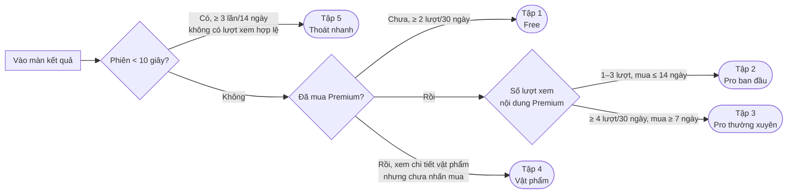
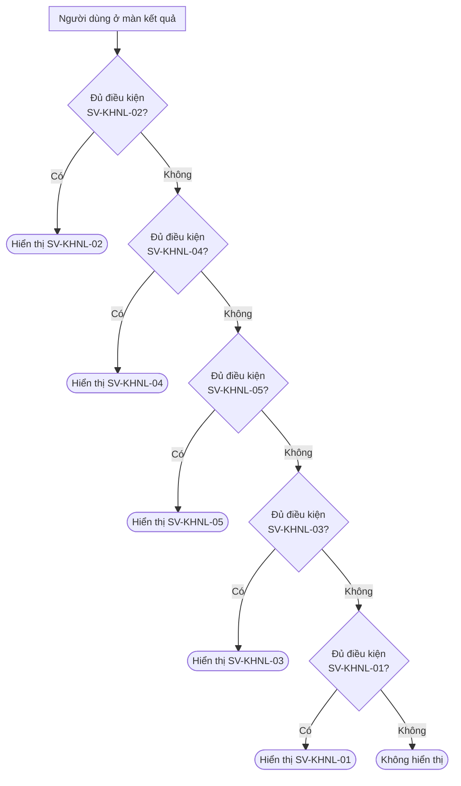

# Kế hoạch khảo sát: Kích Hoạt Năng Lượng (SVP-KHNL)

> Survey Plan — kế hoạch và cấu hình toàn bộ khảo sát in-app của một tính năng.
>
> **Đọc [[BPRD-002-KhaoSatInApp]] trước** để hiểu cơ chế chung. Các mục hay tra cứu: [[BPRD-002-KhaoSatInApp#4.3. Điều kiện hiển thị (Business Rules)|4.3 Điều kiện hiển thị]] · [[BPRD-002-KhaoSatInApp#4.4. Bộ tham số mặc định|4.4 Tham số mặc định]] · [[BPRD-002-KhaoSatInApp#5.1. Kiểu hiển thị (Display Type)|5.1 Kiểu hiển thị]] · [[BPRD-002-KhaoSatInApp#8. Trường hợp ngoại lệ (Edge Cases)|8 Ngoại lệ]]

## 1. Thông tin tài liệu

| **Trường**                | **Nội dung**                    |
| :-------------------------------- | :------------------------------------- |
| Tính năng                       | Kích Hoạt Năng Lượng Cá Nhân —[[BPRD-001-KichHoatNangLuong]] |
| Mã tính năng (`feature_key`) | `KHNL`                               |
| Cơ chế nền tảng               | [[BPRD-002-KhaoSatInApp]]                                       |
| Số chiến dịch                  | 5                                      |
| Người phụ trách               | Đỗ Thị Hường                      |
| Phiên bản                       | v1.0                                   |
| Trạng thái                      | Draft — chờ PO duyệt                |

## Nhật ký thay đổi

| Ngày cập nhật | Phiên bản | Người thực hiện | Nội dung thay đổi                                                                                                                                                                                                                                                                                                                                                       |
| :--------------- | :---------- | :------------------ | :------------------------------------------------------------------------------------------------------------------------------------------------------------------------------------------------------------------------------------------------------------------------------------------------------------------------------------------------------------------------- |
| 2026-09-17       | v1.0        | Đỗ Thị Hường   | Khởi tạo kế hoạch 5 chiến dịch theo tập người dùng                                                                                                                                                                                                                                                                                                               |
| 2026-09-18       | v1.0        | Đỗ Thị Hường   | Bổ sung mục 8: số liệu cần phân tích để chốt tham số điều kiện                                                                                                                                                                                                                                                                                               |
| 2026-09-22       | v1.0        | Đỗ Thị Hường   | Cập nhật bộ câu hỏi mục 5.1 (SV-KHNL-01) thành 2 câu theo prototype demo                                                                                                                                                                                                                                                                                           |
| 2026-09-22       | v1.0        | Đỗ Thị Hường   | Cập nhật chi tiết 2 luồng điểm kích hoạt mục 5.1 (SV-KHNL-01): Luồng 1 (Micro-survey 1 câu từ nút "Chưa phù hợp" ở thẻ Đánh giá cuối màn) & Luồng 2 (Khảo sát 2 câu từ Entry Teaser / nút "Chia sẻ ý kiến"), cập nhật bộ câu hỏi, đáp án, placeholder, giao diện popup 2/3 chiều cao và Popup cảm ơn tự động đóng sau 4s |

---

## 2. Mục tiêu nghiên cứu

### 2.1. Câu hỏi nghiên cứu

Mỗi chiến dịch trả lời **một** câu hỏi nghiên cứu (RQ) và phục vụ **một** nhóm quyết định sản phẩm. Câu hỏi khảo sát nào không phục vụ RQ của chiến dịch thì không đưa vào.

| **Mã** | **Câu hỏi nghiên cứu**                                                                          | **Chiến dịch** | **Quyết định sản phẩm dựa trên kết quả**                                 |
| :------------ | :-------------------------------------------------------------------------------------------------------- | :--------------------- | :-------------------------------------------------------------------------------------- |
| RQ1           | Vì sao người dùng Free chưa nâng cấp? Họ kỳ vọng gì, nội dung nào đủ hấp dẫn để mua?   | `SV-KHNL-01`         | Nội dung xem trước ở khối bị khóa, thông điệp CTA, giá gói                  |
| RQ2           | Nội dung Premium có dễ hiểu, đúng với người dùng không? Phần nào có giá trị / khó hiểu? | `SV-KHNL-02`         | Ưu tiên viết lại / bổ sung giải thích cho từng phần luận giải                |
| RQ3           | Người dùng thường xuyên dùng tính năng để làm gì, vì sao họ quay lại?                     | `SV-KHNL-03`         | Roadmap tính năng giữ chân (nhắc nhở, nội dung theo ngày/tháng…)              |
| RQ4           | Vì sao người quan tâm linh vật/vật phẩm chưa mua?                                                 | `SV-KHNL-04`         | Trang chi tiết vật phẩm, lựa chọn đối tác, cân nhắc mua trực tiếp trong app |
| RQ5           | Vì sao người dùng vào rồi thoát nhanh nhiều lần?                                                 | `SV-KHNL-05`         | Tốc độ tải, UX màn kết quả, thông điệp kỳ vọng ở màn Intro                |

---

## 3. Tổng quan chiến dịch

| **Mã khảo sát** | **Tập người dùng**           | **RQ** | **Ưu tiên** | **Kiểu** | **Số câu** | **Cỡ mẫu** | **Thời gian chạy** | **Trạng thái** |
| :----------------------- | :------------------------------------- | :----------- | :------------------ | :-------------- | :----------------- | :----------------- | :------------------------- | :--------------------- |
| [[#5.1. SV-KHNL-01 — Free tính năng\|SV-KHNL-01]]                         | Free tính năng                       | RQ1          | 1                   | Entry           | 2                  | 500                | 01/10 – 31/10             | draft                  |
| [[#5.2. SV-KHNL-02 — Pro trải nghiệm ban đầu\|SV-KHNL-02]]                         | Pro – trải nghiệm ban đầu         | RQ2          | **1**         | Entry           | 3                  | 300                | 01/10 – 31/10             | draft                  |
| [[#5.3. SV-KHNL-03 — Pro sử dụng thường xuyên\|SV-KHNL-03]]                         | Pro – sử dụng thường xuyên       | RQ3          | 4                   | Entry           | 3                  | 300                | 01/10 – 31/10             | draft                  |
| [[#5.4. SV-KHNL-04 — Quan tâm vật phẩm nhưng chưa mua\|SV-KHNL-04]]                         | Quan tâm vật phẩm nhưng chưa mua  | RQ4          | 2                   | Entry           | 2                  | 300                | 01/10 – 31/10             | draft                  |
| [[#5.5. SV-KHNL-05 — Vào nhanh, thoát nhanh\|SV-KHNL-05]]                         | Vào nhanh – thoát nhanh nhiều lần | RQ5          | 3                   | Direct (micro)  | 3                  | 200                | 01/10 – 31/10             | draft                  |

> Khi thay đổi thời gian chạy hoặc trạng thái, cập nhật đồng thời bảng đăng ký toàn app tại [[BPRD-002-KhaoSatInApp#10. Danh mục khảo sát (Survey Registry)]].

---

## 4. Phân tập người dùng

### 4.1. Định nghĩa dùng chung

| **Khái niệm**              | **Định nghĩa**                                                                                                                                  |
| :--------------------------------- | :------------------------------------------------------------------------------------------------------------------------------------------------------- |
| **Lượt xem hợp lệ**      | Màn kết quả dựng thành công và người dùng ở lại**≥ 10 giây**. Đây là "lần sử dụng hợp lệ" của điều kiện 1 (BPRD-002, mục 4.3) |
| **Phiên thoát nhanh**      | Màn kết quả dựng thành công nhưng người dùng rời màn**< 10 giây**                                                                           |
| **Người dùng Free**       | Chưa mua gói Premium tính năng KHNL                                                                                                                  |
| **Người dùng Pro**        | Đã mua gói Premium tính năng KHNL                                                                                                                   |
| **Xem chi tiết vật phẩm** | Nhấn mở chi tiết một linh vật/vật phẩm                                                                                                            |
| **Đã mua vật phẩm**      | Đã nhấn nút mua hàng                                                                                                                                |

### 4.2. Bản đồ tập theo phễu



**Quan hệ giữa các tập:**

* Tập 1 (Free) loại trừ tập 2, 3, 4 (Pro) theo định nghĩa; tập 2 và 3 loại trừ nhau theo số lượt xem.
* Tập 4 có thể trùng tập 2 hoặc 3; tập 5 có thể trùng tập 1 hoặc 3 ⇒ xử lý bằng thứ tự ưu tiên (mục 4.3).

### 4.3. Thứ tự ưu tiên khi thuộc nhiều tập

Mỗi lượt vào màn kết quả chỉ hiển thị **tối đa 1 khảo sát**. Hệ thống xét lần lượt từ ưu tiên 1; chiến dịch đầu tiên mà người dùng **vừa thuộc tập vừa thỏa mãn toàn bộ điều kiện hiển thị** sẽ được chọn.

Sau khi một chiến dịch của KHNL đã hiển thị, **mọi chiến dịch còn lại của tính năng phải chờ K = 90 ngày** (điều kiện 9 của BPRD-002). Nghĩa là mỗi người dùng chỉ nhận tối đa 1 khảo sát KHNL trong 90 ngày, dù họ đi qua nhiều tập.



| **Ưu tiên** | **Chiến dịch** | **Lý do**                                                                              |
| :------------------ | :--------------------- | :-------------------------------------------------------------------------------------------- |
| 1                   | `SV-KHNL-02`         | Cửa sổ ngắn (14 ngày sau khi mua); để lâu cảm nhận ban đầu không còn chính xác |
| 2                   | `SV-KHNL-04`         | Ý định mua vật phẩm phai nhanh, cần hỏi khi lý do còn rõ                            |
| 3                   | `SV-KHNL-05`         | Tín hiệu rời bỏ gần đây phản ánh trạng thái hiện tại tốt hơn hành vi cũ      |
| 4                   | `SV-KHNL-03`         | Hành vi ổn định, có thể chờ đợt sau                                                  |
| 5                   | `SV-KHNL-01`         | Tập lớn nhất, dễ đạt cỡ mẫu, không gấp                                              |

---

## 5. Chi tiết từng chiến dịch

Mỗi chiến dịch gồm 7 phần cố định: **a.** Thông tin · **b.** Tập người dùng · **c.** Điều kiện hiển thị · **d.** Cách hiển thị · **e.** Thiết kế · **f.** Bộ câu hỏi · **g.** Đọc kết quả.

### 5.1. SV-KHNL-01 — Free tính năng

**a. Thông tin chiến dịch**

| Trường               | Giá trị                               |
| :--------------------- | :-------------------------------------- |
| Mã khảo sát         | `SV-KHNL-01` · version 1             |
| Loại khảo sát       | Nhu cầu & rào cản nâng cấp         |
| Câu hỏi nghiên cứu | RQ1                                     |
| Ưu tiên              | 1                                       |
| Đối tượng          | Free, gồm cả Guest chưa đăng nhập |
| Cỡ mẫu mục tiêu    | 500                                     |
| Thời gian chạy       | 01/10 – 31/10                          |
| Trạng thái           | Todo                                    |

**b. Tập người dùng**

* **Thuộc tập khi**: là người dùng Free **và** có ≥ 2 lượt xem hợp lệ màn kết quả trong 30 ngày.
* **Loại trừ**: phiên hiện tại đã mở màn mua hàng (IAP) — không chen khảo sát vào lúc người dùng đang cân nhắc mua.

**c. Điều kiện hiển thị**

| STT | Điều kiện                                               | Bật | Tham số                  | So với mặc định                                           |
| :-- | :--------------------------------------------------------- | :--- | :------------------------ | :------------------------------------------------------------ |
| 1   | Số lần sử dụng hợp lệ trong N ngày                  | ✅   | X = 2, N = 30 ngày       | X giảm 3 → 2: người Free ít lý do quay lại nhiều lần |
| 2   | Tổng thời gian xem màn kết quả trong N ngày          | ⬜   | —                        | Tắt: phần Free ngắn, điều kiện 1 đã đủ lọc         |
| 3   | Thời gian ở màn kết quả trong phiên                  | ✅   | Z = 30 giây              | Tăng 20 → 30 giây: để người dùng xem hết phần Free  |
| 4   | Chưa hoàn thành khảo sát/phiên bản                  | ✅   | —                        | Bắt buộc                                                    |
| 5   | Thời gian chờ sau khi bỏ qua                            | ✅   | 14 ngày, tối đa 2 lần | Như mặc định                                              |
| 6   | Trong ngày chưa hiển thị khảo sát nào khác         | ✅   | 1/ngày                   | Như mặc định                                              |
| 7   | Khoảng cách tối thiểu từ khảo sát gần nhất        | ✅   | M = 30 ngày              | Như mặc định                                              |
| 8   | Đối tượng & tập người dùng                         | ✅   | Free · Tập 1            | —                                                            |
| 9   | Khoảng cách với khảo sát khác của cùng tính năng | ✅   | K = 90 ngày              | Như mặc định                                              |

**d. Cách hiển thị & Luồng kích hoạt (Trigger Flows)**

Chiến dịch hỗ trợ 2 luồng tiếp cận (Point of Entry) giúp tối ưu tỷ lệ phản hồi người dùng:

1. **Luồng 1 — Thẻ Đánh giá cố định ở cuối màn (Fixed Bottom Feedback Card):**

   - **Vị trí**: Nằm ở cuối màn kết quả
   - **Giao diện thẻ**: Tiêu đề *"Bạn thấy nội dung vừa xem thế nào?"* kèm 2 nút bấm dạng pill: *"Phù hợp"* 👍 và *"Chưa phù hợp"* 👎.
   - **Cơ chế hoạt động**:
     - Nút *"Phù hợp"*: Đổi trạng thái được chọn (selected state), không mở popup khảo sát.
     - Nút *"Chưa phù hợp"*: Trực tiếp kích hoạt Popup Micro-survey 1 câu (`step-unfit`).
2. **Luồng 2 — Thẻ Entry Teaser Popup (Popup giới thiệu khảo sát):**

   - **Tự động kích hoạt**: Xuất hiện dạng Popup Teaser sau khi người dùng thỏa mãn điều kiện ở màn kết quả (hoặc bấm vào thẻ điểm vào khảo sát).
   - **Giao diện Teaser**: Icon hình quả cầu / tài liệu 3D bên trái, tiêu đề *"Bạn còn băn khoăn điều gì về kết quả này?"*, nội dung *"Chia sẻ để Lịch Việt hiểu bạn cần gì và mang đến trải nghiệm tốt hơn."*, nút đóng `x` hình tròn ở góc trên bên phải.
   - **Cơ chế hoạt động**: Bấm nút CTA *"Chia sẻ ý kiến"* ➔ Mở luồng khảo sát chính 2 câu (`step-1` và `step-2`).

* **Quy cách giao diện Popup Modal (UI Layout Rules):**
  - **Popup câu hỏi (`step-unfit`, `step-1`, `step-2`)**:
    - Chiều cao cố định: **2/3 chiều cao màn hình** (`height: 66.67%`), trượt từ dưới lên (Bottom Sheet Modal) trên lớp nền mờ (Dark backdrop).
    - **Header Modal**: Có nút mũi tên quay lại `<` (hiển thị ở góc trên bên trái từ câu 2), tiêu đề *"Chia sẻ của bạn giúp trải nghiệm tốt hơn"* căn giữa (2 dòng), nút đóng `x` ở góc trên bên phải.
    - **Thân Modal (Body)**: Vùng cuộn nội dung độc lập (`overflow-y: auto`).
    - **Chân Modal (Footer)**: Nút bấm CTA full-width (`btn-primary-blue`) ghim cố định ở đáy modal.
  - **Popup Cảm ơn (`step-thankyou`)**:
    - **Giao diện**: Modal căn giữa màn hình (Center Dialog Modal) kèm hiệu ứng nảy nhẹ (`bounceIn`) và nền mờ (backdrop filter).
    - **Icon đóng**: Nút hình tròn chứa icon `x` ở góc trên bên phải
    - **Hình ảnh minh họa**: Minh họa 3D Hộp quà trái tim (`thank_you_illustration.png`, kích thước `140x140px`).
    - **Tiêu đề**: *"Cảm ơn bạn đã chia sẻ"*.
    - **Nội dung**: *"Mỗi góp ý của bạn đều giúp Lịch Việt hiểu bạn hơn và mang đến trải nghiệm tốt hơn mỗi ngày."*.
    - **Cơ chế tự đóng**: Popup tự động đóng hoàn toàn sau **4 giây** (4000ms), hoặc khi người dùng bấm nút `x` góc trên bên phải / chạm vào lớp nền ngoài backdrop.

**e. Thiết kế**

- **Link demo thiết kế**: [KichHoatNangLuong_Result_KhaoSat.html](file:///Users/dohuong/Desktop/Lich_Viet/prototype/KichHoatNangLuong_Result_KhaoSat.html)
- **Ảnh minh họa**: Được tích hợp trong prototype đính kèm.

**f. Bộ câu hỏi**

##### Luồng 1: Micro-survey 1 câu (Kích hoạt khi bấm "Chưa phù hợp" ở thẻ đánh giá cuối màn)

| STT | Câu hỏi                                               | Dạng                       | Đáp án / Giao diện                                                                                                                           | Bắt buộc | Mục đích                                                                  |
| :-- | :------------------------------------------------------ | :-------------------------- | :----------------------------------------------------------------------------------------------------------------------------------------------- | :--------- | :--------------------------------------------------------------------------- |
| 1   | **Điều gì khiến bạn thấy chưa phù hợp?** | Chọn nhiều (Multi-select) | • Nội dung còn chung chung• Có phần chưa đúng với tôi• Có phần khó hiểu• Chưa thấy đủ giá trị để xem phần chuyên sâu | Có        | Tìm nguyên nhân khiến nội dung Free chưa làm hài lòng người dùng |
| —  | *Chia sẻ thêm của bạn*                            | Nhập văn bản (Textarea)  | Placeholder:`"Ví dụ: phần nào chưa đúng, còn chung chung hoặc bạn muốn biết thêm điều gì..."`                                  | Không     | Thu thập phản hồi chi tiết của người dùng                            |

*Nút CTA*: **"Gửi phản hồi"** ➔ Mở Popup Cảm ơn (`step-thankyou`).

##### Luồng 2: Khảo sát chính 2 câu (Kích hoạt từ thẻ Entry Teaser / Nút "Chia sẻ ý kiến")

| STT | Câu hỏi                                                                      | Dạng                      | Đáp án / Giao diện                                                                                                                                                                                                    | Bắt buộc | Mục đích                                                                                  |
| :-- | :----------------------------------------------------------------------------- | :------------------------- | :------------------------------------------------------------------------------------------------------------------------------------------------------------------------------------------------------------------------ | :--------- | :------------------------------------------------------------------------------------------- |
| 1   | **1. Bạn quan tâm nhất đến nội dung nào?** *(Chọn tối đa 2)* | Chọn nhiều (Tối đa 2)  | • Điểm mạnh & điểm cần lưu ý trong lá số Bát tự• Biểu đồ Ngũ hành & chân dung năng lực• Dụng thần phù hợp với bạn• Linh vật & cách kích hoạt tài lộc, sự nghiệp, các mối quan hệ | Có        | Kỳ vọng nội dung — xác định chủ đề quan tâm nhất để tối ưu khối xem trước |
| 2   | **2. Điều gì khiến bạn chưa muốn xem đầy đủ kết quả?**      | Chọn 1 (Single-select)    | • Chưa rõ phần đầy đủ có thêm gì hữu ích• Mức giá chưa phù hợp• Phần miễn phí hiện tại đã đủ với tôi• Tôi muốn xem thêm nhưng chưa phải lúc này                                   | Có        | Rào cản nâng cấp chính — tìm hiểu nguyên nhân chưa mở khóa                      |
| —  | *Chia sẻ thêm*                                                             | Nhập văn bản (Textarea) | Placeholder:`"Điều gì khiến bạn còn phân vân?"`                                                                                                                                                                 | Không     | Thu thập các băn khoăn khác ngoài lựa chọn có sẵn                                  |

*Nút CTA từng câu*:

- **Câu 1**: *"Tiếp tục"* ➔ Chuyển sang Câu 2 (có icon mũi tên quay lại `<` góc trên bên trái header).
- **Câu 2**: *"Gửi phản hồi"* ➔ Mở Popup Cảm ơn (`step-thankyou`).

**g. Đọc kết quả & ngưỡng hành động** *(đề xuất)*

| Tín hiệu                                                                           | Ngưỡng | Hành động gợi ý                                                                        |
| :----------------------------------------------------------------------------------- | :------- | :------------------------------------------------------------------------------------------ |
| Câu 1 Luồng 2 — Phần nội dung được chọn nhiều nhất                        | Top 1–2 | Đưa phần đó làm điểm nhấn nổi bật / trích đoạn xem trước ở khối bị khóa |
| Luồng 1 chọn "Nội dung còn chung chung" hoặc "Có phần chưa đúng với tôi" | ≥ 30%   | Rà soát và tinh chỉnh nội dung luận giải Free cho sát thực tế lá số             |
| Luồng 2 chọn "Chưa rõ phần đầy đủ có thêm gì hữu ích"                  | ≥ 30%   | Viết lại / tối ưu thông điệp giới thiệu & trích đoạn xem trước ở khối khóa |
| Luồng 2 chọn "Mức giá chưa phù hợp"                                           | ≥ 35%   | Thử nghiệm giá hoặc thiết kế gói mua nhỏ/linh hoạt hơn                            |
| Luồng 2 chọn "Phần miễn phí hiện tại đã đủ với tôi"                     | ≥ 25%   | Bổ sung thêm các giá trị độc quyền chỉ có ở bản mở khóa đầy đủ            |

---

### 5.2. SV-KHNL-02 — Pro trải nghiệm ban đầu

**a. Thông tin chiến dịch**

| Trường               | Giá trị                   |
| :--------------------- | :-------------------------- |
| Mã khảo sát         | `SV-KHNL-02` · version 1 |
| Loại khảo sát       | Trải nghiệm ban đầu     |
| Câu hỏi nghiên cứu | RQ2                         |
| Ưu tiên              | **1**                 |
| Đối tượng          | Pro                         |
| Cỡ mẫu mục tiêu    | 300                         |
| Thời gian chạy       | 01/10 – 31/10              |
| Trạng thái           | draft                       |

**b. Tập người dùng**

* **Thuộc tập khi**: là người dùng Pro, đã mua **trong vòng 14 ngày** và có **1–3** lượt xem hợp lệ nội dung Premium kể từ khi mua.
* **Ra khỏi tập**: quá 14 ngày kể từ khi mua, hoặc từ lượt xem thứ 4.

**c. Điều kiện hiển thị**

| STT | Điều kiện                                               | Bật | Tham số                 | So với mặc định                                                                        |
| :-- | :--------------------------------------------------------- | :--- | :----------------------- | :----------------------------------------------------------------------------------------- |
| 1   | Số lần sử dụng hợp lệ trong N ngày                  | ⬜   | —                       | Tắt: số lượt (1–3) đã nằm trong định nghĩa tập —*ngoại lệ cần PO duyệt* |
| 2   | Tổng thời gian xem màn kết quả trong N ngày          | ⬜   | —                       | Tắt: thay bằng Z = 90 giây ở điều kiện 3                                            |
| 3   | Thời gian ở màn kết quả trong phiên                  | ✅   | Z = 90 giây             | Tăng 20 → 90 giây: chỉ hỏi người đã đọc hết lượt đầu                       |
| 4   | Chưa hoàn thành khảo sát/phiên bản                  | ✅   | —                       | Bắt buộc                                                                                 |
| 5   | Thời gian chờ sau khi bỏ qua                            | ✅   | 7 ngày, tối đa 1 lần | Rút ngắn vì cửa sổ của tập chỉ 14 ngày                                            |
| 6   | Trong ngày chưa hiển thị khảo sát nào khác         | ✅   | 1/ngày                  | Như mặc định                                                                           |
| 7   | Khoảng cách tối thiểu từ khảo sát gần nhất        | ✅   | M = 30 ngày             | Như mặc định                                                                           |
| 8   | Đối tượng & tập người dùng                         | ✅   | Pro · Tập 2            | —                                                                                         |
| 9   | Khoảng cách với khảo sát khác của cùng tính năng | ✅   | K = 90 ngày             | Như mặc định                                                                           |

**d. Cách hiển thị**

| Trường | Giá trị                                                                                                                           |
| :------- | :---------------------------------------------------------------------------------------------------------------------------------- |
| Kiểu    | Entry                                                                                                                               |
| Vị trí | Cuối nội dung Premium (sau khối "Linh vật hỗ trợ")                                                                            |
| Ghi chú | Được hiển thị ngay trong phiên vừa mua, vì vị trí cuối nội dung + Z = 90 giây đã đảm bảo người dùng đọc xong |

**e. Thiết kế**

- **Link thiết kế**: (sẽ cập nhật)
- **Ảnh minh họa**: (sẽ cập nhật)
- **Yêu cầu riêng**:
  - Giọng điệu cảm ơn đã mở khóa, tránh giọng "khảo sát bắt buộc".
  - 2 câu thang 1–5 đặt trước để người dùng trả lời nhanh, tạo đà.
  - Có chỉ báo tiến độ (1/5) vì khảo sát dài 5 câu.
  - Danh sách 6 phần luận giải ở câu 3, 4 dùng đúng tên hiển thị trên màn Kết quả.

**f. Bộ câu hỏi**

| STT | Câu hỏi                                                          | Dạng                     | Đáp án                                                                                                                                                   | Bắt buộc | Mục đích                      |
| :-- | :----------------------------------------------------------------- | :------------------------ | :---------------------------------------------------------------------------------------------------------------------------------------------------------- | :--------- | :------------------------------- |
| 1   | Phần luận giải có dễ hiểu với bạn không?                  | Thang 1–5                | 1 = Rất khó hiểu … 5 = Rất dễ hiểu                                                                                                                   | Có        | Mức độ dễ hiểu tổng thể   |
| 2   | Nội dung luận giải đúng với bạn tới mức nào?             | Thang 1–5                | 1 = Hoàn toàn không đúng … 5 = Rất đúng                                                                                                            | Có        | Độ chính xác cảm nhận      |
| 3   | Phần nào bạn thấy có giá trị nhất?                         | Chọn nhiều (tối đa 2) | Chân dung năng lượng · Điểm mạnh nổi bật · Điểm cần cân bằng · Hướng phát triển phù hợp · Màu sắc phù hợp · Linh vật hỗ trợ | Có        | Phần cần giữ và phát triển |
| 4   | Phần nào khiến bạn thấy khó hiểu hoặc chưa thuyết phục? | Chọn nhiều              | (6 phần như câu 3) · Không có phần nào                                                                                                              | Có        | Phần cần viết lại            |
| 5   | Bạn muốn góp ý gì để phần luận giải tốt hơn?           | Câu hỏi mở             | —                                                                                                                                                          | Không     | Góp ý chi tiết                |

**g. Đọc kết quả & ngưỡng hành động** *(đề xuất)*

| Tín hiệu                                      | Ngưỡng | Hành động gợi ý                                                          |
| :---------------------------------------------- | :------- | :---------------------------------------------------------------------------- |
| Câu 1 điểm trung bình                       | < 3,5    | Rà soát thuật ngữ, thêm giải thích ngắn cho các khái niệm Bát tự |
| Câu 2 điểm trung bình                       | < 3,5    | Rà soát logic luận giải cùng chuyên gia nội dung                       |
| Câu 4 — một phần bị chọn                  | ≥ 25%   | Đưa phần đó vào danh sách viết lại ưu tiên                         |
| Câu 3 và câu 4 cùng chọn nhiều một phần | —       | Phần có giá trị nhưng khó hiểu ⇒ ưu tiên cao nhất khi cải thiện  |

---

### 5.3. SV-KHNL-03 — Pro sử dụng thường xuyên

**a. Thông tin chiến dịch**

| Trường               | Giá trị                   |
| :--------------------- | :-------------------------- |
| Mã khảo sát         | `SV-KHNL-03` · version 1 |
| Loại khảo sát       | Sử dụng tính năng       |
| Câu hỏi nghiên cứu | RQ3                         |
| Ưu tiên              | 4                           |
| Đối tượng          | Pro                         |
| Cỡ mẫu mục tiêu    | 300                         |
| Thời gian chạy       | 01/10 – 31/10              |
| Trạng thái           | draft                       |

**b. Tập người dùng**

* **Thuộc tập khi**: là người dùng Pro, đã mua **≥ 7 ngày**, có **≥ 4** lượt xem hợp lệ nội dung Premium trong 30 ngày và tổng thời gian xem ≥ 5 phút.

**c. Điều kiện hiển thị**

| STT | Điều kiện                                               | Bật | Tham số                  | So với mặc định                                             |
| :-- | :--------------------------------------------------------- | :--- | :------------------------ | :-------------------------------------------------------------- |
| 1   | Số lần sử dụng hợp lệ trong N ngày                  | ✅   | X = 4, N = 30 ngày       | Tăng 3 → 4: phân biệt rõ với tập 2 (1–3 lượt)         |
| 2   | Tổng thời gian xem màn kết quả trong N ngày          | ✅   | Y = 5 phút               | Tăng 3 → 5 phút: loại người chỉ mở lướt nhiều lần   |
| 3   | Thời gian ở màn kết quả trong phiên                  | ✅   | Z = 20 giây              | Như mặc định — người quay lại thường chỉ xem 1 phần |
| 4   | Chưa hoàn thành khảo sát/phiên bản                  | ✅   | —                        | Bắt buộc                                                      |
| 5   | Thời gian chờ sau khi bỏ qua                            | ✅   | 14 ngày, tối đa 2 lần | Như mặc định                                                |
| 6   | Trong ngày chưa hiển thị khảo sát nào khác         | ✅   | 1/ngày                   | Như mặc định                                                |
| 7   | Khoảng cách tối thiểu từ khảo sát gần nhất        | ✅   | M = 30 ngày              | Như mặc định                                                |
| 8   | Đối tượng & tập người dùng                         | ✅   | Pro · Tập 3             | —                                                              |
| 9   | Khoảng cách với khảo sát khác của cùng tính năng | ✅   | K = 90 ngày              | Như mặc định                                                |

**d. Cách hiển thị**

| Trường | Giá trị            |
| :------- | :------------------- |
| Kiểu    | Entry                |
| Vị trí | Cuối màn kết quả |

**e. Thiết kế**

- **Link thiết kế**: (sẽ cập nhật)
- **Ảnh minh họa**: (sẽ cập nhật)
- **Yêu cầu riêng**:
  - Thang NPS 0–10 phải đọc được trên màn hẹp (cuộn ngang hoặc xuống 2 hàng), kèm nhãn 2 đầu thang.
  - Câu 1 chọn tối đa 3 đáp án nên cần hiển thị số lựa chọn còn lại.
  - Có chỉ báo tiến độ (1/5).

**f. Bộ câu hỏi**

| STT | Câu hỏi                                                                | Dạng                     | Đáp án                                                                                                                                                                                                                                                                               | Bắt buộc | Mục đích                                      |
| :-- | :----------------------------------------------------------------------- | :------------------------ | :-------------------------------------------------------------------------------------------------------------------------------------------------------------------------------------------------------------------------------------------------------------------------------------- | :--------- | :----------------------------------------------- |
| 1   | Bạn thường xem lại luận giải để làm gì?                        | Chọn nhiều (tối đa 3) | Chọn màu sắc/phương hướng trước việc quan trọng · Tra cứu linh vật, vật phẩm phù hợp · Đọc lại điểm mạnh – điểm cần cân bằng để tự điều chỉnh · Tham khảo khi ra quyết định công việc/tài chính · Xem cho người thân · Khác (nhập) | Có        | Mục đích sử dụng                            |
| 2   | Phần nào bạn xem lại nhiều nhất?                                   | Chọn 1                   | Chân dung năng lượng · Điểm mạnh nổi bật · Điểm cần cân bằng · Hướng phát triển phù hợp · Màu sắc phù hợp · Linh vật hỗ trợ                                                                                                                             | Có        | Phần giữ chân người dùng                   |
| 3   | Bạn thường quay lại xem vào lúc nào?                              | Chọn 1                   | Hằng ngày, theo thói quen · Trước sự kiện/việc quan trọng · Khi gặp chuyện không thuận · Đầu tháng/đầu năm · Không cố định                                                                                                                                   | Có        | Thời điểm quay lại — cơ sở cho nhắc nhở |
| 4   | Bạn sẵn sàng giới thiệu tính năng này cho bạn bè ở mức nào? | Thang 0–10 (NPS)         | 0 = Chắc chắn không … 10 = Chắc chắn có                                                                                                                                                                                                                                          | Có        | Mức độ hài lòng (NPS)                       |
| 5   | Bạn muốn tính năng có thêm gì để dùng thường xuyên hơn?    | Câu hỏi mở             | —                                                                                                                                                                                                                                                                                      | Không     | Nhu cầu cải tiến                              |

**g. Đọc kết quả & ngưỡng hành động** *(đề xuất)*

| Tín hiệu                                             | Ngưỡng | Hành động gợi ý                                           |
| :----------------------------------------------------- | :------- | :------------------------------------------------------------- |
| Câu 3 "Trước sự kiện" + "Đầu tháng/đầu năm" | ≥ 40%   | Đề xuất tính năng nhắc nhở theo mốc thời gian         |
| Câu 1 "Xem cho người thân"                         | ≥ 30%   | Cân nhắc gói lá số gia đình                             |
| Câu 4 NPS                                             | < 20     | Đọc kỹ câu 5 của nhóm chấm 0–6 để tìm nguyên nhân |

---

### 5.4. SV-KHNL-04 — Quan tâm vật phẩm nhưng chưa mua

**a. Thông tin chiến dịch**

| Trường               | Giá trị                                     |
| :--------------------- | :-------------------------------------------- |
| Mã khảo sát         | `SV-KHNL-04` · version 1                   |
| Loại khảo sát       | Rào cản mua vật phẩm                      |
| Câu hỏi nghiên cứu | RQ4                                           |
| Ưu tiên              | 2                                             |
| Đối tượng          | Pro (vật phẩm nằm trong nội dung Premium) |
| Cỡ mẫu mục tiêu    | 300                                           |
| Thời gian chạy       | 01/10 – 31/10                                |
| Trạng thái           | draft                                         |

**b. Tập người dùng**

* **Thuộc tập khi**: đã xem chi tiết ≥ 1 linh vật/vật phẩm trong 14 ngày **và** chưa nhấn mua vật phẩm đó.
* **Loại trừ**: lần xem chi tiết gần nhất cách chưa tới **24 giờ** — người dùng có thể vẫn đang cân nhắc.

**c. Điều kiện hiển thị**

| STT | Điều kiện                                               | Bật | Tham số                  | So với mặc định                                                                                    |
| :-- | :--------------------------------------------------------- | :--- | :------------------------ | :----------------------------------------------------------------------------------------------------- |
| 1   | Số lần sử dụng hợp lệ trong N ngày                  | ⬜   | —                        | Tắt: hành vi mở chi tiết vật phẩm đã thể hiện đủ quan tâm —*ngoại lệ cần PO duyệt* |
| 2   | Tổng thời gian xem màn kết quả trong N ngày          | ⬜   | —                        | Tắt: cùng lý do trên                                                                               |
| 3   | Thời gian ở màn kết quả trong phiên                  | ✅   | Z = 20 giây              | Như mặc định                                                                                       |
| 4   | Chưa hoàn thành khảo sát/phiên bản                  | ✅   | —                        | Bắt buộc                                                                                             |
| 5   | Thời gian chờ sau khi bỏ qua                            | ✅   | 14 ngày, tối đa 1 lần | Giảm số lần bỏ qua 2 → 1: chủ đề mua bán dễ gây cảm giác bị chào hàng                  |
| 6   | Trong ngày chưa hiển thị khảo sát nào khác         | ✅   | 1/ngày                   | Như mặc định                                                                                       |
| 7   | Khoảng cách tối thiểu từ khảo sát gần nhất        | ✅   | M = 30 ngày              | Như mặc định                                                                                       |
| 8   | Đối tượng & tập người dùng                         | ✅   | Pro · Tập 4             | —                                                                                                     |
| 9   | Khoảng cách với khảo sát khác của cùng tính năng | ✅   | K = 90 ngày              | Như mặc định                                                                                       |

**d. Cách hiển thị**

| Trường | Giá trị                              |
| :------- | :------------------------------------- |
| Kiểu    | Entry                                  |
| Vị trí | Ngay dưới khối "Linh vật hỗ trợ" |

**e. Thiết kế**

- **Link thiết kế**: (sẽ cập nhật)
- **Ảnh minh họa**: (sẽ cập nhật)
- **Yêu cầu riêng**:
  - Thẻ Entry phải khác rõ với thẻ sản phẩm phía trên để không bị hiểu là quảng cáo.
  - Nếu khả thi, nhắc lại tên/ảnh vật phẩm người dùng đã xem để họ nhớ ngữ cảnh.
  - Câu hỏi về giá (câu 3) dùng đúng đơn vị và khoảng giá của danh mục vật phẩm hiện tại.

**f. Bộ câu hỏi**

| STT | Câu hỏi                                                           | Dạng                     | Đáp án                                                                                                                                                                                                                           | Bắt buộc | Mục đích                          |
| :-- | :------------------------------------------------------------------ | :------------------------ | :---------------------------------------------------------------------------------------------------------------------------------------------------------------------------------------------------------------------------------- | :--------- | :----------------------------------- |
| 1   | Điều gì khiến bạn chưa mua vật phẩm đã xem?               | Chọn nhiều (tối đa 2) | Giá cao · Chưa thấy cần thiết · Chưa tin vào hiệu quả · Chưa tin chất lượng/nơi bán · Chưa rõ cách dùng, cách bài trí · Chưa đúng thời điểm · Muốn mua ở nơi khác · Khác (nhập)            | Có        | Rào cản mua chính                 |
| 2   | Thông tin nào giúp bạn dễ quyết định hơn?                  | Chọn nhiều (tối đa 2) | Giải thích vì sao vật phẩm hợp với bản mệnh · Hướng dẫn cách dùng, cách đặt · Đánh giá từ người đã mua · Chứng nhận nguồn gốc, chất liệu · Ưu đãi/giá tốt hơn · Mua trực tiếp trong app | Có        | Hướng cải thiện trang vật phẩm |
| 3   | Bạn sẵn sàng chi bao nhiêu cho một vật phẩm phong thủy?     | Chọn 1                   | Dưới 200.000đ · 200.000 – 500.000đ · 500.000đ – 1 triệu · Trên 1 triệu · Chưa có ý định mua                                                                                                                      | Có        | Khoảng giá chấp nhận được     |
| 4   | Bạn có góp ý gì thêm về phần gợi ý linh vật, vật phẩm? | Câu hỏi mở             | —                                                                                                                                                                                                                                  | Không     | Góp ý chi tiết                    |

**g. Đọc kết quả & ngưỡng hành động** *(đề xuất)*

| Tín hiệu                                                     | Ngưỡng | Hành động gợi ý                                 |
| :------------------------------------------------------------- | :------- | :--------------------------------------------------- |
| Câu 1 "Giá cao" và câu 3 phần lớn dưới giá hiện tại | ≥ 40%   | Bổ sung vật phẩm ở khoảng giá thấp hơn       |
| Câu 1 "Chưa tin chất lượng/nơi bán"                     | ≥ 25%   | Rà soát đối tác, thêm chứng nhận/đánh giá |
| Câu 2 "Mua trực tiếp trong app"                             | ≥ 30%   | Đưa mua in-app vào cân nhắc roadmap             |

---

### 5.5. SV-KHNL-05 — Vào nhanh, thoát nhanh

**a. Thông tin chiến dịch**

| Trường               | Giá trị                                  |
| :--------------------- | :----------------------------------------- |
| Mã khảo sát         | `SV-KHNL-05` · version 1                |
| Loại khảo sát       | Lý do thoát / chưa tiếp tục sử dụng |
| Câu hỏi nghiên cứu | RQ5                                        |
| Ưu tiên              | 3                                          |
| Đối tượng          | Free + Pro                                 |
| Cỡ mẫu mục tiêu    | 200                                        |
| Thời gian chạy       | 01/10 – 31/10                             |
| Trạng thái           | draft                                      |

**b. Tập người dùng**

* **Thuộc tập khi**: có ≥ 3 phiên thoát nhanh trong 14 ngày **và** không có lượt xem hợp lệ nào trong 14 ngày đó.
* **Giới hạn phạm vi**: người thoát ngay ở màn Intro/Nhập liệu chưa tới màn kết quả nên không được khảo sát (màn khác nằm ngoài phạm vi v1.0 của BPRD-002).

**c. Điều kiện hiển thị**

| STT | Điều kiện                                               | Bật | Tham số                  | So với mặc định                                                                       |
| :-- | :--------------------------------------------------------- | :--- | :------------------------ | :---------------------------------------------------------------------------------------- |
| 1   | Số lần sử dụng hợp lệ trong N ngày                  | ⬜   | —                        | Tắt: chủ đích hỏi chính nhóm chưa đọc nội dung —*ngoại lệ cần PO duyệt* |
| 2   | Tổng thời gian xem màn kết quả trong N ngày          | ⬜   | —                        | Tắt: cùng lý do trên                                                                  |
| 3   | Thời gian ở màn kết quả trong phiên                  | ✅   | Z = 5 giây               | Giảm 20 → 5 giây: phải hiện trước ngưỡng thoát 10 giây của tập               |
| 4   | Chưa hoàn thành khảo sát/phiên bản                  | ✅   | —                        | Bắt buộc                                                                                |
| 5   | Thời gian chờ sau khi bỏ qua                            | ✅   | 30 ngày, tối đa 1 lần | Giãn 14 → 30 ngày, giảm 2 → 1 lần: nhóm này dễ bị làm phiền nhất             |
| 6   | Trong ngày chưa hiển thị khảo sát nào khác         | ✅   | 1/ngày                   | Như mặc định                                                                          |
| 7   | Khoảng cách tối thiểu từ khảo sát gần nhất        | ✅   | M = 30 ngày              | Như mặc định                                                                          |
| 8   | Đối tượng & tập người dùng                         | ✅   | Free + Pro · Tập 5      | —                                                                                        |
| 9   | Khoảng cách với khảo sát khác của cùng tính năng | ✅   | K = 90 ngày              | Như mặc định                                                                          |

**d. Cách hiển thị**

| Trường         | Giá trị                                                                                          |
| :--------------- | :------------------------------------------------------------------------------------------------- |
| Kiểu            | **Direct** — micro-survey (bottom sheet)                                                    |
| Thời điểm     | Lượt vào màn kết quả**kế tiếp** sau khi thuộc tập, sau 5 giây                     |
| Lý do           | Nhóm này không cuộn tới cuối màn nên Entry không tiếp cận được                       |
| Theo dõi riêng | S04 (tỷ lệ đóng ngay) dự kiến cao hơn các chiến dịch khác, không so chung ngưỡng 30% |

**e. Thiết kế**

- **Link thiết kế**: (sẽ cập nhật)
- **Ảnh minh họa**: (sẽ cập nhật)
- **Yêu cầu riêng**:
  - Bottom sheet chiếm tối đa **1/2 chiều cao màn hình**, không che phần nội dung chính đang đọc.
  - Nút đóng rõ ràng, vuốt xuống cũng đóng được.
  - Chỉ 1 câu bắt buộc, hiện toàn bộ đáp án không cần cuộn.
  - Câu mở (câu 2) chỉ hiện sau khi chọn xong câu 1.

**f. Bộ câu hỏi**

| STT | Câu hỏi                                                  | Dạng         | Đáp án                                                                                                                                                                                                         | Bắt buộc | Mục đích                        |
| :-- | :--------------------------------------------------------- | :------------ | :---------------------------------------------------------------------------------------------------------------------------------------------------------------------------------------------------------------- | :--------- | :--------------------------------- |
| 1   | Điều gì khiến bạn thường rời màn này khá nhanh? | Chọn 1       | Tải chậm hoặc bị lỗi · Nội dung khó hiểu · Không đúng điều tôi đang tìm · Tôi chỉ cần xem nhanh một thông tin · Nội dung bị khóa, phải trả phí · Tôi vào nhầm · Khác (nhập) | Có        | Nguyên nhân thoát               |
| 2   | Bạn mong đợi thấy điều gì khi mở tính năng này? | Câu hỏi mở | —                                                                                                                                                                                                                | Không     | Kỳ vọng chưa được đáp ứng |

**g. Đọc kết quả & ngưỡng hành động** *(đề xuất)*

| Tín hiệu                                 | Ngưỡng | Hành động gợi ý                                                               |
| :----------------------------------------- | :------- | :--------------------------------------------------------------------------------- |
| "Tải chậm hoặc bị lỗi"                | ≥ 20%   | Đối chiếu chỉ số kỹ thuật (BPRD-001 mục 2.2.3), ưu tiên tối ưu tải    |
| "Không đúng điều tôi đang tìm"     | ≥ 30%   | Viết lại thông điệp màn Intro cho khớp nội dung thực tế                  |
| "Tôi chỉ cần xem nhanh một thông tin" | ≥ 40%   | Hành vi bình thường, không phải vấn đề — cân nhắc tóm tắt đầu màn |

---

## 6. Ma trận so sánh điều kiện (tra cứu nhanh)

| STT | Điều kiện                                               | SV-KHNL-01            | SV-KHNL-02           | SV-KHNL-03            | SV-KHNL-04            | SV-KHNL-05            |
| :-- | :--------------------------------------------------------- | :-------------------- | :------------------- | :-------------------- | :-------------------- | :-------------------- |
| 1   | Số lần sử dụng hợp lệ trong N ngày                  | ✅ X = 2, N = 30      | ⬜                   | ✅ X = 4, N = 30      | ⬜                    | ⬜                    |
| 2   | Tổng thời gian xem màn kết quả trong N ngày          | ⬜                    | ⬜                   | ✅ Y = 5 phút        | ⬜                    | ⬜                    |
| 3   | Thời gian ở màn kết quả trong phiên                  | ✅ 30 giây           | ✅ 90 giây          | ✅ 20 giây           | ✅ 20 giây           | ✅ 5 giây            |
| 4   | Chưa hoàn thành khảo sát/phiên bản                  | ✅                    | ✅                   | ✅                    | ✅                    | ✅                    |
| 5   | Thời gian chờ sau khi bỏ qua                            | ✅ 14 ngày · 2 lần | ✅ 7 ngày · 1 lần | ✅ 14 ngày · 2 lần | ✅ 14 ngày · 1 lần | ✅ 30 ngày · 1 lần |
| 6   | Trong ngày chưa hiển thị khảo sát nào khác         | ✅ 1/ngày            | ✅ 1/ngày           | ✅ 1/ngày            | ✅ 1/ngày            | ✅ 1/ngày            |
| 7   | Khoảng cách tối thiểu từ khảo sát gần nhất        | ✅ 30 ngày           | ✅ 30 ngày          | ✅ 30 ngày           | ✅ 30 ngày           | ✅ 30 ngày           |
| 8   | Đối tượng & tập người dùng                         | Free · Tập 1        | Pro · Tập 2        | Pro · Tập 3         | Pro · Tập 4         | Free + Pro · Tập 5  |
| 9   | Khoảng cách với khảo sát khác của cùng tính năng | ✅ K = 90 ngày       | ✅ K = 90 ngày      | ✅ K = 90 ngày       | ✅ K = 90 ngày       | ✅ K = 90 ngày       |
| —  | Ngoại lệ bộ điều kiện tối thiểu                    | Không                | **Có**        | Không                | **Có**         | **Có**         |

---

## 7. Tác động tới tính năng

*Dành cho Dev, Design, QA của tính năng [[BPRD-001-KichHoatNangLuong]].*

### 7.1. Vị trí trên màn hình

| Màn                        | Vị trí hiển thị                                                  | Khảo sát                     | Ràng buộc với UI hiện có                                                             |
| :-------------------------- | :------------------------------------------------------------------- | :----------------------------- | :---------------------------------------------------------------------------------------- |
| Kết quả – Free           | Cuối màn,**dưới** CTA "Mở khóa luận giải chuyên sâu" | `SV-KHNL-01`                 | Không đè, không thay thế, không làm mờ CTA mua hàng                              |
| Kết quả – Premium        | Cuối nội dung Premium                                              | `SV-KHNL-02`, `SV-KHNL-03` | Dùng chung một vị trí, mỗi lượt chỉ hiện 1                                       |
| Kết quả – Premium        | Ngay dưới khối "Linh vật hỗ trợ"                               | `SV-KHNL-04`                 | Không chen giữa các thẻ vật phẩm                                                    |
| Kết quả – Free & Premium | Bottom sheet                                                         | `SV-KHNL-05`                 | Không bật khi đang mở popup IAP, màn đăng nhập hoặc thông báo lỗi thanh toán |

### 7.2. Tracking cần bổ sung

Ngoài các sự kiện khảo sát chung tại BPRD-002 (mục 7), việc nhận diện tập cần các sự kiện sau của tính năng. *Tên sự kiện là đề xuất, cần đối chiếu với tracking plan hiện có của BPRD-001.*

| **Sự kiện**       | **Thuộc tính bắt buộc**              | **Dùng cho**                                         |
| :------------------------ | :--------------------------------------------- | :---------------------------------------------------------- |
| `khnl_result_viewed`    | `chart_id`, `is_premium`, `duration_sec` | Lượt xem hợp lệ, phiên thoát nhanh — tập 1, 2, 3, 5 |
| `khnl_iap_opened`       | `chart_id`                                   | Loại trừ phiên đang mua — tập 1                       |
| `khnl_purchase_success` | `chart_id`, `purchased_at`                 | Phân biệt Free/Pro, số ngày kể từ mua — tập 1, 2, 3 |
| `product_detail_viewed` | `product_id`, `chart_id`                   | Tập 4                                                      |
| `product_buy_clicked`   | `product_id`, `chart_id`                   | Tập 4                                                      |

### 7.3. Lưu ý khi phát triển

- Kiểm tra điều kiện khảo sát chạy bất đồng bộ, **không được làm chậm** việc dựng màn Kết quả.
- Khảo sát luôn nhường popup IAP, paywall, màn đăng nhập; khi nhường thì không tính là một lượt hiển thị.
- Khi thay đổi cấu trúc màn Kết quả (thêm/bớt khối, đổi vị trí CTA hoặc khối Linh vật hỗ trợ) ⇒ báo BA cập nhật tài liệu này.

---

## 8. Số liệu cần phân tích để chốt tham số

Toàn bộ tham số trong mục 5 (X, Y, Z, số ngày, cỡ mẫu) hiện là **giá trị đề xuất theo kinh nghiệm**. Trước khi bật chiến dịch, cần lấy các số liệu dưới đây để chốt lại bằng dữ liệu thật.

### 8.1. Cách đọc các con số

- **p10, p25, p50, p75, p90 là gì**: xếp toàn bộ số liệu từ nhỏ tới lớn rồi xem mốc nằm ở vị trí bao nhiêu phần trăm. Ví dụ p50 = 25 giây nghĩa là **một nửa số phiên** xem màn Kết quả dưới 25 giây, một nửa còn lại trên 25 giây; p90 = 180 giây nghĩa là **chỉ 10% số phiên** xem lâu hơn 180 giây.
- **Vì sao không lấy số trung bình**: một vài người xem rất lâu sẽ kéo trung bình lên rất cao. Ví dụ 10 phiên lần lượt là 3, 4, 5, 8, 20, 30, 45, 90, 180, 600 giây thì trung bình là 98,5 giây, trong khi 7/10 phiên chưa tới 50 giây. Lấy 98,5 giây làm ngưỡng thì khảo sát hiện ra lúc phần lớn người dùng đã rời màn.
- **Ngưỡng "phiên thoát nhanh" lấy quanh p10–p25**: đây là nhóm vào rồi thoát gần như ngay, chưa kịp đọc gì.
- **Ngưỡng Z (thời gian ở màn trước khi hiện khảo sát) lấy quanh p50–p60**: khảo sát hiện ra khi khoảng một nửa người dùng vẫn còn ở màn, nhưng đã đủ lâu để họ đọc được nội dung.
- **Ngưỡng chờ trước khi hỏi (tập 4) lấy quanh p75–p90**: chờ qua mốc mà hầu hết người có ý định mua đã mua rồi, để không hỏi nhầm người vẫn đang cân nhắc.

### 8.2. Nguyên tắc chọn tham số

- **Mỗi tập nên chiếm 15–40% nhóm đối tượng**: dưới 15% thì tập quá nhỏ, không đủ cỡ mẫu trong thời gian chạy; trên 40% thì điều kiện quá lỏng, không còn là một tập riêng nữa.
- **Tập phải đủ lớn so với cỡ mẫu mục tiêu**: kiểm tra bằng công thức ở mục 8.4 trước khi chốt cỡ mẫu và thời gian chạy.
- **Ngưỡng phân tách giữa các tập phải khớp với hành vi thật**: ví dụ mốc "1–3 lượt" (tập 2) và "≥ 4 lượt" (tập 3) chỉ hợp lý nếu phân bố số lượt xem thực sự có điểm gãy quanh đó.
- **Ngưỡng "đủ trải nghiệm" không nên đặt quá cao**: đặt ở p50–p60 là đủ chặt để loại người chỉ lướt qua, mà vẫn giữ được khoảng một nửa người dùng thật trong tập.

### 8.3. Danh sách số liệu cần lấy

Khoảng thời gian phân tích: **90 ngày gần nhất**. Loại bỏ tài khoản nội bộ/test. Mọi số liệu bóc tách theo **Free / Pro** và theo **nền tảng (iOS/Android)**.

| Mã           | Số liệu cần lấy                                                                                                              | Bóc tách theo   | Dùng để chốt                                                                                                                       | Cách dùng                                                                                                                                                    |
| :------------ | :------------------------------------------------------------------------------------------------------------------------------- | :---------------- | :------------------------------------------------------------------------------------------------------------------------------------- | :------------------------------------------------------------------------------------------------------------------------------------------------------------- |
| **D01** | Phân bố thời gian ở màn Kết quả mỗi phiên (p10, p25, p50, p75, p90)                                                     | Free / Pro        | Ngưỡng**10 giây** của "lượt xem hợp lệ" và "phiên thoát nhanh"; **Z** của điều kiện 3 ở cả 5 chiến dịch | Ngưỡng thoát nhanh đặt quanh p10–p25; Z đặt ở p50–p60 của nhóm đọc thật để khảo sát hiện ra trước khi phần lớn người dùng rời màn |
| **D02** | Phân bố số lượt xem màn Kết quả / người trong 30 ngày (p50, p75, p90)                                                 | Free / Pro        | **X** của điều kiện 1 (tập 1: đang đề xuất 2; tập 3: đang đề xuất 4)                                               | Chọn X sao cho tập chiếm 15–40% nhóm đối tượng                                                                                                        |
| **D03** | Phân bố tổng thời gian xem màn Kết quả / người trong 30 ngày                                                           | Pro               | **Y** của điều kiện 2 (tập 3: đang đề xuất 5 phút)                                                                     | Đặt Y ở p50 của nhóm Pro có ≥ 4 lượt xem                                                                                                              |
| **D04** | Số lượng và tỷ lệ người dùng rơi vào từng tập 1–5 theo tuần                                                       | Tập, Free / Pro  | Tính khả thi của cỡ mẫu; xem lại thứ tự ưu tiên                                                                              | Tập nào quá nhỏ thì nới điều kiện, kéo dài thời gian chạy hoặc hạ cỡ mẫu                                                                      |
| **D05** | Khoảng cách thời gian từ lúc mua Pro tới lượt xem thứ 2, 3, 4 (p50, p75)                                                | Pro               | Cửa sổ**14 ngày** và mốc **1–3 lượt** của tập 2; mốc **≥ 7 ngày** của tập 3                           | Nếu p75 của lượt xem thứ 3 vượt 14 ngày ⇒ nới cửa sổ tập 2, nếu không tập 2 sẽ hụt mẫu                                                      |
| **D06** | Tỷ lệ người xem chi tiết vật phẩm, tỷ lệ trong đó nhấn mua, và thời gian từ xem chi tiết → nhấn mua (p50, p90) | Pro               | Ngưỡng chờ**24 giờ** và cửa sổ **14 ngày** của tập 4                                                             | Ngưỡng chờ nên ≥ p90 của thời gian tới lúc nhấn mua, để không hỏi người vẫn đang cân nhắc                                                  |
| **D07** | Phân bố số phiên thoát nhanh / người trong 14 ngày; tỷ lệ người dùng có ≥ 3 phiên                                | Free / Pro        | Ngưỡng**≥ 3 phiên** của tập 5                                                                                                    | Chọn ngưỡng giữ tập ở mức 15–40%; nếu quá ít, hạ xuống 2 phiên                                                                                   |
| **D08** | Tỷ lệ cuộn tới cuối màn Kết quả (scroll depth ≥ 90%) và tới từng khối nội dung                                     | Free / Pro        | Chọn**Entry hay Direct**, và vị trí đặt điểm vào của 4 chiến dịch Entry                                              | Nếu tỷ lệ cuộn tới cuối < 40% ⇒ điểm vào ở cuối màn sẽ ít người thấy, cần đổi vị trí hoặc chuyển sang Direct                          |
| **D09** | Số lượt vào màn Kết quả mỗi ngày và số người dùng hoạt động (DAU/MAU) của tính năng                          | Free / Pro        | Tốc độ thu mẫu, độ dài thời gian chạy                                                                                         | Đầu vào cho công thức ở mục 8.4                                                                                                                         |
| **D10** | Thời gian từ lần xem màn Kết quả đầu tiên tới lúc mua Pro (p50, p75)                                                  | Free → Pro       | Ngưỡng của tập 1 (tránh hỏi "vì sao chưa mua" khi người dùng vẫn còn trong giai đoạn cân nhắc bình thường)         | Nếu p50 là 5 ngày mà tập 1 chạm người dùng từ ngày thứ 2 ⇒ nới điều kiện 1 hoặc thêm điều kiện số ngày                                 |
| **D11** | Lịch sử hiển thị khảo sát toàn app (nếu đã có chiến dịch chạy trước)                                             | Toàn app         | Ảnh hưởng thực tế của điều kiện 6, 7, 9                                                                                       | Đo tỷ lệ lượt đủ điều kiện nhưng bị chặn vì luật chống làm phiền; nếu quá cao thì phải giãn lịch chạy                                 |
| **D12** | Cơ cấu người dùng theo nền tảng, phiên bản app, vùng                                                                   | Toàn tính năng | Kiểm tra tính đại diện của mẫu thu được                                                                                      | So cơ cấu người trả lời với cơ cấu người dùng; lệch nhiều thì cần chú thích khi đọc kết quả                                              |

> D01, D02, D07 là **bắt buộc có trước khi bật chiến dịch** — ba số liệu này quyết định các ngưỡng cốt lõi (10 giây, X, số phiên thoát nhanh). Các số liệu còn lại có thể bổ sung trong lúc chạy Pilot.

### 8.4. Ước lượng khả năng đạt cỡ mẫu

Với mỗi chiến dịch:

```
Số phản hồi kỳ vọng
  = Số người thuộc tập trong kỳ (D04)
  × Tỷ lệ quay lại màn Kết quả trong kỳ (D09)
  × Tỷ lệ vượt được điều kiện 3, 5, 6, 7, 9 (D11, ước lượng 60–80%)
  × Tỷ lệ phản hồi S01 (giả định 8% với Entry, 20% với Direct)
```

Nếu kết quả **nhỏ hơn cỡ mẫu mục tiêu**, xử lý theo thứ tự: (1) kéo dài thời gian chạy; (2) nới tham số của chính chiến dịch đó (giảm X, giảm Z); (3) hạ cỡ mẫu mục tiêu và chấp nhận sai số lớn hơn; (4) cuối cùng mới cân nhắc tắt điều kiện 9 — cần PO duyệt.

> Cỡ mẫu tham khảo: **≥ 100 phản hồi**/chiến dịch đủ để đọc xu hướng chính (sai số khoảng ±10%); **≥ 300** để so sánh giữa các nhóm đáp án; **≥ 380** cho sai số ±5%.

### 8.5. Bảng chốt tham số sau phân tích

*BA điền sau khi có số liệu; đây là căn cứ để cập nhật mục 5 và 6.*

| Tham số                                    | Chiến dịch   | Giá trị đang đề xuất     | Số liệu dùng | Giá trị sau phân tích | Ngày chốt |
| :------------------------------------------ | :------------- | :----------------------------- | :-------------- | :------------------------ | :---------- |
| Ngưỡng lượt xem hợp lệ / thoát nhanh | Dùng chung    | 10 giây                       | D01, D07        |                           |             |
| X — số lượt xem                         | `SV-KHNL-01` | 2 lượt / 30 ngày            | D02             |                           |             |
| Z — thời gian trong phiên                | `SV-KHNL-01` | 30 giây                       | D01, D08        |                           |             |
| Cửa sổ sau khi mua · số lượt          | `SV-KHNL-02` | 14 ngày · 1–3 lượt        | D05             |                           |             |
| Z — thời gian trong phiên                | `SV-KHNL-02` | 90 giây                       | D01, D08        |                           |             |
| X, Y — số lượt & tổng thời gian       | `SV-KHNL-03` | 4 lượt · 5 phút / 30 ngày | D02, D03        |                           |             |
| Ngưỡng chờ sau khi xem chi tiết         | `SV-KHNL-04` | 24 giờ                        | D06             |                           |             |
| Số phiên thoát nhanh                     | `SV-KHNL-05` | ≥ 3 phiên / 14 ngày         | D07             |                           |             |
| Z — thời gian trong phiên                | `SV-KHNL-05` | 5 giây                        | D01             |                           |             |
| Cỡ mẫu & thời gian chạy                 | Cả 5          | 200–500 · 1 tháng           | D04, D09        |                           |             |

### 8.6. Nguồn dữ liệu

| Nguồn                                       | Dùng cho     | Ghi chú                                                                                          |
| :------------------------------------------- | :------------ | :------------------------------------------------------------------------------------------------ |
| Firebase Analytics / Amplitude               | D01–D10, D12 | Cần các sự kiện ở mục 7.2; nếu chưa có`duration_sec` thì D01, D07 chưa tính được |
| Dữ liệu giao dịch IAP (server)            | D05, D10      | Dùng thời điểm mua đã xác thực ở máy chủ, không dùng sự kiện client                |
| Bảng theo dõi khảo sát (BPRD-002 mục 7) | D11           | Chỉ có sau khi đã chạy chiến dịch đầu tiên                                              |

> **Phụ thuộc quan trọng**: nếu `khnl_result_viewed` chưa gắn kèm `duration_sec` thì chưa lấy được D01 và D07 — tức chưa chốt được ngưỡng 10 giây, Z, và cả định nghĩa tập 5. Đây là việc cần làm trước tiên trong mục 9.

---

## 9. Vấn đề mở / cần duyệt

| # | Vấn đề                                                                                                                                                                     | Người quyết định | Trạng thái |
| :- | :---------------------------------------------------------------------------------------------------------------------------------------------------------------------------- | :-------------------- | :----------- |
| 1 | Duyệt ngoại lệ bộ điều kiện tối thiểu cho`SV-KHNL-02`, `SV-KHNL-04`, `SV-KHNL-05`                                                                              | PO                    | Chờ duyệt  |
| 2 | Xác nhận các sự kiện tracking ở mục 7.2 đã có / cần bổ sung — ưu tiên`duration_sec` vì D01, D07 phụ thuộc vào nó                                        | Dev + Data            | Mở          |
| 3 | Khảo sát người thoát ở màn Intro/Nhập liệu (ngoài phạm vi v1.0)                                                                                                    | PO                    | Để sau     |
| 4 | Các tham số (10 giây, 14 ngày, cỡ mẫu, khoảng giá câu 3 của`SV-KHNL-04`) là đề xuất, phải chốt lại bằng số liệu ở mục 8 trước khi bật chiến dịch | BA + Data             | Mở          |

---

## 10. Theo dõi triển khai

*Cập nhật định kỳ trong thời gian chạy. Định nghĩa chỉ số S01–S05 xem BPRD-002 mục 2.2.*

| **Mã khảo sát** | **Hiển thị** | **Phản hồi / Cỡ mẫu** | **S01 Phản hồi** | **S02 Hoàn thành** | **S03 Entry CTR** | **S04 Đóng ngay** | **S05 Ảnh hưởng** | **Ghi chú** |
| :----------------------- | :------------------- | :------------------------------ | :----------------------- | :------------------------- | :---------------------- | :------------------------ | :------------------------- | :----------------- |
| `SV-KHNL-01`           | —                   | — / 500                        | —                       | —                         | —                      | —                        | —                         |                    |
| `SV-KHNL-02`           | —                   | — / 300                        | —                       | —                         | —                      | —                        | —                         |                    |
| `SV-KHNL-03`           | —                   | — / 300                        | —                       | —                         | —                      | —                        | —                         |                    |
| `SV-KHNL-04`           | —                   | — / 300                        | —                       | —                         | —                      | —                        | —                         |                    |
| `SV-KHNL-05`           | —                   | — / 200                        | —                       | —                         | *(không áp dụng)*  | —                        | —                         |                    |
