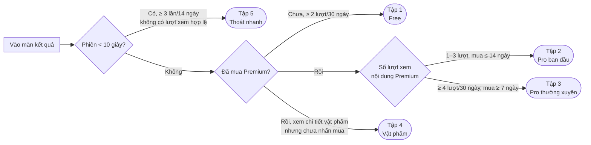
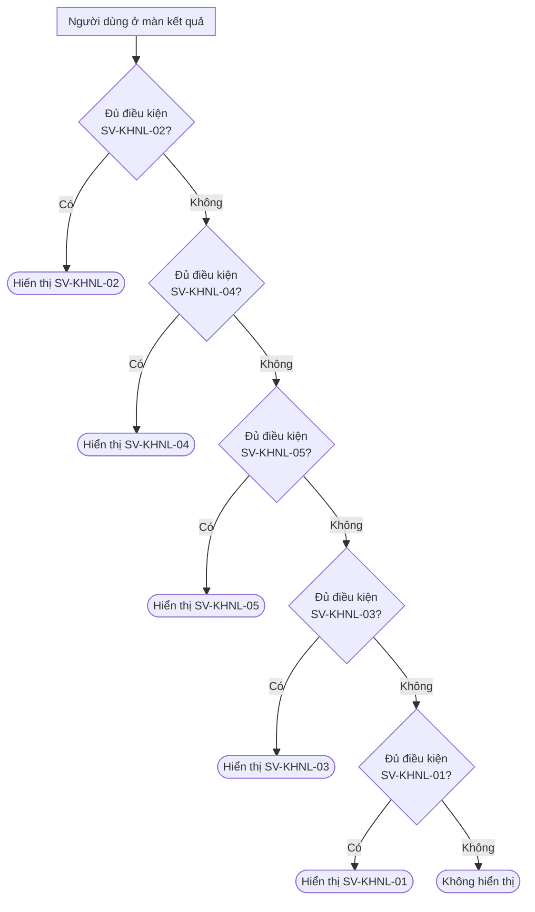

# Kế hoạch khảo sát: Kích Hoạt Năng Lượng (SVP-KHNL)

> Survey Plan — kế hoạch và cấu hình toàn bộ khảo sát in-app của một tính năng.
>
> **Đọc [[BPRD-002-KhaoSatInApp]] trước** để hiểu cơ chế chung. Các mục hay tra cứu: [[BPRD-002-KhaoSatInApp#4.3. Điều kiện hiển thị (Business Rules)|4.3 Điều kiện hiển thị]] · [[BPRD-002-KhaoSatInApp#4.4. Bộ tham số mặc định|4.4 Tham số mặc định]] · [[BPRD-002-KhaoSatInApp#5.1. Kiểu hiển thị (Display Type)|5.1 Kiểu hiển thị]] · [[BPRD-002-KhaoSatInApp#8. Trường hợp ngoại lệ (Edge Cases)|8 Ngoại lệ]]

## 1. Thông tin tài liệu

| **Trường**                | **Nội dung**                    |
| :-------------------------------- | :------------------------------------- |
| Tính năng                       | Kích Hoạt Năng Lượng Cá Nhân —[[BPRD-001-KichHoatNangLuong]] |
| Mã tính năng (`feature_key`) | `KHNL`                               |
| Cơ chế nền tảng               | [[BPRD-002-KhaoSatInApp]]                                       |
| Thiết kế UI (Prototype)      | [KichHoatNangLuong_Result_KhaoSat.html](file:///Users/dohuong/Desktop/Lich_Viet/prototype/KichHoatNangLuong_Result_KhaoSat.html) (Free) <br /> [KichHoatNangLuong_Result_Premium_KhaoSat.html](file:///Users/dohuong/Desktop/Lich_Viet/prototype/KichHoatNangLuong_Result_Premium_KhaoSat.html) (Pro) |
| User Story liên quan          | [[Story-KhaoSatInline-KichHoatNangLuong]] |
| Số chiến dịch                  | 5                                      |
| Người phụ trách               | Đỗ Thị Hường                      |
| Phiên bản                       | v1.1                                   |
| Trạng thái                      | Draft — chờ PO duyệt                |

## Nhật ký thay đổi

| Ngày cập nhật | Phiên bản | Người thực hiện | Nội dung thay đổi                                                                                                                                                                                                                                                                                                  |
| :--------------- | :---------- | :------------------ | :-------------------------------------------------------------------------------------------------------------------------------------------------------------------------------------------------------------------------------------------------------------------------------------------------------------------- |
| 2026-09-17       | v1.0        | Đỗ Thị Hường   | Khởi tạo kế hoạch 5 chiến dịch theo tập người dùng                                                                                                                                                                                                                                                          |
| 2026-09-18       | v1.0        | Đỗ Thị Hường   | Bổ sung mục 8: số liệu cần phân tích để chốt tham số điều kiện                                                                                                                                                                                                                                          |
| 2026-09-22       | v1.0        | Đỗ Thị Hường   | Cập nhật bộ câu hỏi mục 5.1 (SV-KHNL-01) thành 2 câu theo prototype demo                                                                                                                                                                                                                                      |
| 2026-09-22       | v1.0        | Đỗ Thị Hường   | Cập nhật chi tiết 2 luồng điểm kích hoạt mục 5.1 (SV-KHNL-01)                                                                                                                                                                                                                                                |
| 2026-10-01       | v1.1        | Đỗ Thị Hường   | Bổ sung & ưu tiên triển khai hình thức Khảo sát Inline (Inline Survey Card ở cuối màn kết quả) làm hình thức áp dụng đầu tiên cho tính năng Kích Hoạt Năng Lượng; cập nhật bộ câu hỏi đánh giá Hữu ích / Chưa hữu ích & quy định gửi dữ liệu real-time theo từng câu. |

---

## 2. Mục tiêu nghiên cứu

### 2.1. Câu hỏi nghiên cứu

Mỗi chiến dịch trả lời **một** câu hỏi nghiên cứu (RQ) và phục vụ **một** nhóm quyết định sản phẩm. Câu hỏi khảo sát nào không phục vụ RQ của chiến dịch thì không đưa vào.

| **Mã** | **Câu hỏi nghiên cứu**                                                                          | **Chiến dịch** | **Quyết định sản phẩm dựa trên kết quả**                                 |
| :------------ | :-------------------------------------------------------------------------------------------------------- | :--------------------- | :-------------------------------------------------------------------------------------- |
| RQ1           | Vì sao người dùng Free chưa nâng cấp? Họ kỳ vọng gì, nội dung nào đủ hấp dẫn để mua?   | `SV-KHNL-01`         | Nội dung xem trước ở khối bị khóa, thông điệp CTA, giá gói                  |
| RQ2           | Nội dung Premium có dễ hiểu, đúng với người dùng không? Phần nào có giá trị / khó hiểu? | `SV-KHNL-02`         | Ưu tiên viết lại / bổ sung giải thích cho từng phần luận giải                |
| RQ3           | Người dùng thường xuyên dùng tính năng để làm gì, vì sao họ quay lại?                     | `SV-KHNL-03`         | Roadmap tính năng giữ chân (nhắc nhở, nội dung theo ngày/tháng…)              |
| RQ4           | Vì sao người quan tâm linh vật/vật phẩm chưa mua?                                                 | `SV-KHNL-04`         | Trang chi tiết vật phẩm, lựa chọn đối tác, cân nhắc mua trực tiếp trong app |
| RQ5           | Vì sao người dùng vào rồi thoát nhanh nhiều lần?                                                 | `SV-KHNL-05`         | Tốc độ tải, UX màn kết quả, thông điệp kỳ vọng ở màn Intro                |

---

## 3. Tổng quan chiến dịch

### Giai đoạn 1: Khảo sát Inline cố định ở cuối màn kết quả (Triển khai trước)

| **Mã khảo sát** | **Tập người dùng** | **RQ** | **Ưu tiên** | **Kiểu**     | **Số câu** | **Cỡ mẫu** | **Thời gian chạy** | **Trạng thái** |
| :----------------------- | :--------------------------- | :----------- | :------------------ | :------------------ | :----------------- | :----------------- | :------------------------- | :--------------------- |
| [[#5.A.1. SV-KHNL-01-INLINE — Khảo sát Inline cho Tập Free\|SV-KHNL-01-INLINE]]                         | Người dùng Free           | RQ1          | 1                   | Entry (Inline Card) | 1 câu popup       | 500                | 01/10 – 31/10             | draft                  |
| [[#5.A.2. SV-KHNL-02-INLINE — Khảo sát Inline cho Tập Pro\|SV-KHNL-02-INLINE]]                         | Người dùng Pro            | RQ2          | 1                   | Entry (Inline Card) | 1 câu popup       | 300                | 01/10 – 31/10             | draft                  |

### Giai đoạn 2: Khảo sát Entry Teaser Card & Direct theo 5 tập người dùng (Triển khai mở rộng)

| **Mã khảo sát** | **Tập người dùng**     | **RQ** | **Ưu tiên** | **Kiểu**      | **Số câu** | **Cỡ mẫu** | **Thời gian chạy** | **Trạng thái** |
| :----------------------- | :------------------------------- | :----------- | :------------------ | :------------------- | :----------------- | :----------------- | :------------------------- | :--------------------- |
| [[#5.B.1. SV-KHNL-01 — Free tính năng\|SV-KHNL-01]]                         | Free tính năng                 | RQ1          | 5                   | Entry (Teaser Card)  | 2                  | 500                | 01/10 – 31/10             | draft                  |
| [[#5.B.2. SV-KHNL-02 — Pro trải nghiệm ban đầu\|SV-KHNL-02]]                         | Pro – trải nghiệm ban đầu   | RQ2          | **1**         | Entry (Teaser Card)  | 3                  | 300                | 01/10 – 31/10             | draft                  |
| [[#5.B.3. SV-KHNL-03 — Pro sử dụng thường xuyên\|SV-KHNL-03]]                         | Pro – sử dụng thường xuyên | RQ3          | 4                   | Entry (Teaser Card)  | 3                  | 300                | 01/10 – 31/10             | draft                  |
| [[#5.B.4. SV-KHNL-04 — Quan tâm vật phẩm nhưng chưa mua\|SV-KHNL-04]]                         | Quan tâm vật phẩm chưa mua   | RQ4          | 2                   | Entry (Teaser Card)  | 2                  | 300                | 01/10 – 31/10             | draft                  |
| [[#5.B.5. SV-KHNL-05 — Vào nhanh, thoát nhanh\|SV-KHNL-05]]                         | Vào nhanh – thoát nhanh       | RQ5          | 3                   | Direct (Micro-sheet) | 2                  | 200                | 01/10 – 31/10             | draft                  |

> Khi thay đổi thời gian chạy hoặc trạng thái, cập nhật đồng thời bảng đăng ký toàn app tại [[BPRD-002-KhaoSatInApp#10. Danh mục khảo sát (Survey Registry)]].

---

## 4. Phân tập người dùng

### 4.1. Định nghĩa dùng chung

| **Khái niệm**              | **Định nghĩa**                                                                                                                                  |
| :--------------------------------- | :------------------------------------------------------------------------------------------------------------------------------------------------------- |
| **Lượt xem hợp lệ**      | Màn kết quả dựng thành công và người dùng ở lại**≥ 10 giây**. Đây là "lần sử dụng hợp lệ" của điều kiện 1 (BPRD-002, mục 4.3) |
| **Phiên thoát nhanh**      | Màn kết quả dựng thành công nhưng người dùng rời màn**< 10 giây**                                                                           |
| **Người dùng Free**       | Chưa mua gói Premium tính năng KHNL                                                                                                                  |
| **Người dùng Pro**        | Đã mua gói Premium tính năng KHNL                                                                                                                   |
| **Xem chi tiết vật phẩm** | Nhấn mở chi tiết một linh vật/vật phẩm                                                                                                            |
| **Đã mua vật phẩm**      | Đã nhấn nút mua hàng                                                                                                                                |

### 4.2. Bản đồ tập theo phễu


```mermaid
%%{init: {"themeVariables": {"fontSize": "12px"}, "flowchart": {"nodeSpacing": 25, "rankSpacing": 30, "padding": 6}}}%%
flowchart LR
    A["Vào màn kết quả"] --> B{"Phiên < 10 giây?"}
    B -- "Có, ≥ 3 lần/14 ngày<br/>không có lượt xem hợp lệ" --> T5(["Tập 5<br/>Thoát nhanh"])
    B -- "Không" --> C{"Đã mua Premium?"}
    C -- "Chưa, ≥ 2 lượt/30 ngày" --> T1(["Tập 1<br/>Free"])
    C -- "Rồi" --> D{"Số lượt xem<br/>nội dung Premium"}
    D -- "1–3 lượt, mua ≤ 14 ngày" --> T2(["Tập 2<br/>Pro ban đầu"])
    D -- "≥ 4 lượt/30 ngày, mua ≥ 7 ngày" --> T3(["Tập 3<br/>Pro thường xuyên"])
    C -- "Rồi, xem chi tiết vật phẩm<br/>nhưng chưa nhấn mua" --> T4(["Tập 4<br/>Vật phẩm"])
```

**Quan hệ giữa các tập:**

* Tập 1 (Free) loại trừ tập 2, 3, 4 (Pro) theo định nghĩa; tập 2 và 3 loại trừ nhau theo số lượt xem.
* Tập 4 có thể trùng tập 2 hoặc 3; tập 5 có thể trùng tập 1 hoặc 3 ⇒ xử lý bằng thứ tự ưu tiên (mục 4.3).

### 4.3. Thứ tự ưu tiên khi thuộc nhiều tập

Mỗi lượt vào màn kết quả chỉ hiển thị **tối đa 1 khảo sát**. Hệ thống xét lần lượt từ ưu tiên 1; chiến dịch đầu tiên mà người dùng **vừa thuộc tập vừa thỏa mãn toàn bộ điều kiện hiển thị** sẽ được chọn.

Sau khi một chiến dịch của KHNL đã hiển thị, **mọi chiến dịch còn lại của tính năng phải chờ K = 90 ngày** (điều kiện 9 của BPRD-002). Nghĩa là mỗi người dùng chỉ nhận tối đa 1 khảo sát KHNL trong 90 ngày, dù họ đi qua nhiều tập.


```mermaid
%%{init: {"themeVariables": {"fontSize": "12px"}, "flowchart": {"nodeSpacing": 25, "rankSpacing": 30, "padding": 6}}}%%
flowchart TD
    S["Người dùng ở màn kết quả"] --> P1{"Đủ điều kiện<br/>SV-KHNL-02?"}
    P1 -- "Có" --> R2(["Hiển thị SV-KHNL-02"])
    P1 -- "Không" --> P2{"Đủ điều kiện<br/>SV-KHNL-04?"}
    P2 -- "Có" --> R4(["Hiển thị SV-KHNL-04"])
    P2 -- "Không" --> P3{"Đủ điều kiện<br/>SV-KHNL-05?"}
    P3 -- "Có" --> R5(["Hiển thị SV-KHNL-05"])
    P3 -- "Không" --> P4{"Đủ điều kiện<br/>SV-KHNL-03?"}
    P4 -- "Có" --> R3(["Hiển thị SV-KHNL-03"])
    P4 -- "Không" --> P5{"Đủ điều kiện<br/>SV-KHNL-01?"}
    P5 -- "Có" --> R1(["Hiển thị SV-KHNL-01"])
    P5 -- "Không" --> N(["Không hiển thị"])
```

| **Ưu tiên** | **Chiến dịch** | **Lý do**                                                                              |
| :------------------ | :--------------------- | :-------------------------------------------------------------------------------------------- |
| 1                   | `SV-KHNL-02`         | Cửa sổ ngắn (14 ngày sau khi mua); để lâu cảm nhận ban đầu không còn chính xác |
| 2                   | `SV-KHNL-04`         | Ý định mua vật phẩm phai nhanh, cần hỏi khi lý do còn rõ                            |
| 3                   | `SV-KHNL-05`         | Tín hiệu rời bỏ gần đây phản ánh trạng thái hiện tại tốt hơn hành vi cũ      |
| 4                   | `SV-KHNL-03`         | Hành vi ổn định, có thể chờ đợt sau                                                  |
| 5                   | `SV-KHNL-01`         | Tập lớn nhất, dễ đạt cỡ mẫu, không gấp                                              |

---

## 5. Đặc tả chi tiết các chiến dịch khảo sát

---

### 5.A. Giai đoạn 1 — Khảo sát Inline cố định ở cuối màn kết quả (Triển khai trước)

#### 5.A.0. Cấu hình Khung Khảo Sát Inline tính năng KHNL

Chiến dịch khảo sát Inline của Kích Hoạt Năng Lượng tuân thủ quy chuẩn khung giao diện và luồng nghiệp vụ **Luồng B (Inline Card)** tại [[BPRD-002-KhaoSatInApp#4.2.2. Luồng B: Khảo sát dạng Entry - Inline Card (Khối khảo sát cuối màn kết quả)|BPRD-002 mục 4.2.2]] và [[BPRD-002-KhaoSatInApp#6.2. Điểm vào khảo sát dạng Entry|BPRD-002 mục 6.2]].

- **Tài liệu User Story**: [[Story-KhaoSatInline-KichHoatNangLuong]]
- **Prototype Thiết kế UI**: 
  - Màn Free: [KichHoatNangLuong_Result_KhaoSat.html](file:///Users/dohuong/Desktop/Lich_Viet/prototype/KichHoatNangLuong_Result_KhaoSat.html)
  - Màn Pro: [KichHoatNangLuong_Result_Premium_KhaoSat.html](file:///Users/dohuong/Desktop/Lich_Viet/prototype/KichHoatNangLuong_Result_Premium_KhaoSat.html)
- **Vị trí hiển thị**: Đặt cố định ở cuối nội dung màn kết quả Kích Hoạt Năng Lượng (dưới khối kết quả / xem trước).
- **Quy tắc hiển thị**: **LUÔN LUÔN HIỂN THỊ** đối với mọi người dùng khi xem màn kết quả.
- **Ràng buộc tương tác nút đánh giá nhanh**:
  1. Nhấp *Hữu ích* 👍 hoặc *Chưa hữu ích* 👎 ➔ Highlight nút & ghi nhận ngay phản hồi đánh giá nhanh lên máy chủ.
  2. **Điều kiện mở Popup khảo sát chi tiết**: Tự động bung Popup khảo sát tương ứng theo cấu hình ở mục `5.A.1` (Tập Free) và `5.A.2` (Tập Pro). Nếu người dùng đã từng hoàn thành Popup khảo sát đó trước đó, hệ thống dừng ở bước ghi nhận đánh giá nhanh và **không hiển thị Popup**.

---

#### 5.A.1. SV-KHNL-01-INLINE — Khảo sát Inline cho Tập Free

- **Đối tượng**: Người dùng Free (chưa mở khóa Premium) khi xem màn kết quả.
- **Khối Inline**: Dùng Khung Inline chuẩn ở mục `5.A.0`.
- **Tiêu đề Popup Khảo sát (`popup_title`)**: `"Chia sẻ thêm ý kiến của bạn"`
- **Cấu hình Popup khảo sát chi tiết**:

##### Luồng khi chọn "Hữu ích" (Popup `step-useful`)

| STT | Câu hỏi                                            | Dạng        | Đáp án / Giao diện                                                                                                                                                                                                                                                              | Bắt buộc | Mục đích                                                                                               |
| :-- | :--------------------------------------------------- | :----------- | :---------------------------------------------------------------------------------------------------------------------------------------------------------------------------------------------------------------------------------------------------------------------------------- | :--------- | :-------------------------------------------------------------------------------------------------------- |
| 1   | **Bạn quan tâm nhất đến nội dung nào?** | Chọn nhiều | • Điểm mạnh & điểm cần lưu ý• Biểu đồ Ngũ hành & phân tích năng lực• Dụng thần phù hợp• Linh vật phù hợp• Ngày giờ & cách kích hoạt• Các cách cân bằng Ngũ hành khác*(Vòng tay, quả cầu, Tháp Văn Xương, màu sắc hỗ trợ...)* | Có        | Tìm hiểu nội dung thu hút nhất với người dùng Free để tối ưu khối trích đoạn xem trước |

*Nút CTA*: **"Gửi phản hồi"** ➔ Gửi dữ liệu câu trả lời & hiển thị Popup Cảm ơn (`step-thankyou`).

##### Luồng khi chọn "Chưa hữu ích" (Popup `step-unfit`)

| STT | Câu hỏi                                               | Dạng              | Đáp án / Giao diện                                                                                                                           | Bắt buộc | Mục đích                                                         |
| :-- | :------------------------------------------------------ | :----------------- | :----------------------------------------------------------------------------------------------------------------------------------------------- | :--------- | :------------------------------------------------------------------ |
| 1   | **Điều gì khiến bạn thấy chưa hữu ích?** | Chọn nhiều       | • Nội dung còn chung chung• Có phần chưa đúng với tôi• Có phần khó hiểu• Chưa thấy đủ giá trị để xem phần chuyên sâu | Có        | Nhận diện rào cản & điểm chưa hài lòng của nội dung Free |
| —  | *Chia sẻ thêm ý kiến của bạn*                   | Ô nhập văn bản | Placeholder:`"Ví dụ: phần nào chưa đúng, còn chung chung hoặc bạn muốn biết thêm điều gì..."`                                  | Không     | Thu thập ý kiến đóng góp chi tiết                            |

*Nút CTA*: **"Gửi phản hồi"** ➔ Gửi dữ liệu câu trả lời & hiển thị Popup Cảm ơn (`step-thankyou`).

---

#### 5.A.2. SV-KHNL-02-INLINE — Khảo sát Inline cho Tập Pro

- **Đối tượng**: Người dùng Pro (đã mở khóa đầy đủ) khi xem màn kết quả Premium.
- **Khối Inline**: Dùng Khung Inline chuẩn ở mục `5.A.0`.
- **Tiêu đề Popup Khảo sát (`popup_title`)**: `"Chia sẻ thêm ý kiến của bạn"`
- **Cấu hình Popup khảo sát chi tiết**:

##### Luồng khi chọn "Hữu ích" (Popup gán nút Hữu ích)

| STT | Câu hỏi                                                 | Dạng        | Đáp án / Giao diện                                                                                                                                                                             | Bắt buộc | Mục đích                                                                    |
| :-- | :-------------------------------------------------------- | :----------- | :------------------------------------------------------------------------------------------------------------------------------------------------------------------------------------------------- | :--------- | :----------------------------------------------------------------------------- |
| 1   | **Phần nào trong kết quả hữu ích với bạn?** | Chọn nhiều | • Điểm mạnh & điểm cần lưu ý• Biểu đồ Ngũ hành & phân tích năng lực• Dụng thần phù hợp• Linh vật & phương hướng kích hoạt• Các cách cân bằng Ngũ hành khác | Có        | Xác định nội dung đem lại giá trị cao nhất cho khách hàng trả phí |

*Nút CTA*: **"Gửi phản hồi"** ➔ Gửi dữ liệu câu trả lời & hiển thị Popup Cảm ơn (`step-thankyou`).

##### Luồng khi chọn "Chưa hữu ích" (Popup gán nút Chưa hữu ích)

| STT | Câu hỏi                                                              | Dạng              | Đáp án / Giao diện                                                                                                                                                                                   | Bắt buộc | Mục đích                                                            |
| :-- | :--------------------------------------------------------------------- | :----------------- | :------------------------------------------------------------------------------------------------------------------------------------------------------------------------------------------------------- | :--------- | :--------------------------------------------------------------------- |
| 1   | **Phần nào trong kết quả bạn thấy chưa hữu ích?**       | Chọn nhiều       | • Điểm mạnh, điểm cần lưu ý• Biểu đồ Ngũ hành & phân tích năng lực• Dụng thần phù hợp• Linh vật & phương hướng kích hoạt• Các cách cân bằng Ngũ hành khác        | Có        | Nhận diện các phần nội dung Pro cần tối ưu                     |
| 2   | **Những phần bạn vừa chọn chưa hữu ích ở điểm nào?** | Chọn nhiều       | - Nội dung còn chung chung<br />- Có thông tin chưa đúng với tôi<br />- Có phần dài hoặc khó hiểu<br />- Có chỗ khó xem hoặc khó sử dụng<br />- Chưa có nội dung tôi quan tâm | Có        | Phân tích chi tiết nguyên nhân người dùng Pro chưa hài lòng |
| —  | Ý kiến thêm                                                          | Ô nhập văn bản | Placeholder:`"Bạn muốn nói rõ hơn hoặc góp ý thêm điều gì?"`                                                                                                                          | Không     | Thu thập góp ý chuyên sâu                                         |

*Luồng hiển thị*: Popup chia thành 2 bước câu hỏi chuyển trang lần lượt:
- *Chuyển bước (Bước 1 ➔ Bước 2)*: Nút **"Tiếp tục"** tại Bước 1 (Câu 1).
- *Hoàn tất*: Nút **"Gửi phản hồi"** tại Bước 2 (Câu 2 & Ý kiến đóng góp) ➔ Gửi dữ liệu câu trả lời & hiển thị Popup Cảm ơn (`step-thankyou`).

---

### 5.B. Giai đoạn 2 — Khảo sát Entry Teaser Card & Direct theo 5 tập người dùng (Triển khai mở rộng)

#### 5.B.1. SV-KHNL-01 — Free tính năng (Entry Teaser Card)

- **Kiểu hiển thị**: Entry Teaser Card (Popup trượt nhỏ tự mở từ dưới lên sau Z = 30s)
- **Tập người dùng**: Free tính năng, có ≥ 2 lượt xem hợp lệ trong 30 ngày.
- **Bộ câu hỏi (2 câu)**:
  - **Câu 1**: *1. Bạn quan tâm nhất đến nội dung nào? (Chọn tối đa 2)* ➔ [Điểm mạnh/lưu ý, Biểu đồ Ngũ hành, Dụng thần phù hợp, Linh vật & cách kích hoạt]
  - **Câu 2**: *2. Điều gì khiến bạn chưa muốn xem đầy đủ kết quả?* ➔ [Chưa rõ phần đầy đủ có gì hữu ích, Mức giá chưa phù hợp, Phần miễn phí đã đủ, Muốn xem nhưng chưa phải lúc này] + Ô nhập chia sẻ thêm.

#### 5.B.2. SV-KHNL-02 — Pro trải nghiệm ban đầu (Entry Teaser Card)

- **Kiểu hiển thị**: Entry Teaser Card (sau Z = 90s khi xem nội dung Premium)
- **Tập người dùng**: Pro đã mua ≤ 14 ngày và có 1–3 lượt xem hợp lệ.
- **Bộ câu hỏi (3 câu)**:
  - **Câu 1**: *Phần nào trong kết quả hữu ích với bạn?*
  - **Câu 2**: *Phần nào trong kết quả bạn thấy khó hiểu?*
  - **Câu 3**: *Nội dung luận giải đúng với bạn ở mức nào?* (Rất đúng / Khá đúng / Đúng 1 phần / Chưa đúng) + Ô nhập ý kiến tự do.

#### 5.B.3. SV-KHNL-03 — Pro sử dụng thường xuyên (Entry Teaser Card & NPS)

- **Kiểu hiển thị**: Entry Teaser Card
- **Tập người dùng**: Pro đã mua ≥ 7 ngày và có ≥ 4 lượt xem hợp lệ trong 30 ngày (tổng thời gian ≥ 5 phút).
- **Bộ câu hỏi (5 câu & Thang NPS)**:
  - **Câu 1**: *Bạn thường xem lại luận giải để làm gì?* (Chọn tối đa 3)
  - **Câu 2**: *Phần nào bạn xem lại nhiều nhất?*
  - **Câu 3**: *Bạn thường quay lại xem vào lúc nào?*
  - **Câu 4**: *Bạn sẵn sàng giới thiệu tính năng này cho bạn bè ở mức nào?* (Thang 0–10 NPS)
  - **Câu 5**: *Bạn muốn tính năng có thêm gì để dùng thường xuyên hơn?* (Câu hỏi mở).

#### 5.B.4. SV-KHNL-04 — Quan tâm vật phẩm nhưng chưa mua (Entry Teaser Card)

- **Kiểu hiển thị**: Entry Teaser Card (Ngay dưới khối Linh vật hỗ trợ)
- **Tập người dùng**: Pro xem chi tiết ≥ 1 vật phẩm trong 14 ngày nhưng chưa mua.
- **Bộ câu hỏi (4 câu)**:
  - **Câu 1**: *Điều gì khiến bạn chưa mua vật phẩm đã xem?* (Giá cao, Chưa tin chất lượng, Chưa rõ cách dùng, v.v.)
  - **Câu 2**: *Thông tin nào giúp bạn dễ quyết định hơn?* (Giải thích vì sao hợp bản mệnh, Đánh giá người đã mua, v.v.)
  - **Câu 3**: *Bạn sẵn sàng chi bao nhiêu cho một vật phẩm phong thủy?* (Dưới 200k, 200k-500k, 500k-1tr, Trên 1tr)
  - **Câu 4**: *Góp ý thêm về gợi ý linh vật, vật phẩm.* (Câu hỏi mở).

#### 5.B.5. SV-KHNL-05 — Vào nhanh, thoát nhanh (Direct Bottom Sheet Micro-survey)

- **Kiểu hiển thị**: Direct Micro-sheet (Bung tự động sau 5s ở phiên kế tiếp)
- **Tập người dùng**: Có ≥ 3 phiên thoát nhanh (< 10s) trong 14 ngày.
- **Bộ câu hỏi (2 câu)**:
  - **Câu 1**: *Điều gì khiến bạn thường rời màn này khá nhanh?* (Tải chậm, Nội dung khó hiểu, Không đúng điều tìm kiếm, v.v.)
  - **Câu 2**: *Bạn mong đợi thấy điều gì khi mở tính năng này?* (Câu hỏi mở).

---

## 6. Ma trận so sánh điều kiện (tra cứu nhanh)

| STT | Điều kiện                            | SV-KHNL-01-INLINE / 02-INLINE      | SV-KHNL-01 (Teaser) | SV-KHNL-02 (Teaser)    | SV-KHNL-03 (Teaser) | SV-KHNL-04 (Teaser) | SV-KHNL-05 (Direct)  |
| :-- | :-------------------------------------- | :--------------------------------- | :------------------ | :--------------------- | :------------------ | :------------------ | :------------------- |
| 1   | Số lần sử dụng hợp lệ             | Mặc định                        | X = 2 (30 ngày)    | 1–3 lượt (14 ngày) | X = 4 (30 ngày)    | ⬜                  | ⬜                   |
| 2   | Tổng thời gian xem màn kết quả     | Mặc định                        | ⬜                  | ⬜                     | Y = 5 phút         | ⬜                  | ⬜                   |
| 3   | Thời gian ở màn kết quả phiên     | 0s (Khối Inline luôn hiển thị) | Z = 30s             | Z = 90s                | Z = 20s             | Z = 20s             | Z = 5s               |
| 4   | Chưa hoàn thành khảo sát           | ✅ Bắt buộc                      | ✅ Bắt buộc       | ✅ Bắt buộc          | ✅ Bắt buộc       | ✅ Bắt buộc       | ✅ Bắt buộc        |
| 5   | Thời gian chờ sau bỏ qua             | 14 ngày · 2 lần                 | 14 ngày · 2 lần  | 7 ngày · 1 lần      | 14 ngày · 2 lần  | 14 ngày · 1 lần  | 30 ngày · 1 lần   |
| 6   | Trong ngày chưa xem survey khác      | ✅ 1/ngày                         | ✅ 1/ngày          | ✅ 1/ngày             | ✅ 1/ngày          | ✅ 1/ngày          | ✅ 1/ngày           |
| 7   | Khoảng cách survey gần nhất         | ✅ 30 ngày                        | ✅ 30 ngày         | ✅ 30 ngày            | ✅ 30 ngày         | ✅ 30 ngày         | ✅ 30 ngày          |
| 8   | Đối tượng & tập người dùng      | Free / Pro                         | Free · Tập 1      | Pro · Tập 2          | Pro · Tập 3       | Pro · Tập 4       | Free + Pro · Tập 5 |
| 9   | Khoảng cách với survey cùng feature | ✅ K = 90 ngày                    | ✅ K = 90 ngày     | ✅ K = 90 ngày        | ✅ K = 90 ngày     | ✅ K = 90 ngày     | ✅ K = 90 ngày      |

---

## 7. Tác động tới tính năng

*Dành cho Dev, Design, QA của tính năng [[BPRD-001-KichHoatNangLuong]].*

### 7.1. Vị trí trên màn hình

| Màn                        | Vị trí hiển thị                                                  | Khảo sát                     | Ràng buộc với UI hiện có                                                             |
| :-------------------------- | :------------------------------------------------------------------- | :----------------------------- | :---------------------------------------------------------------------------------------- |
| Kết quả – Free           | Cuối màn,**dưới** CTA "Mở khóa luận giải chuyên sâu" | `SV-KHNL-01`                 | Không đè, không thay thế, không làm mờ CTA mua hàng                              |
| Kết quả – Premium        | Cuối nội dung Premium                                              | `SV-KHNL-02`, `SV-KHNL-03` | Dùng chung một vị trí, mỗi lượt chỉ hiện 1                                       |
| Kết quả – Premium        | Ngay dưới khối "Linh vật hỗ trợ"                               | `SV-KHNL-04`                 | Không chen giữa các thẻ vật phẩm                                                    |
| Kết quả – Free & Premium | Bottom sheet                                                         | `SV-KHNL-05`                 | Không bật khi đang mở popup IAP, màn đăng nhập hoặc thông báo lỗi thanh toán |

### 7.2. Tracking cần bổ sung

Ngoài các sự kiện khảo sát chung tại BPRD-002 (mục 7), việc nhận diện tập cần các sự kiện sau của tính năng. *Tên sự kiện là đề xuất, cần đối chiếu với tracking plan hiện có của BPRD-001.*

| **Sự kiện**       | **Thuộc tính bắt buộc**              | **Dùng cho**                                         |
| :------------------------ | :--------------------------------------------- | :---------------------------------------------------------- |
| `khnl_result_viewed`    | `chart_id`, `is_premium`, `duration_sec` | Lượt xem hợp lệ, phiên thoát nhanh — tập 1, 2, 3, 5 |
| `khnl_iap_opened`       | `chart_id`                                   | Loại trừ phiên đang mua — tập 1                       |
| `khnl_purchase_success` | `chart_id`, `purchased_at`                 | Phân biệt Free/Pro, số ngày kể từ mua — tập 1, 2, 3 |
| `product_detail_viewed` | `product_id`, `chart_id`                   | Tập 4                                                      |
| `product_buy_clicked`   | `product_id`, `chart_id`                   | Tập 4                                                      |

### 7.3. Lưu ý khi phát triển

- Kiểm tra điều kiện khảo sát chạy bất đồng bộ, **không được làm chậm** việc dựng màn Kết quả.
- Khảo sát luôn nhường popup IAP, paywall, màn đăng nhập; khi nhường thì không tính là một lượt hiển thị.
- Khi thay đổi cấu trúc màn Kết quả (thêm/bớt khối, đổi vị trí CTA hoặc khối Linh vật hỗ trợ) ⇒ báo BA cập nhật tài liệu này.

---

## 8. Số liệu cần phân tích để chốt tham số

Toàn bộ tham số trong mục 5 (X, Y, Z, số ngày, cỡ mẫu) hiện là **giá trị đề xuất theo kinh nghiệm**. Trước khi bật chiến dịch, cần lấy các số liệu dưới đây để chốt lại bằng dữ liệu thật.

### 8.1. Cách đọc các con số

- **p10, p25, p50, p75, p90 là gì**: xếp toàn bộ số liệu từ nhỏ tới lớn rồi xem mốc nằm ở vị trí bao nhiêu phần trăm. Ví dụ p50 = 25 giây nghĩa là **một nửa số phiên** xem màn Kết quả dưới 25 giây, một nửa còn lại trên 25 giây; p90 = 180 giây nghĩa là **chỉ 10% số phiên** xem lâu hơn 180 giây.
- **Vì sao không lấy số trung bình**: một vài người xem rất lâu sẽ kéo trung bình lên rất cao. Ví dụ 10 phiên lần lượt là 3, 4, 5, 8, 20, 30, 45, 90, 180, 600 giây thì trung bình là 98,5 giây, trong khi 7/10 phiên chưa tới 50 giây. Lấy 98,5 giây làm ngưỡng thì khảo sát hiện ra lúc phần lớn người dùng đã rời màn.
- **Ngưỡng "phiên thoát nhanh" lấy quanh p10–p25**: đây là nhóm vào rồi thoát gần như ngay, chưa kịp đọc gì.
- **Ngưỡng Z (thời gian ở màn trước khi hiện khảo sát) lấy quanh p50–p60**: khảo sát hiện ra khi khoảng một nửa người dùng vẫn còn ở màn, nhưng đã đủ lâu để họ đọc được nội dung.
- **Ngưỡng chờ trước khi hỏi (tập 4) lấy quanh p75–p90**: chờ qua mốc mà hầu hết người có ý định mua đã mua rồi, để không hỏi nhầm người vẫn đang cân nhắc.

### 8.2. Nguyên tắc chọn tham số

- **Mỗi tập nên chiếm 15–40% nhóm đối tượng**: dưới 15% thì tập quá nhỏ, không đủ cỡ mẫu trong thời gian chạy; trên 40% thì điều kiện quá lỏng, không còn là một tập riêng nữa.
- **Tập phải đủ lớn so với cỡ mẫu mục tiêu**: kiểm tra bằng công thức ở mục 8.4 trước khi chốt cỡ mẫu và thời gian chạy.
- **Ngưỡng phân tách giữa các tập phải khớp với hành vi thật**: ví dụ mốc "1–3 lượt" (tập 2) và "≥ 4 lượt" (tập 3) chỉ hợp lý nếu phân bố số lượt xem thực sự có điểm gãy quanh đó.
- **Ngưỡng "đủ trải nghiệm" không nên đặt quá cao**: đặt ở p50–p60 là đủ chặt để loại người chỉ lướt qua, mà vẫn giữ được khoảng một nửa người dùng thật trong tập.

### 8.3. Danh sách số liệu cần lấy

Khoảng thời gian phân tích: **90 ngày gần nhất**. Loại bỏ tài khoản nội bộ/test. Mọi số liệu bóc tách theo **Free / Pro** và theo **nền tảng (iOS/Android)**.

| Mã           | Số liệu cần lấy                                                                                                              | Bóc tách theo   | Dùng để chốt                                                                                                                       | Cách dùng                                                                                                                                                    |
| :------------ | :------------------------------------------------------------------------------------------------------------------------------- | :---------------- | :------------------------------------------------------------------------------------------------------------------------------------- | :------------------------------------------------------------------------------------------------------------------------------------------------------------- |
| **D01** | Phân bố thời gian ở màn Kết quả mỗi phiên (p10, p25, p50, p75, p90)                                                     | Free / Pro        | Ngưỡng**10 giây** của "lượt xem hợp lệ" và "phiên thoát nhanh"; **Z** của điều kiện 3 ở cả 5 chiến dịch | Ngưỡng thoát nhanh đặt quanh p10–p25; Z đặt ở p50–p60 của nhóm đọc thật để khảo sát hiện ra trước khi phần lớn người dùng rời màn |
| **D02** | Phân bố số lượt xem màn Kết quả / người trong 30 ngày (p50, p75, p90)                                                 | Free / Pro        | **X** của điều kiện 1 (tập 1: đang đề xuất 2; tập 3: đang đề xuất 4)                                               | Chọn X sao cho tập chiếm 15–40% nhóm đối tượng                                                                                                        |
| **D03** | Phân bố tổng thời gian xem màn Kết quả / người trong 30 ngày                                                           | Pro               | **Y** của điều kiện 2 (tập 3: đang đề xuất 5 phút)                                                                     | Đặt Y ở p50 của nhóm Pro có ≥ 4 lượt xem                                                                                                              |
| **D04** | Số lượng và tỷ lệ người dùng rơi vào từng tập 1–5 theo tuần                                                       | Tập, Free / Pro  | Tính khả thi của cỡ mẫu; xem lại thứ tự ưu tiên                                                                              | Tập nào quá nhỏ thì nới điều kiện, kéo dài thời gian chạy hoặc hạ cỡ mẫu                                                                      |
| **D05** | Khoảng cách thời gian từ lúc mua Pro tới lượt xem thứ 2, 3, 4 (p50, p75)                                                | Pro               | Cửa sổ**14 ngày** và mốc **1–3 lượt** của tập 2; mốc **≥ 7 ngày** của tập 3                           | Nếu p75 của lượt xem thứ 3 vượt 14 ngày ⇒ nới cửa sổ tập 2, nếu không tập 2 sẽ hụt mẫu                                                      |
| **D06** | Tỷ lệ người xem chi tiết vật phẩm, tỷ lệ trong đó nhấn mua, và thời gian từ xem chi tiết → nhấn mua (p50, p90) | Pro               | Ngưỡng chờ**24 giờ** và cửa sổ **14 ngày** của tập 4                                                             | Ngưỡng chờ nên ≥ p90 của thời gian tới lúc nhấn mua, để không hỏi người vẫn đang cân nhắc                                                  |
| **D07** | Phân bố số phiên thoát nhanh / người trong 14 ngày; tỷ lệ người dùng có ≥ 3 phiên                                | Free / Pro        | Ngưỡng**≥ 3 phiên** của tập 5                                                                                                    | Chọn ngưỡng giữ tập ở mức 15–40%; nếu quá ít, hạ xuống 2 phiên                                                                                   |
| **D08** | Tỷ lệ cuộn tới cuối màn Kết quả (scroll depth ≥ 90%) và tới từng khối nội dung                                     | Free / Pro        | Chọn**Entry hay Direct**, và vị trí đặt điểm vào của 4 chiến dịch Entry                                              | Nếu tỷ lệ cuộn tới cuối < 40% ⇒ điểm vào ở cuối màn sẽ ít người thấy, cần đổi vị trí hoặc chuyển sang Direct                          |
| **D09** | Số lượt vào màn Kết quả mỗi ngày và số người dùng hoạt động (DAU/MAU) của tính năng                          | Free / Pro        | Tốc độ thu mẫu, độ dài thời gian chạy                                                                                         | Đầu vào cho công thức ở mục 8.4                                                                                                                         |
| **D10** | Thời gian từ lần xem màn Kết quả đầu tiên tới lúc mua Pro (p50, p75)                                                  | Free → Pro       | Ngưỡng của tập 1 (tránh hỏi "vì sao chưa mua" khi người dùng vẫn còn trong giai đoạn cân nhắc bình thường)         | Nếu p50 là 5 ngày mà tập 1 chạm người dùng từ ngày thứ 2 ⇒ nới điều kiện 1 hoặc thêm điều kiện số ngày                                 |
| **D11** | Lịch sử hiển thị khảo sát toàn app (nếu đã có chiến dịch chạy trước)                                             | Toàn app         | Ảnh hưởng thực tế của điều kiện 6, 7, 9                                                                                       | Đo tỷ lệ lượt đủ điều kiện nhưng bị chặn vì luật chống làm phiền; nếu quá cao thì phải giãn lịch chạy                                 |
| **D12** | Cơ cấu người dùng theo nền tảng, phiên bản app, vùng                                                                   | Toàn tính năng | Kiểm tra tính đại diện của mẫu thu được                                                                                      | So cơ cấu người trả lời với cơ cấu người dùng; lệch nhiều thì cần chú thích khi đọc kết quả                                              |

> D01, D02, D07 là **bắt buộc có trước khi bật chiến dịch** — ba số liệu này quyết định các ngưỡng cốt lõi (10 giây, X, số phiên thoát nhanh). Các số liệu còn lại có thể bổ sung trong lúc chạy Pilot.

### 8.4. Ước lượng khả năng đạt cỡ mẫu

Với mỗi chiến dịch:

```
Số phản hồi kỳ vọng
  = Số người thuộc tập trong kỳ (D04)
  × Tỷ lệ quay lại màn Kết quả trong kỳ (D09)
  × Tỷ lệ vượt được điều kiện 3, 5, 6, 7, 9 (D11, ước lượng 60–80%)
  × Tỷ lệ phản hồi S01 (giả định 8% với Entry, 20% với Direct)
```

Nếu kết quả **nhỏ hơn cỡ mẫu mục tiêu**, xử lý theo thứ tự: (1) kéo dài thời gian chạy; (2) nới tham số của chính chiến dịch đó (giảm X, giảm Z); (3) hạ cỡ mẫu mục tiêu và chấp nhận sai số lớn hơn; (4) cuối cùng mới cân nhắc tắt điều kiện 9 — cần PO duyệt.

> Cỡ mẫu tham khảo: **≥ 100 phản hồi**/chiến dịch đủ để đọc xu hướng chính (sai số khoảng ±10%); **≥ 300** để so sánh giữa các nhóm đáp án; **≥ 380** cho sai số ±5%.

### 8.5. Bảng chốt tham số sau phân tích

*BA điền sau khi có số liệu; đây là căn cứ để cập nhật mục 5 và 6.*

| Tham số                                    | Chiến dịch   | Giá trị đang đề xuất     | Số liệu dùng | Giá trị sau phân tích | Ngày chốt |
| :------------------------------------------ | :------------- | :----------------------------- | :-------------- | :------------------------ | :---------- |
| Ngưỡng lượt xem hợp lệ / thoát nhanh | Dùng chung    | 10 giây                       | D01, D07        |                           |             |
| X — số lượt xem                         | `SV-KHNL-01` | 2 lượt / 30 ngày            | D02             |                           |             |
| Z — thời gian trong phiên                | `SV-KHNL-01` | 30 giây                       | D01, D08        |                           |             |
| Cửa sổ sau khi mua · số lượt          | `SV-KHNL-02` | 14 ngày · 1–3 lượt        | D05             |                           |             |
| Z — thời gian trong phiên                | `SV-KHNL-02` | 90 giây                       | D01, D08        |                           |             |
| X, Y — số lượt & tổng thời gian       | `SV-KHNL-03` | 4 lượt · 5 phút / 30 ngày | D02, D03        |                           |             |
| Ngưỡng chờ sau khi xem chi tiết         | `SV-KHNL-04` | 24 giờ                        | D06             |                           |             |
| Số phiên thoát nhanh                     | `SV-KHNL-05` | ≥ 3 phiên / 14 ngày         | D07             |                           |             |
| Z — thời gian trong phiên                | `SV-KHNL-05` | 5 giây                        | D01             |                           |             |
| Cỡ mẫu & thời gian chạy                 | Cả 5          | 200–500 · 1 tháng           | D04, D09        |                           |             |

### 8.6. Nguồn dữ liệu

| Nguồn                                       | Dùng cho     | Ghi chú                                                                                          |
| :------------------------------------------- | :------------ | :------------------------------------------------------------------------------------------------ |
| Firebase Analytics / Amplitude               | D01–D10, D12 | Cần các sự kiện ở mục 7.2; nếu chưa có`duration_sec` thì D01, D07 chưa tính được |
| Dữ liệu giao dịch IAP (server)            | D05, D10      | Dùng thời điểm mua đã xác thực ở máy chủ, không dùng sự kiện client                |
| Bảng theo dõi khảo sát (BPRD-002 mục 7) | D11           | Chỉ có sau khi đã chạy chiến dịch đầu tiên                                              |

> **Phụ thuộc quan trọng**: nếu `khnl_result_viewed` chưa gắn kèm `duration_sec` thì chưa lấy được D01 và D07 — tức chưa chốt được ngưỡng 10 giây, Z, và cả định nghĩa tập 5. Đây là việc cần làm trước tiên trong mục 9.

---

## 9. Vấn đề mở / cần duyệt

| # | Vấn đề                                                                                                                                                                     | Người quyết định | Trạng thái |
| :- | :---------------------------------------------------------------------------------------------------------------------------------------------------------------------------- | :-------------------- | :----------- |
| 1 | Duyệt ngoại lệ bộ điều kiện tối thiểu cho`SV-KHNL-02`, `SV-KHNL-04`, `SV-KHNL-05`                                                                              | PO                    | Chờ duyệt  |
| 2 | Xác nhận các sự kiện tracking ở mục 7.2 đã có / cần bổ sung — ưu tiên`duration_sec` vì D01, D07 phụ thuộc vào nó                                        | Dev + Data            | Mở          |
| 3 | Khảo sát người thoát ở màn Intro/Nhập liệu (ngoài phạm vi v1.0)                                                                                                    | PO                    | Để sau     |
| 4 | Các tham số (10 giây, 14 ngày, cỡ mẫu, khoảng giá câu 3 của`SV-KHNL-04`) là đề xuất, phải chốt lại bằng số liệu ở mục 8 trước khi bật chiến dịch | BA + Data             | Mở          |

---

## 10. Theo dõi triển khai

*Cập nhật định kỳ trong thời gian chạy. Định nghĩa chỉ số S01–S05 xem BPRD-002 mục 2.2.*

| **Mã khảo sát** | **Hiển thị** | **Phản hồi / Cỡ mẫu** | **S01 Phản hồi** | **S02 Hoàn thành** | **S03 Entry CTR** | **S04 Đóng ngay** | **S05 Ảnh hưởng** | **Ghi chú** |
| :----------------------- | :------------------- | :------------------------------ | :----------------------- | :------------------------- | :---------------------- | :------------------------ | :------------------------- | :----------------- |
| `SV-KHNL-01`           | —                   | — / 500                        | —                       | —                         | —                      | —                        | —                         |                    |
| `SV-KHNL-02`           | —                   | — / 300                        | —                       | —                         | —                      | —                        | —                         |                    |
| `SV-KHNL-03`           | —                   | — / 300                        | —                       | —                         | —                      | —                        | —                         |                    |
| `SV-KHNL-04`           | —                   | — / 300                        | —                       | —                         | —                      | —                        | —                         |                    |
| `SV-KHNL-05`           | —                   | — / 200                        | —                       | —                         | *(không áp dụng)*  | —                        | —                         |                    |
