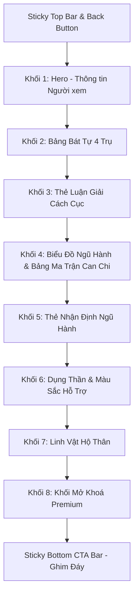

# Yêu cầu Thiết kế Figma: Màn hình Kết quả Luận giải Bát tự (Kích hoạt Năng lượng)

Tài liệu này tổng hợp toàn bộ thông tin chi tiết, đặc tả UX/UI, màu sắc, typography, component và layout từ prototype demo `KichHoatNangLuong_Result.html` nhằm cung cấp yêu cầu đầy đủ cho Designer dựng lại file thiết kế chuẩn chỉnh trên Figma.

---

## 1. Tổng quan Màn hình & Định hướng Visual (Concept & Tone)

- **Tên màn hình**: Kết quả Luận giải Bát tự - Kích hoạt Năng lượng (`KichHoatNangLuong_Result`)
- **Nền tảng mục tiêu**: Mobile App (iOS / Android), tỉ lệ thiết kế chuẩn iPhone 14/15 Pro (`393 x 852 px`).
- **Phong cách thị giác (Design Style)**: Phong thủy hiện đại (Modern Oriental), kết hợp nét truyền thống trang nhã với ngôn ngữ UI mobile cao cấp.
- **Tone & Mood**: Tinh tế, uy tín, huyền bí nhẹ nhàng nhưng hiện đại và dễ tiếp cận. Sử dụng sắc xanh lục bảo đậm (`Deep Green`) làm nền tảng mệnh hợp, điểm xuyết màu Vàng kim (`Gold Accent`) tạo vẻ sang trọng.

---

## 2. Hệ thống Thiết kế & Design Tokens (Color, Typography, Shadows)

### 2.1 Bảng màu (Color Palette)

| Loại màu | Mã HEX / RGBA | Mục đích sử dụng |
| :--- | :--- | :--- |
| **Primary Background** | `#FAFAFA` | Nền tổng thể toàn màn hình |
| **Card Background 1** | `#FFFFFF` | Thẻ nội dung chính, ô bảng Bát tự |
| **Card Background 2** | `#FFFDF8` | Thẻ luận giải mệnh chủ & ngũ hành |
| **Premium BG** | `#FFFCF7` | Nền khối Mở khoá Premium |
| **Deep Green (Chủ đạo)**| `#174F38` / `#1B4332` | Header, tên khối, button icon, chữ nhấn mạnh |
| **Gold Accent (Điểm nhấn)**| `#B67F30` (Chính), `#C8901A` (Sáng), `#94601A` (Đậm) | Nút CTA, tiêu đề mệnh chủ, badge Premium, icon sao |
| **Gold Soft / Border** | `#EBD6BA` / `#E8D8C4` / `rgba(182, 127, 48, 0.35)` | Viền thẻ luận giải, viền bảng, divider |
| **Text Primary** | `#1B4332` / `#333333` | Chữ văn bản chính, tên tiêu đề |
| **Text Secondary** | `#4B5563` / `#374151` | Chữ phụ, nhãn thông tin, ngày tháng |
| **Mộc (Wood)** | `#2D6A4F` / `#52B788` | Màu đại diện ngũ hành Mộc |
| **Hỏa (Fire)** | `#A1201B` / `#C53030` / `#F87171` | Màu đại diện ngũ hành Hỏa |
| **Thổ (Earth)** | `#8A6D3B` / `#B67F30` / `#F59E0B` | Màu đại diện ngũ hành Thổ |
| **Kim (Metal)** | `#6B6F76` / `#9CA3AF` | Màu đại diện ngũ hành Kim |
| **Thủy (Water)** | `#2563EB` / `#60A5FA` | Màu đại diện ngũ hành Thủy |

### 2.2 Typography (Phông chữ & Kiểu chữ)

- **Font Family**: `SF Pro Display` / `SF Pro Text` (hoặc `Inter` trên Figma).
- **Phân cấp Typo**:
  - `Screen Title` (Top Bar): Bold 16px, color `#1B4332`.
  - `Hero Title`: Bold 24px, line-height 1.25, color `#174F38`.
  - `User Name`: Bold 20px, color `#B67F30`.
  - `Section Title`: Bold 19px - 20px, color `#174F38` hoặc `#B67F30`.
  - `Highlight Title`: Bold 16px, color `#174F38`.
  - `Body Text`: Medium/Regular 15px, line-height 1.6, color `#333333`.
  - `Table Label / Subtext`: SemiBold/Medium 10.5px - 12px, color `#4B5563`.
  - `Table Value`: Bold 13px - 16px, color `#1B4332`.

### 2.3 Shadow & Radius (Đổ bóng & Bo góc)

- **Radius**:
  - Thẻ thông tin / Card: `14px` - `16px`.
  - Bảng Bát tự: `14px`.
  - CTA Button: `12px`.
  - Circle Icon Badge: `50%`.
- **Shadow**:
  - Card Shadow: `0 2px 6px rgba(182, 127, 48, 0.03)`.
  - Premium Unlock Box Shadow: `0 -4px 20px rgba(182, 127, 48, 0.08)`.
  - CTA Floating Bar Shadow: `0 -4px 16px rgba(0, 0, 0, 0.06)`.
  - Gold Button Shadow: `0 6px 16px rgba(148, 96, 26, 0.3)`.

---

## 3. Cấu trúc Layout & Các Khối Component Chi Tiết

Giao diện cuộn dọc bao gồm **7 khối thành phần chính**:

### 3.1 Top Bar & Header Cố Định
- **Status Bar**: Tối giản iOS standard (09:50, Pin, Wifi).
- **Floating Back Button**: Nút tròn `30x30px`, nền trắng `rgba(255, 255, 255, 0.95)`, icon mũi tên sang trái.
- **Fixed App Bar**: Chiều cao `96px` (đã gồm safe padding top), title căn giữa "Kết quả luận giải", viền đáy mỏng `rgba(182, 127, 48, 0.08)`.

### 3.2 Khối 1: Hero - Thông tin Người xem (Viewer Info)
- **Tiêu đề khối**: "Lá số Bát tự của bạn" (Bold 24px).
- **Tên người dùng**: "Nguyễn Hiếu Minh" (Bold 20px, màu vàng kim `#B67F30`).
- **Lưới thông tin Ngày & Giờ sinh (2 cột)**:
  - Cột 1 (Ngày sinh): Icon lịch SVG, giá trị Dương lịch `09/01/1998`, phụ đề Âm lịch `11/12/1997`.
  - Cột 2 (Giờ sinh): Icon đồng hồ SVG, giá trị `05:30`, phụ đề Giờ Can chi `Giờ Mão`.

### 3.3 Khối 2: Bảng Bát Tự 4 Trụ (Four Pillars Grid)
- Bảng lưới **4 cột tương ứng 4 trụ**: **NĂM | THÁNG | NGÀY | GIỜ**.
- Các hàng thông tin (từ trên xuống):
  1. **Header Row**: Tên trụ (NĂM/THÁNG/NGÀY/GIỜ), Mệnh nạp âm (vd: THIÊN ĐẦU THỔ), Số năm/tháng/ngày/giờ.
  2. **Thiên Can**: Tên can (MẬU, ĐINH, MẬU, CANH) + Âm Dương Ngũ hành. Tô màu phân biệt ngũ hành (ví dụ: Hỏa tô đỏ).
  3. **Địa Chi**: Tên chi (DẦN, TỊ, THÌN, THÂN) + Trạng thái Vòng Trường Sinh (Lâm Quan, Đế Vượng,...).
  4. **Tàng Can**: Danh sách các can ẩn bên trong địa chi. Mỗi dòng tô màu theo thuộc tính ngũ hành (Mộc: xanh, Hỏa: đỏ, Thổ: nâu, Kim: xám, Thủy: xanh dương).
  5. **Thập Thần**: Tỷ, Ấn, Nhật chủ, Thực thần.

### 3.4 Khối 3: Thẻ Luận Giải Cách Cục (Destiny Structure Card)
- Nền kem nhạt `#FFFDF8`, viền `#EBD6BA`.
- Tiêu đề chính: "Lá số Bát tự của bạn thuộc cách cục **Kiến Lộc**" (chữ Kiến Lộc màu Vàng kim nổi bật).
- 2 Phần phân tích:
  - **Điểm mạnh nổi bật**: Icon ngôi sao vàng kim + Tiêu đề + Đoạn văn mô tả (có in đậm các từ khóa quan trọng như *nền tảng bền vững*).
  - **Điểm cần lưu ý**: Icon chấm chú ý vàng kim + Tiêu đề + Đoạn văn mô tả (in đậm từ khóa *quá thận trọng*).

### 3.5 Khối 4: Biểu Đồ Ngũ Hành & Bảng Ma Trận Can Chi
- **Tiêu đề**: "Biểu đồ Ngũ hành" + Đoạn văn giới thiệu ngắn.
- **Biểu đồ cột (Bar Chart cuộn ngang)**:
  - 10 Cột ứng với 10 Thiên can: Canh, Tân, Nhâm, Quý, Giáp, Ất, Bính, Đinh, Mậu, Kỷ.
  - Phía trên mỗi cột ghi tỷ lệ phần trăm (vd: 20%, 4%, 11%, 26%...).
  - Màu thanh đại diện chuẩn theo 5 Ngũ hành.
- **Bảng ma trận Can Chi bên dưới**:
  - Cột đầu tiên cố định (Label: Thần, Can, Thiên can, Địa chi, Trạng thái, Trường sinh).
  - 10 Cột tiếp theo đồng bộ độ rộng thẳng hàng với 10 cột biểu đồ bên trên.

### 3.6 Khối 5: Thẻ Nhận Định Ngũ Hành & Khối 6: Dụng Thần
- Thẻ bo góc `#FFFDF8` chứa nhận định bổ trợ:
  - Subtitle: "NHẬN ĐỊNH TỪ NGŨ HÀNH" (Upcase, vàng kim).
  - Title: "Nhật chủ Giáp · Sinh tháng Tý".
  - Phần 1: **Chân dung năng lực** (Icon la bàn).
  - Phần 2: **Điểm cần lưu ý** (Icon cảnh báo).
- Khối **Dụng thần của bạn**: Hiển thị chi tiết Dụng thần (vd: Mộc), các mục tác động (Công việc, Phát triển bản thân, Tài lộc) và Màu sắc hỗ trợ / tương khắc.

### 3.7 Khối 7: Linh Vật Hộ Thân (Animal Mascot Protection Card)
- **Vị trí**: Đặt ngay bên dưới khối Dụng thần và dải phân cách section.
- **Tiêu đề lớn**: "Linh vật hộ thân của bạn" (Bold 24px).
- **Bố cục thẻ**:
  - **Bên trái**: Hình ảnh minh họa linh vật (`mascot_trau.png`, kích thước `90x90px` bo góc `12px` nhẹ, nền nhạt `#FAF7F2`).
  - **Bên phải**: Tên linh vật in hoa "TRÂU" (Bold 22px, font SF Pro, màu `#1F5A3D`) kèm dòng mô tả ngắn "Biểu tượng của sức mạnh bền bỉ" (Medium 14px, màu `#555555`).

### 3.8 Khối 8: Khối Mở Khoá Premium (Premium Unlock Section)
- Nền `#FFFCF7`, bo góc cong phía trên (`16px 16px 0 0`), shadow đẩy ngược lên trên.
- **Họa tiết trang trí phong thủy**:
  - Radial gradient vầng sáng vàng nhạt phía sau.
  - Các icon ngôi sao lấp lánh (Sparkles) thiết kế vector đính góc trên.
- **Badge**: "PREMIUM" màu vàng kim gradient kèm icon vương miện.
- **Headline**: "Mở khoá luận giải chuyên sâu" (Bold 28px, màu xanh `#174F38`).
- **Inner White Box**:
  - Group Header 1: Nền xanh `#F2F6EF` + Title "Bản phân tích dành riêng cho bạn" + Icon Ổ khóa Vàng Gradient.
    - 3 Feature Items kèm Icon tròn nổi bật: *Chân dung năng lượng*, *Bản đồ ngũ hành cá nhân*, *Hướng phát triển phù hợp*.
  - Group Header 2: Nền xanh `#F2F6EF` + Title "Giải pháp kích hoạt theo lá số" + Icon Ổ khóa Vàng Gradient.
    - Feature Item: *Linh vật đặt* + Lưới 2x2 gồm 4 gợi ý kích hoạt: **LỘC** (Kích tài lộc), **MÃ** (Kích cơ hội), **ÂM QUÝ NHÂN** (Kết nối người hỗ trợ), **DƯƠNG QUÝ NHÂN** (Gặp người nâng đỡ).
    - Feature Item: *Linh vật hộ thân* (Cân bằng năng lượng, an tâm).

### 3.8 Khối 7: Thanh CTA Ghim Đáy Màn Hình (Sticky Bottom CTA Bar)
- Cố định ở chân màn hình, phủ màu `#FFFDFA`, hiệu ứng shadow nhẹ `0 -4px 16px rgba(0, 0, 0, 0.06)`.
- **Button chính**:
  - Background: Gold Gradient `linear-gradient(135deg, #C8901A 0%, #B67F30 45%, #94601A 100%)`.
  - Icon ổ khóa trắng bên trái + Text "Mở khoá luận giải chuyên sâu" (Chữ hoa/thường, Bold 16px, màu trắng `#FFFFFF`).
- **Quy tắc hiển thị (Scroll Trigger)**: Thanh CTA ẩn/trượt xuống khi người dùng ở các khối thông tin phía trên và nảy trượt lên (Slide up transition) khi người dùng cuộn tới Khối Mở khóa Premium.

---

## 4. Danh sách Component & Variant cần tạo trên Figma

1. `Comp / TopBar`: Variants (Default iOS, Android).
2. `Comp / UserCard`: Card thông tin người xem (Cột ngày sinh, giờ sinh).
3. `Comp / FourPillarsTable`: Table 4 cột với các slot cell linh hoạt tô màu ngũ hành.
4. `Comp / DestiniCard`: Card luận giải (Variants: Cách cục, Ngũ hành).
5. `Comp / FiveElementsChart`: Chart 10 cột kèm bảng chi tiết cuộn ngang.
6. `Comp / FeatureItem`: Item danh sách tính năng Premium (Icon circle + Title + Description).
7. `Comp / ActivationGrid`: Grid 2x2 linh vật (Lộc, Mã, Âm Quý Nhân, Dương Quý Nhân).
8. `Comp / BottomCTABar`: Bar ghim đáy kèm Button Gold Gradient.

---

## 5. Ghi chú Handoff Kỹ thuật (Developer & Motion Specs)

- **Font rendering**: Ưu tiên font hệ thống SF Pro trên iOS / Roboto trên Android.
- **Scroll behavior**: Cuộn dọc tự do (`scroller`), riêng phần biểu đồ 10 cột ngũ hành có thuộc tính horizontal scroll (`overflow-x: auto`) không hiện scrollbar.
- **Micro-interaction**:
  - Nút Back & CTA: Active state thu nhỏ nhẹ (`scale 0.98`), giảm shadow.
  - CTA Bar: `transform: translateY(0)` xuất hiện mượt với bezier curve `cubic-bezier(0.22, 1, 0.36, 1)`.
