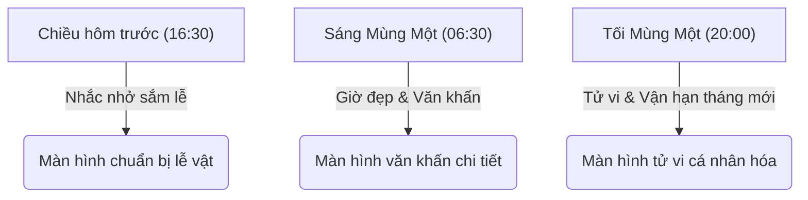

# CHIẾN LƯỢC NỘI DUNG THÔNG BÁO ĐẨY NGÀY MÙNG MỘT ĐỂ TĂNG SỰ GẮN KẾT VÀ TÍN NHIỆM

Tài liệu này phân tích và đề xuất chiến lược nội dung thông báo đẩy (push notification) dành riêng cho ngày Mùng Một âm lịch. Mục tiêu tối thượng là mang lại giá trị thiết thực cho người dùng, xây dựng lòng tin, củng cố sự gắn kết và từ đó thúc đẩy tỷ lệ mở thông báo một cách tự nhiên.

---

## 1. Hành vi và tâm lý người dùng trong ngày Mùng Một

Mùng Một đầu tháng là thời điểm bắt đầu một chu kỳ âm lịch mới. Tâm lý chung của người Việt trong ngày này tập trung vào các yếu tố:

*   **Tâm an và may mắn:** Mong muốn một khởi đầu suôn sẻ, không gặp vận xui, vạn sự hanh thông suốt cả tháng.
*   **Hoàn thành nghi lễ chỉn chu:** Chuẩn bị đồ lễ thành tâm, thắp hương đúng giờ tốt và tìm kiếm văn khấn chuẩn xác cho gia tiên, thần linh.
*   **Chiêm nghiệm tương lai:** Tìm hiểu xem vận trình của bản thân trong tháng mới sẽ có biến động gì (vận hạn, tài lộc, sức khỏe).

---

## 2. Nguyên tắc xây dựng niềm tin và sự gắn kết qua thông báo đẩy

Để tránh cảm giác bị làm phiền (spam) và gia tăng độ tin cậy của ứng dụng Lịch Việt đối với người dùng, chiến lược nội dung cần tuân thủ ba nguyên tắc cốt lõi sau:

### Nguyên tắc 1 - Trao giá trị trước, tăng chuyển đổi sau
Thông báo đẩy phải cung cấp một thông tin thực sự có ích cho người dùng ngay tại thời điểm nhận tin (ví dụ: khung giờ hoàng đạo đẹp nhất để dâng hương, bài văn khấn chuẩn xác). Người dùng mở app vì họ cần giải quyết một vấn đề cụ thể, chứ không phải vì lời mời chào sáo rỗng.

### Nguyên tắc 2 - Hành văn ấm áp, trang trọng và đáng tin cậy
Yếu tố tâm linh đòi hỏi sự nghiêm túc và thành kính. Cách hành văn cần ấm áp, mang tính chiêm nghiệm và học hỏi, tránh các từ ngữ giật gân, dọa dẫm về vận xui nhằm "câu click". Thay vì tạo nỗi sợ, hãy đưa ra lời khuyên tích cực để người dùng chủ động đón lành, tránh dữ.

### Nguyên tắc 3 - Cá nhân hóa dựa trên sự thấu hiểu
Mỗi người dùng có một độ tuổi, giới tính và mối quan tâm khác nhau. Việc chèn tuổi can chi của họ (ví dụ: tuổi Ất Tỵ, tuổi Bính Ngọ) vào nội dung sẽ tạo cảm giác thông báo này được biên soạn dành riêng cho họ, nâng cao mối liên kết giữa ứng dụng và người dùng.

---

## 3. Khung điểm chạm nội dung Mùng Một tối ưu

Thay vì chỉ gửi một thông báo nhắc nhở duy nhất, chiến lược này phân chia quy trình giao tiếp thành ba điểm chạm hợp lý trong vòng 24 giờ xung quanh ngày Mùng Một:

### Điểm chạm 1 - Nhắc nhở chuẩn bị (16:30 chiều ngày hôm trước)
*   **Mục tiêu:** Nhắc người dùng chuẩn bị lễ vật trước khi tan sở về nhà, giúp họ không bị quên hoặc cập rập vào sáng hôm sau.
*   **Nội dung:** Gợi ý sắm mâm lễ đơn giản, thành tâm và nhắc nhở chuẩn bị nhẹ nhàng.

### Điểm chạm 2 - Nghi lễ và Cát lành (06:30 sáng đúng ngày Mùng Một)
*   **Mục tiêu:** Phục vụ trực tiếp nhu cầu thắp hương dâng lễ vào buổi sáng sớm.
*   **Nội dung:** Giờ đẹp thắp hương trong ngày và lối tắt mở nhanh bài văn khấn Mùng Một chuẩn.

### Điểm chạm 3 - Chiêm nghiệm vận hạn tháng mới (20:00 tối đúng ngày Mùng Một)
*   **Mục tiêu:** Tận dụng thời gian rảnh rỗi buổi tối để người dùng chiêm nghiệm tử vi cả tháng.
*   **Nội dung:** Dự báo tử vi cá nhân hóa theo tuổi của người dùng cho tháng âm lịch mới.

---

## 4. Các mẫu nội dung thông báo đẩy đề xuất

Dưới đây là các mẫu tin nhắn mẫu được biên soạn kỹ lưỡng để tối ưu hóa giá trị thông tin và tăng tỷ lệ mở:

### 4.1. Mẫu tin nhắn gửi chiều hôm trước (16:30 chiều)

*   **Mẫu chuẩn nhắc nhở:**
    *   *Tiêu đề:* Mai là mùng 1 tháng [x] âm lịch
    *   *Nội dung:* Xem ngay bài văn khấn và lễ vật cần chuẩn bị, giúp lễ cúng đầu tháng chu đáo hơn.

### 4.2. Mẫu tin nhắn gửi sáng đúng ngày Mùng Một (06:30 sáng)

Nội dung được chia thành 5 trường hợp dựa trên chất lượng ngày và danh sách việc hợp tuổi của người dùng:

1. **Trường hợp: Ngày tốt + có việc nên làm**
   * *Tiêu đề:* Hôm nay mùng 1 tháng [x] âm
   * *Nội dung:* Chúc bạn tháng mới hanh thông. Tuổi [Can Chi] của bạn hôm nay khá tốt [y]%, nên hạn chế [việc 1], [việc 2]...

2. **Trường hợp: Ngày tốt + có 3 việc ngắn**
   * *Tiêu đề:* Hôm nay mùng 1 tháng [x] âm
   * *Nội dung:* Chúc bạn tháng mới hanh thông. Tuổi [Can Chi] của bạn hôm nay khá tốt [y]%, hợp [việc 1], [việc 2].

3. **Trường hợp: Ngày tốt + không có việc nên làm**
   * *Tiêu đề:* Hôm nay mùng 1 tháng [x] âm
   * *Nội dung:* Chúc bạn tháng mới hanh thông. Tuổi [Can Chi] của bạn hôm nay khá tốt [y]%, phù hợp nghỉ ngơi và giữ tinh thần thoải mái.

4. **Trường hợp: Ngày thấp/xấu + có việc nên làm**
   * *Tiêu đề:* Hôm nay mùng 1 tháng [x] âm
   * *Nội dung:* Chúc bạn tháng mới bình an. Tuổi [Can Chi] của bạn hôm nay hợp [việc 1], [việc 2]...

5. **Trường hợp: Ngày thấp/xấu + không có việc nên làm**
   * *Tiêu đề:* Hôm nay mùng 1 tháng [x] âm
   * *Nội dung:* Chúc bạn tháng mới bình an. Buổi sáng phù hợp thắp hương, ưu tiên việc nhẹ trong ngày đầu tháng.

### 4.3. Mẫu tin nhắn gửi tối đúng ngày Mùng Một (20:00 tối)

*   **Mẫu 1 (Hướng dự báo vận hạn - Tò mò cá nhân):**
    *   *Tiêu đề:* Tử vi tháng [X] của tuổi [Can Chi] có gì nổi bật?
    *   *Nội dung:* Lá số tử vi tháng này dự báo bạn có cơ hội lớn về tài lộc hay cần lưu ý điều gì về sức khỏe? Mở xem chi tiết vận hạn tháng mới của bạn ngay.
*   **Mẫu 2 (Hướng chiêm nghiệm cuộc sống):**
    *   *Tiêu đề:* Thông điệp bình an đầu tháng gửi bạn
    *   *Nội dung:* Dành 1 phút thư giãn tối mùng Một để nhận thông điệp gieo duyên lành và lời khuyên giúp tâm hồn an tĩnh, tháng mới gặp nhiều hanh thông.

---

## 5. Giải pháp điều hướng sâu để mang lại trải nghiệm mượt mà

Một thông báo hay nhưng điều hướng sai màn hình sẽ làm giảm nghiêm trọng lòng tin của người dùng. Mỗi điểm chạm phải đi kèm với một liên kết sâu (deep link) chính xác:

1.  **Nhấp vào tin nhắn chiều hôm trước:** Chuyển thẳng tới màn hình chi tiết ngày hôm sau (ngày mùng Một), tự động cuộn đến khu vực **Cẩm nang chuẩn bị lễ vật** hoặc các bài viết cẩm nang lễ nghĩa.
2.  **Nhấp vào tin nhắn sáng mùng Một:** Chuyển tới màn hình chi tiết ngày hôm nay, tự động mở một cửa sổ nhỏ (pop-up) hoặc tab **Văn khấn Mùng Một** để người dùng có thể cầm điện thoại đọc khấn ngay trước bàn thờ.
3.  **Nhấp vào tin nhắn tối mùng Một:** Chuyển thẳng tới phân hệ **Vận hạn tháng mới** trong tính năng Tử vi/Lá số của tuổi người dùng.

---

## 6. Lộ trình triển khai và Đo lường hiệu quả

Để hiện thực hóa chiến lược này, các nhóm dự án cần phối hợp triển khai:

*   **Nhóm Nội dung (Content):** Biên soạn và tối ưu hóa thư viện bài viết về cẩm nang sắm lễ, bài văn khấn chuẩn cho từng tháng và lời chúc danh ngôn bình an.
*   **Nhóm Kỹ thuật (Dev):** Cấu hình các chiến dịch gửi thông báo đẩy theo các khung giờ mới trên Firebase (FCM). Tích hợp tham số để phân biệt tỷ lệ nhấp chuột giữa các nhóm nội dung khác nhau (kiểm thử A/B).
*   **Nhóm Phân tích (Analytics):** Theo dõi các chỉ số quan trọng như tỷ lệ mở thông báo (CTR), tỷ lệ người dùng gỡ cài đặt hoặc tắt thông báo (Opt-out rate), và tỷ lệ chuyển đổi từ thông báo sang sử dụng tính năng văn khấn.
