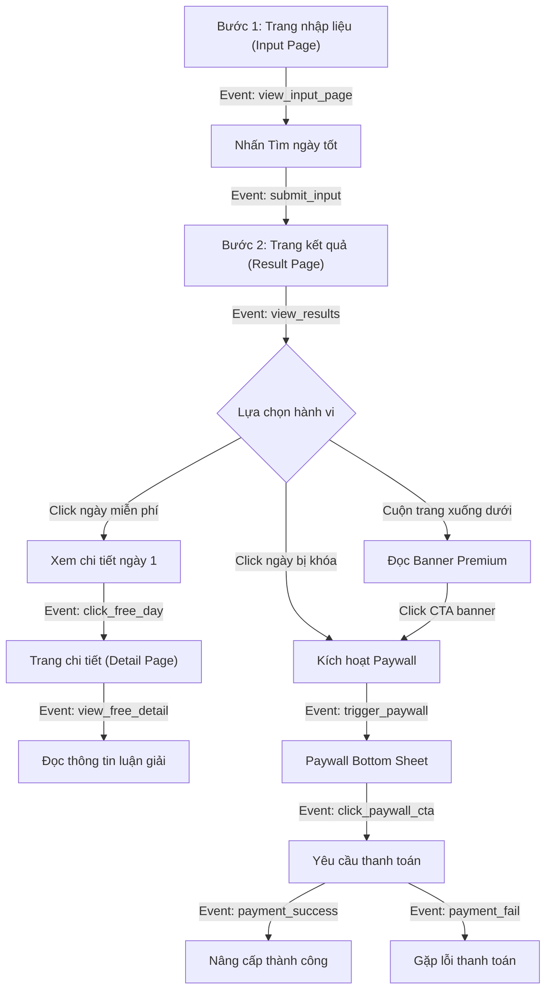

# CHỈ SỐ THỐNG KÊ ĐÁNH GIÁ HIỆU QUẢ CẢI TIẾN TÍNH NĂNG CHỌN NGÀY MUA XE

## 1. Bối cảnh và mục tiêu đánh giá

Tính năng **Chọn ngày mua xe** đã được cải tiến từ mô hình khóa cứng (Hard Paywall) sang mô hình miễn phí một phần (Freemium) kết hợp hiệu ứng làm mờ kính (Glassmorphic Blur) và hiển thị thanh toán dạng kéo lên (Paywall Bottom Sheet) thay vì sử dụng thông báo trình duyệt (`alert()`) thô sơ.

Mục tiêu của tài liệu này nhằm thiết lập các chỉ số thống kê (KPIs) và sự kiện theo dõi hành vi (Event Tracking) để:
* Đánh giá hiệu quả của trải nghiệm Freemium mới đối với hành vi người dùng.
* Đo lường tác động trực tiếp lên tỷ lệ chuyển đổi nâng cấp Premium (IAP).
* Nhận diện các điểm thắt nút cổ chai (Bottlenecks) trong phễu mua hàng để tiếp tục tối ưu hóa.

---

## 2. Hệ thống chỉ số thống kê cốt lõi

Để đánh giá toàn diện, hệ thống chỉ số được chia thành ba nhóm chính bao gồm: chỉ số chuyển đổi doanh thu, chỉ số tương tác hành vi và chỉ số trải nghiệm kỹ thuật.

### Chỉ số chuyển đổi - Đo lường hiệu quả doanh thu

* **Tỷ lệ chuyển đổi Premium (IAP Conversion Rate)**
  * Định nghĩa: Tỷ lệ người dùng nâng cấp Premium thành công trên tổng số người dùng truy cập tính năng Chọn ngày mua xe.
  * Công thức: (Số người nâng cấp thành công / Tổng số người dùng truy cập Chọn ngày mua xe) * 100%.
  * Mục tiêu: Tăng trưởng đáng kể so với phiên bản cũ nhờ trải nghiệm mượt mà và không gây gián đoạn.
* **Tỷ lệ nhấp thanh toán (Paywall Click-Through Rate - CTR)**
  * Định nghĩa: Tỷ lệ người dùng nhấn vào nút hành động (CTA) trên Paywall Bottom Sheet.
  * Công thức: (Số lượt click CTA trên Paywall / Tổng số lượt hiển thị Paywall) * 100%.
  * Mục tiêu: Đo lường mức độ hấp dẫn của thông tin quyền lợi được hiển thị trên Paywall.
* **Doanh thu trung bình trên người dùng tính năng (ARPU - Average Revenue Per User)**
  * Định nghĩa: Tổng doanh thu thu được từ tính năng Chọn ngày mua xe chia cho tổng số người dùng truy cập tính năng này.
  * Công thức: Tổng doanh thu từ tính năng Chọn ngày mua xe / Số người dùng truy cập tính năng.

### Chỉ số tương tác - Đo lường hành vi người dùng

* **Tỷ lệ hoàn thành biểu mẫu (Form Completion Rate)**
  * Định nghĩa: Tỷ lệ người dùng thực hiện nhập thông tin và nhấn nút tìm kiếm thành công để xem kết quả.
  * Công thức: (Số lượt xem kết quả / Số lượt truy cập trang nhập liệu) * 100%.
  * Ý nghĩa: Đánh giá xem phần thiết kế giới thiệu xe mới và các trường nhập liệu cá nhân hóa (tuổi, mệnh) có quá phức tạp khiến người dùng bỏ cuộc hay không.
* **Tỷ lệ tương tác ngày miễn phí (Free Day Detail View Rate)**
  * Định nghĩa: Tỷ lệ người dùng nhấn vào xem chi tiết của ngày tốt đầu tiên (ngày duy nhất được mở khóa hoàn toàn ở trang kết quả).
  * Công thức: (Số lượt xem chi tiết ngày 1 / Tổng số lượt xem trang kết quả) * 100%.
  * Ý nghĩa: Đánh giá mức độ quan tâm của người dùng đối với nội dung luận giải chất lượng cao mà ứng dụng cung cấp miễn phí để làm "mồi nhử".
* **Tỷ lệ tương tác ngày bị khóa (Locked Day Curiosity Rate)**
  * Định nghĩa: Tỷ lệ người dùng cố gắng nhấp vào các ngày bị khóa ở trang kết quả hoặc trang chi tiết.
  * Công thức: (Số lượt nhấp vào các ngày hoặc giờ bị khóa / Tổng số lượt xem trang kết quả) * 100%.
  * Ý nghĩa: Đo lường hiệu quả của "khoảng trống tò mò" (Curiosity Gap) tạo ra bởi hiệu ứng làm mờ và icon khóa.
* **Tỷ lệ kích hoạt Paywall (Paywall Trigger Rate)**
  * Định nghĩa: Tỷ lệ người dùng kích hoạt hiển thị Paywall Bottom Sheet.
  * Công thức: (Số lượt hiển thị Paywall / Tổng số người dùng truy cập trang kết quả) * 100%.
  * Ý nghĩa: Xác định xem luồng thiết kế có dẫn dắt người dùng chạm vào paywall một cách tự nhiên hay không.
* **Tỷ lệ thoát từ Paywall (Paywall Dismissal Rate)**
  * Định nghĩa: Tỷ lệ người dùng chủ động đóng Paywall (bằng cách vuốt xuống, bấm nút đóng hoặc bấm ra ngoài) mà không thực hiện nâng cấp.
  * Công thức: (Số lượt đóng Paywall / Tổng số lượt hiển thị Paywall) * 100%.
  * Ý nghĩa: Nếu tỷ lệ này quá cao (trên 90%), chứng tỏ thiết kế Paywall hoặc mức giá chưa đủ thuyết phục.

### Chỉ số trải nghiệm và vận hành - Đo lường chất lượng

* **Thời gian tương tác trung bình (Average Engagement Time)**
  * Định nghĩa: Thời gian trung bình người dùng dành để đọc nội dung luận giải trên trang chi tiết (Detail) đối với ngày miễn phí.
  * Ý nghĩa: Đánh giá chất lượng nội dung luận giải. Thời gian đọc lâu chứng tỏ nội dung hữu ích và có giá trị với người dùng.
* **Tỷ lệ lỗi thanh toán (Payment Error Rate)**
  * Định nghĩa: Tỷ lệ giao dịch lỗi khi người dùng thực hiện thanh toán qua cổng App Store hoặc Google Play.
  * Công thức: (Số giao dịch lỗi / Tổng số yêu cầu thanh toán) * 100%.
  * Ý nghĩa: Đảm bảo tính ổn định về mặt kỹ thuật của luồng thanh toán giả lập mới.

---

## 3. Bản đồ phễu chuyển đổi và các sự kiện đo lường

Để có được các chỉ số trên, hệ thống cần ghi nhận các sự kiện (Event Tracking) tại từng bước trong hành trình của người dùng.

### Danh sách các sự kiện cần cài đặt mã theo dõi (Tracking Events)

| Tên sự kiện | Mô tả chi tiết | Các thuộc tính đi kèm (Parameters) |
| :--- | :--- | :--- |
| `view_input_page` | Người dùng mở trang nhập thông tin mua xe. | `source_platform` |
| `submit_input` | Người dùng nhấn nút tìm kiếm ngày tốt. | `birthdate`, `car_color`, `timeframe_days` |
| `view_results` | Người dùng xem trang kết quả gợi ý. | `total_days_suggested`, `is_premium` |
| `click_free_day` | Người dùng nhấp vào ngày đầu tiên (miễn phí). | `day_index` (luôn là 1) |
| `click_locked_day` | Người dùng nhấp vào ngày bị khóa hoặc giờ bị khóa. | `day_index`, `locked_type` (`hour` hoặc `day`) |
| `trigger_paywall` | Paywall Bottom Sheet được hiển thị. | `trigger_source` (`click_locked_day`, `click_promo_card`, `click_detail_lock`) |
| `dismiss_paywall` | Người dùng đóng Paywall Bottom Sheet. | `time_spent_seconds`, `dismiss_method` (`button`, `swipe`, `backdrop`) |
| `click_paywall_cta` | Người dùng nhấn nút nâng cấp trên Paywall. | `package_type`, `price` |
| `payment_success` | Giao dịch nâng cấp Premium thành công. | `transaction_id`, `revenue` |
| `payment_fail` | Giao dịch thất bại hoặc bị hủy giữa chừng. | `error_code`, `error_message` |

---

## 4. Tiêu chí đánh giá thành công (Success Benchmarks)

Sau 30 ngày triển khai thực tế trên môi trường sản xuất (Production), cải tiến được coi là thành công nếu đạt được các cột mốc sau:

* **Tỷ lệ chuyển đổi nâng cấp Premium (IAP Conversion Rate)** đạt tối thiểu **1.8%** (so với mức trung bình 0.5% - 0.8% của cơ chế khóa cứng cũ).
* **Tỷ lệ tương tác ngày miễn phí (Free Day Detail View Rate)** đạt trên **70%**, chứng tỏ người dùng thực sự muốn trải nghiệm thử dịch vụ trước khi ra quyết định.
* **Tỷ lệ kích hoạt Paywall (Paywall Trigger Rate)** tăng trưởng trên **45%** nhờ cơ chế chạm mở tự nhiên thay vì popup tự động ép buộc.
* **Tỷ lệ phản hồi tiêu cực liên quan đến quảng cáo hoặc khóa tính năng trên App Store** giảm thiểu tối đa nhờ trải nghiệm Freemium thân thiện hơn, không gây gián đoạn khó chịu.

Lưu ý quan trọng: Cần liên tục theo dõi biểu đồ phễu hàng tuần để phát hiện nếu tỷ lệ thoát `dismiss_paywall` quá cao, từ đó tối ưu hóa nội dung thông điệp hoặc thay đổi các gói giá phù hợp hơn.

---

## 5. Khung cấu trúc bảng KPI đề xuất cho các tính năng cải tiến

Để quản lý và đánh giá hiệu quả cho nhiều tính năng được sửa đổi cùng lúc (trong đó mỗi tính năng có các mục tiêu và cách đo lường riêng biệt), bảng cấu trúc KPI tinh gọn nên bao gồm 5 cột sau:

| Tính năng / Thay đổi | Chỉ số | Định nghĩa / Công thức | Mục tiêu | Thời hạn |
| :--- | :--- | :--- | :--- | :--- |
| **Luồng Freemium Chọn ngày mua xe** | Tỷ lệ tương tác ngày miễn phí | (Số lượt xem chi tiết ngày 1 / Tổng số lượt xem trang kết quả) * 100% | Đạt tối thiểu 70% | 2 tuần sau ra mắt |
| | Tỷ lệ tò mò ngày bị khóa | (Số lượt nhấp vào ngày hoặc giờ bị khóa / Tổng số lượt xem trang kết quả) * 100% | Đạt tối thiểu 30% | 2 tuần sau ra mắt |
| **Nâng cấp Bottom Sheet Paywall** | Tỷ lệ nhấp thanh toán (Paywall CTR) | (Số lượt click CTA trên Paywall / Tổng số lượt hiển thị Paywall) * 100% | Đạt tối thiểu 5% | 1 tháng sau ra mắt |
| | Tỷ lệ thoát Paywall | (Số lượt đóng Paywall / Tổng số lượt hiển thị Paywall) * 100% | Dưới 92% | 1 tháng sau ra mắt |

