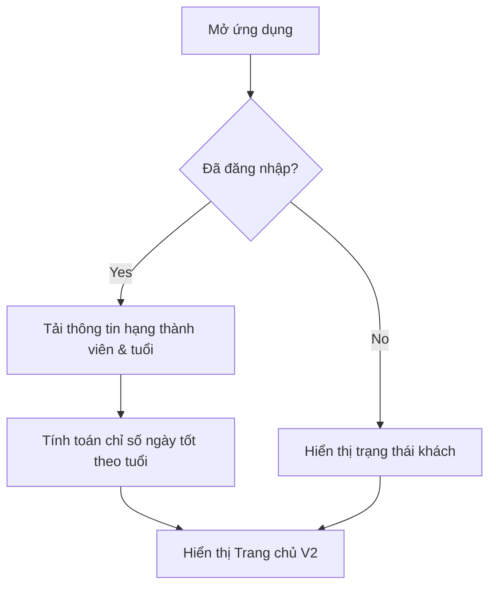

# BPRD: TRANG CHỦ V2 LỊCH VIỆT
> Business and Product Requirements Document

## 1. Thông tin chung (Document information)
- **Dự án/Tính năng:** Trang chủ V2 (Màn hình chính ứng dụng Lịch Việt)
- **Mục tiêu (Epic):** Cải tiến trải nghiệm người dùng trên màn hình chính, tăng tính cá nhân hóa và tiện ích xem ngày tốt
- **Người chịu trách nhiệm (Owner):** Product Manager
- **Nhóm tham gia (Stakeholders):** Design, Dev, QA, Marketing
- **Mức độ ưu tiên (Priority):** High

---

## 2. Tổng quan kinh doanh (Business context)

### 2.1. Vấn đề và cơ hội (Problem & opportunity)
- Người dùng gặp khó khăn trong việc nắm bắt nhanh các thông tin cá nhân hóa (như giờ tốt, ngày tốt hợp tuổi) ngay khi mở ứng dụng.
- Giao diện cũ thiếu tính tương tác và điểm nhấn (hook) để giữ chân người dùng truy cập hàng ngày.
- Cần thúc đẩy tỷ lệ chuyển đổi (conversion rate) vào các dịch vụ xem ngày tốt, tử vi cốt lõi thông qua các khối thông tin trực quan.

### 2.2. Mục tiêu (Business goals & OKRs)
- **Khía cạnh sản phẩm:** Tăng thời lượng phiên (session length) và tỷ lệ người dùng hoạt động hàng ngày (DAU) thông qua các thông tin cá nhân hóa hữu ích như "Giờ tốt hôm nay" và "Chỉ số ngày tốt".
- **Khía cạnh kinh doanh:** Tăng tỷ lệ nhấp (CTR) vào các nhóm dịch vụ (Chọn ngày tốt, Hiểu vận mệnh, Tiền bạc, Xem tình duyên) lên ít nhất 20%.

### 2.3. Phạm vi (Scope)
- **Nằm trong phạm vi (In-Scope):**
  - Thanh trạng thái cá nhân hóa (Ảnh đại diện, hạng thành viên, tuổi can chi).
  - Thanh lịch tuần với đánh dấu ngày hiện tại và sự kiện.
  - Khu vực hiển thị ngày tháng, chỉ số ngày tốt và lời khuyên.
  - Bảng thông báo dạng Slider tự động chuyển đổi giữa đếm ngược sự kiện khẩn cấp và câu hỏi tử vi thường gặp.
  - Màn hình chi tiết câu hỏi tử vi thường gặp (tuvi_faq_detail.html).
  - Lưới dịch vụ nổi bật (6 tính năng chính).
  - Thẻ thông tin đếm ngược giờ tốt hiện tại.
  - Khối dịch vụ chọn ngày lành cho việc trọng đại (Cưới hỏi, Mua xe, Mua nhà...).
  - Thanh điều hướng dưới cùng.
- **Nằm ngoài phạm vi (Out-of-Scope):**
  - Luồng thanh toán các dịch vụ.
  - Màn hình chi tiết của từng dịch vụ (như chi tiết tử vi, sự kiện, ngoại trừ màn hình chi tiết câu hỏi tử vi thường gặp).

---

## 3. Người dùng mục tiêu (User personas & JTBD)

### 3.1. Chân dung người dùng (Personas)
- **Người dùng phổ thông (Daily User):** Truy cập ứng dụng mỗi sáng để xem ngày, tháng, và thông tin tốt xấu cơ bản để sắp xếp lịch trình trong ngày.
- **Người dùng tâm linh hoặc kinh doanh:** Thường xuyên cần chọn ngày tốt cho các quyết định lớn như khai trương, ký hợp đồng, mua nhà, cưới hỏi.

### 3.2. Jobs-to-be-Done
- Khi mở ứng dụng vào buổi sáng, người dùng muốn biết hôm nay là ngày gì, giờ nào tốt để lên kế hoạch công việc nhằm mang lại may mắn và tránh xui xẻo.
- Khi chuẩn bị có việc trọng đại, người dùng muốn truy cập nhanh vào dịch vụ chọn ngày tốt để đưa ra quyết định chuẩn xác theo phong thủy.

---

## 4. Yêu cầu nghiệp vụ (Business requirements)

### 4.1. Quy trình nghiệp vụ (Process flows)

### 4.2. Quy tắc kinh doanh (Business rules)
- **Rule 1:** Thông tin tuổi can chi và hạng thành viên phải lấy từ dữ liệu hồ sơ của người dùng hiện tại.
- **Rule 2:** "Chỉ số ngày tốt" được hệ thống tính toán tự động dựa trên thuật toán phong thủy kết hợp với tuổi của người dùng.
- **Rule 3:** Bảng đếm ngược sự kiện quan trọng chỉ hiển thị khi thời gian đến sự kiện còn dưới hoặc bằng 3 ngày.
- **Rule 4:** "Giờ tốt hôm nay" phải cập nhật theo thời gian thực (Live countdown) dựa trên đồng hồ thiết bị.

---

## 5. Yêu cầu sản phẩm (Functional requirements)

| ID | User Story | Acceptance Criteria (Tiêu chí nghiệm thu) | Priority |
| :--- | :--- | :--- | :--- |
| US-01 | Là người dùng, tôi muốn xem thông tin cá nhân ở góc trên cùng để biết trạng thái tài khoản của mình. | **[Hiển thị]** Khi mở ứng dụng, thì hệ thống hiển thị ảnh đại diện, tên, hạng thành viên (VD: Bạc) và tuổi can chi (VD: Đinh Mão). **[Logic]** Khi chưa đăng nhập, thì hiển thị trạng thái khách kèm nút "Đăng nhập". | High |
| US-02 | Là người dùng, tôi muốn xem lịch tuần có đánh dấu các ngày quan trọng để nắm bắt lịch trình sắp tới. | **[Hiển thị]** Khi xem lịch tuần, thì ngày hiện tại được làm nổi bật bằng viền xanh. **[Hiển thị]** Khi một ngày có sự kiện, thì hiển thị dấu chấm vàng dưới ngày đó. **[Tương tác]** Khi vuốt ngang thanh lịch, thì hiển thị các tuần tiếp theo hoặc trước đó. | High |
| US-03 | Là người dùng, tôi muốn xem chỉ số ngày tốt và lời khuyên để biết tổng quan về ngày hôm nay. | **[Hiển thị]** Khi tải xong trang chủ, thì chỉ số ngày tốt chạy hiệu ứng tăng dần lên mức thực tế. **[Hiển thị]** Khi xem phần lời khuyên, thì thấy danh sách việc "Nên làm" (VD: mua sắm, cầu an). | High |
| US-04 | Là người dùng, tôi muốn thấy bảng đếm ngược sự kiện để không bỏ lỡ các dịp đặc biệt. | **[Logic]** Khi thời gian đến sự kiện <= 3 ngày, thì hiển thị bảng đếm ngược thời gian thực (ngày, giờ). **[Logic]** Khi thời gian > 3 ngày, thì ẩn bảng này. | Medium |
| US-05 | Là người dùng, tôi muốn truy cập nhanh các nhóm dịch vụ nổi bật từ lưới menu để tiết kiệm thời gian tìm kiếm. | **[Hiển thị]** Khi xem lưới dịch vụ, thì hiển thị 6 nút tính năng (Lịch tháng, Chọn ngày tốt, Hiểu vận mệnh, Tiền bạc, Xem tình duyên, Xem tất cả). **[Tương tác]** Khi bấm vào "Xem tất cả", thì hệ thống chuyển hướng sang màn hình Dịch vụ. | High |
| US-06 | Là người dùng, tôi muốn xem thẻ giờ tốt đếm ngược để biết khi nào đến thời điểm thuận lợi nhất. | **[Hiển thị]** Khi đến gần giờ tốt, thì hiển thị đếm ngược (VD: Còn 45 phút tới Giờ Tốt). **[Hiển thị]** Khi xem thẻ giờ tốt, thì hiển thị tên giờ (VD: Giáp Ngọ), thời gian, đánh giá sao và danh sách việc hợp (Hợp bàn, Xuất hành). | High |
| US-07 | Là người dùng, tôi muốn chọn nhanh dịch vụ xem ngày cho các việc trọng đại (Cưới hỏi, Mua xe...) từ lưới chuyên biệt. | **[Hiển thị]** Khi cuộn xuống khối "Sắp có việc quan trọng", thì hiển thị lưới 9 tính năng chọn ngày. **[Tương tác]** Khi bấm vào dịch vụ "Cưới hỏi", thì chuyển sang luồng chức năng Chọn Ngày Cưới Hỏi. **[Tương tác]** Khi bấm vào dịch vụ "Mua xe", thì chuyển sang màn hình nhập thông tin Chọn Ngày Mua Xe. | Medium |
| US-08 | Là người dùng, tôi muốn xem câu hỏi tử vi thường gặp chạy luân phiên để tìm hiểu sâu về bản thân. | **[Hiển thị]** Khối banner đếm ngược sự kiện được chuyển đổi thành Slider trượt ngang chứa 2 thẻ: thẻ đếm ngược và thẻ tử vi thường gặp. **[Tương tác]** Tự động chuyển đổi thẻ sau mỗi 4 giây. Chạm vào thẻ tử vi mở ra màn chi tiết (`tuvi_faq_detail.html`). **[Tương tác]** Màn chi tiết hiển thị câu trả lời trực quan và có nút CTA kết nối tới `tuvi_nghenghiep_input.html`. | High |

### 5.1. UX/UI và trải nghiệm
- **Hiệu ứng (Animation):**
  - Số "Chỉ số ngày tốt" đếm từ 0% lên mức thực tế trong 1 giây (hiệu ứng ease-out).
  - Nút "Xem thêm" có hiệu ứng mũi tên chuyển động nhẹ nhàng.
  - Bảng sự kiện khẩn cấp có hiệu ứng ánh sáng lướt qua để thu hút sự chú ý.
- **Nguyên tắc thiết kế:** Sử dụng giao diện tối giản, bo góc mượt mà, bóng đổ mềm mại (Soft shadows) và nền sáng để tạo cảm giác "Zen Premium".

---

## 6. Yêu cầu phi chức năng (Non-functional requirements)
- **Hiệu năng (Performance):** Tải và render toàn bộ Trang chủ dưới 1.5 giây. Các hiệu ứng animation phải mượt mà đạt 60fps trên đa số thiết bị.
- **Tính khả dụng (Availability):** Thông tin ngày giờ, lịch tuần phải hoạt động offline nhờ lưu trữ cache. Cập nhật chỉ số ngày tốt khi có kết nối mạng.
- **Tính tương thích (Compatibility):** Hiển thị chuẩn không bị vỡ layout trên các thiết bị mobile có kích thước màn hình từ 320px đến 430px.

---

## 7. Edge Cases (Trường hợp ngoại lệ)
- **Mất kết nối Internet:**
  - Ẩn phần ảnh đại diện nếu chưa lưu cache.
  - Khi người dùng bấm vào các dịch vụ online, hiển thị thông báo: "Vui lòng kiểm tra kết nối mạng để tiếp tục".
- **Không có dữ liệu ngày sinh:**
  - Ẩn tuổi can chi ở khu vực thông tin người dùng.
  - Hiển thị lời khuyên "Nên làm" ở mức chung thay vì cá nhân hóa.
- **Không có sự kiện cận kề:** Không render bảng đếm ngược, đẩy các khối giao diện bên dưới lên một cách liền mạch.

---

## 8. Kế hoạch ra mắt (Go-to-Market)
- **Giai đoạn:** Alpha test (nội bộ) → Rollout 20% người dùng → Rollout 100%.

---

## 9. Definition of Done
- [ ] Giao diện triển khai đúng 100% so với prototype HTML (TrangChu_V2.html).
- [ ] Vượt qua tất cả Tiêu chí nghiệm thu (Acceptance Criteria) từ US-01 đến US-07.
- [ ] Kiểm tra responsive trên các dòng thiết bị mục tiêu mà không bị lỗi giao diện.
- [ ] Tích hợp thành công API cá nhân hóa và thuật toán tính chỉ số ngày tốt.
